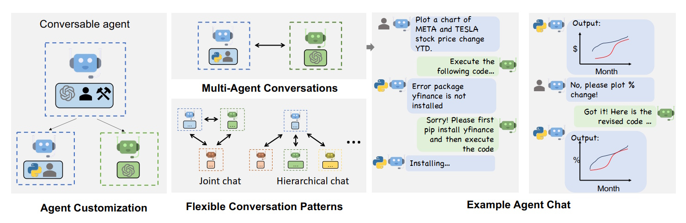
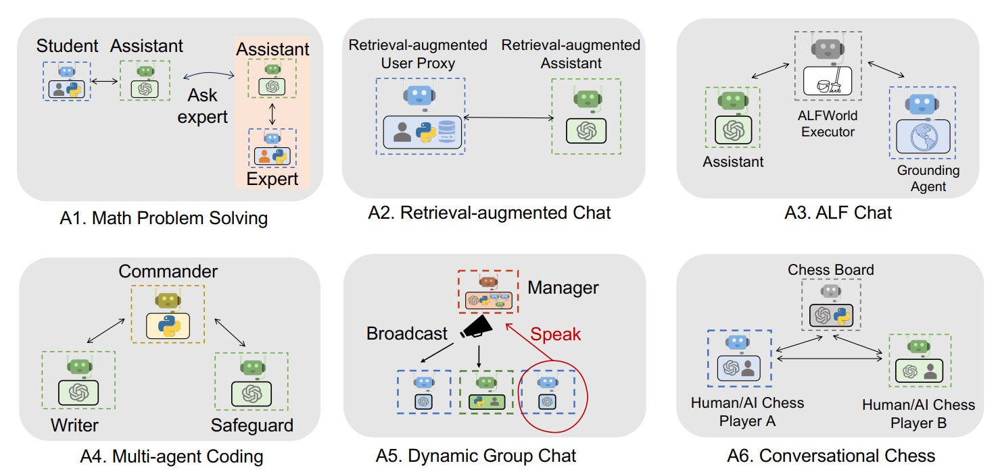
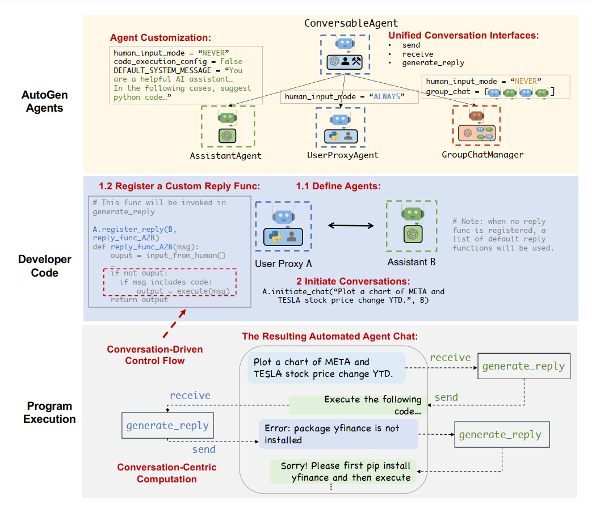

# AutoGen: Enabling Next-Gen LLM Applications via Multi-Agent Conversation

## Table of Contents
1. [Introduction](#introduction)
2. [What is AutoGen?](#what-is-autogen)
3. [The AutoGen Framework](#the-autogen-framework)
4. [Applications of AutoGen](#applications-of-autogen)
5. [Multi-Agent Conversations in AutoGen](#multi-agent-conversations-in-autogen)
6. [Key Features of AutoGen](#key-features-of-autogen)
7. [Conclusion](#conclusion)
8. [References](#references)

## Introduction

In the rapidly evolving world of artificial intelligence, Large Language Models (LLMs) like GPT-4 have become essential tools for developing intelligent applications. These models can understand and generate human-like text, making them powerful for various tasks such as reasoning, coding, and decision-making. However, as tasks become more complex, single agents powered by LLMs may struggle to handle everything alone. This is where **AutoGen** comes into play.

AutoGen is an open-source framework designed to build advanced LLM applications using multiple **agents** that communicate with each other. By enabling these agents to converse and collaborate, AutoGen allows developers to create more capable and flexible AI systems.

## What is AutoGen?

AutoGen is a framework that simplifies the creation of applications powered by Large Language Models (LLMs). It does this by allowing multiple agents to interact through conversations to complete tasks. These agents can be customized, interact naturally, and use various tools or human inputs to achieve their goals. Whether you're working on math problems, coding, or interactive games, AutoGen provides the tools to build efficient and effective applications.

## The AutoGen Framework

The core idea behind AutoGen is to make it easy to set up and manage conversations between multiple agents. This approach not only enhances the capabilities of each agent but also allows them to work together seamlessly to solve complex problems.

### Conversable Agents

A **conversable agent** in AutoGen is like a smart participant in a conversation. Each agent has a specific role and can send and receive messages from other agents. They keep track of the conversation's context and can be equipped with different abilities, such as:

- **LLMs**: These agents use language models to understand and generate text. They can perform tasks like role-playing, inferring information, and writing code.
- **Humans**: Some agents can involve human input at certain points in the conversation, allowing for human-AI collaboration.
- **Tools**: These agents can use external tools or execute code to perform specific functions.

**Customization and Cooperation**: Developers can create agents with unique roles and abilities by mixing and matching these capabilities. For example, one agent might handle coding tasks, while another manages user interactions.

### Conversation Programming

**Conversation Programming** is the method AutoGen uses to manage how agents interact. It involves two main concepts:

1. **Computation**: What actions agents take to respond during a conversation.
2. **Control Flow**: The order and conditions under which these actions happen.

AutoGen provides several design patterns to help developers manage these interactions:

- **Unified Interfaces**: All agents use the same methods to send and receive messages, making it easier to manage conversations.
- **Auto-Reply Mechanisms**: Agents can automatically respond to messages without needing manual intervention.
- **Fusion of Programming and Natural Language**: Developers can use both code and natural language to control how conversations flow, allowing for flexible and dynamic interactions.

This setup allows for both fixed (static) and adaptable (dynamic) conversation patterns, making it versatile for various applications.

## Applications of AutoGen

AutoGen shines in a variety of real-world applications by simplifying the development of multi-agent systems. Here are six key areas where AutoGen has proven effective:

### 1. Math Problem Solving

AutoGen can create applications that help solve math problems by using multiple agents working together.

- **Autonomous Problem Solving**: Built-in agents can tackle math problems without human help, performing better than some commercial tools.
- **Human-in-the-loop Problem Solving**: Agents can ask for human input when they encounter difficult problems.
- **Multi-User Problem Solving**: Multiple humans can collaborate with agents to solve complex math issues together.

**Example**: An AutoGen-powered math tutor where one agent explains the problem, another solves it, and a third verifies the solution with human feedback.

### 2. Retrieval-Augmented Code Generation and Question Answering

AutoGen can enhance code generation and answer questions by retrieving relevant information.

- **Natural Question Answering**: Agents can find and use information to answer questions effectively.
- **Code Generation**: Agents can write code using the latest APIs, even those not covered in their initial training data.

**Example**: A coding assistant that retrieves documentation snippets to help write accurate and up-to-date code.

### 3. Decision Making in Text World Environments

AutoGen helps in making decisions within interactive text-based environments.

- **Interactive Decision Making**: Agents can navigate and make choices in virtual environments.
- **Grounding Agent**: An additional agent provides essential commonsense knowledge to improve decision-making.

**Example**: An AI that plays text-based adventure games by planning moves and learning from each decision.

### 4. Multi-Agent Coding

AutoGen facilitates collaborative coding by coordinating multiple agents.

- **Commander Agent**: Oversees the coding process.
- **Writer and Safeguard Agents**: Write code and ensure its safety by checking for errors or unsafe practices.

**Example**: A coding team where one agent writes the code, another reviews it for security issues, and a commander coordinates the tasks.

### 5. Dynamic Group Chat

AutoGen supports dynamic group chats where multiple agents interact in real-time.

- **GroupChatManager**: Selects speakers and manages the flow of conversation.
- **Role-Play Prompts**: Helps agents stay in character and maintain effective communication.

**Example**: A virtual meeting where agents represent different team members, discussing project updates and making decisions together.

### 6. Conversational Chess

AutoGen enables the creation of a chess game that can be played through natural language.

- **Player Agents**: Can be human or AI players.
- **Board Agent**: Manages the game state, validates moves, and ensures rules are followed.

**Example**: A chatbot that plays chess with users, explaining each move and ensuring the game stays fair.

## Multi-Agent Conversations in AutoGen

AutoGen's strength lies in its ability to manage conversations between multiple agents effectively. Here's how it works:

1. **Agent Customization**:
   - Agents can be tailored with specific settings, such as enabling human input or allowing code execution.
   - Each agent has a system message defining its role, like "You are a helpful AI assistant."

2. **Unified Conversation Interfaces**:
   - All agents use the same methods to communicate, making interactions seamless.
   - The `generate_reply` function is central, determining how agents respond to messages.

3. **Agent Types**:
   - **ConversableAgent**: The base class for all agents.
   - **AssistantAgent**: Acts as an AI assistant, typically powered by LLMs.
   - **UserProxyAgent**: Bridges human input or tool usage with the conversation.
   - **GroupChatManager**: Handles dynamic group conversations, managing who speaks and when.

4. **Developer Code**:
   - Developers can define how agents respond by writing custom functions.
   - For example, a function can make an agent execute code or ask for human input when needed.

5. **Conversation-Driven Control Flow**:
   - Conversations drive the sequence of actions, where one agent's message prompts a response from another.
   - **Example**: A user asks an assistant to plot stock prices, the assistant provides Python code, and the user proxy executes it.

6. **Program Execution**:
   - Agents collaborate to complete tasks, handling errors and adjusting as needed.
   - **Example**: If a code execution fails due to a missing library, an agent can request its installation.

**Illustration Table**:

| Feature                    | Description                                                                                   | Example                                               |
|----------------------------|-----------------------------------------------------------------------------------------------|-------------------------------------------------------|
| Agent Customization        | Tailor agents with specific configurations and roles.                                        | Setting an agent to suggest Python code.             |
| Unified Interfaces         | Standard methods for all agents to communicate.                                              | Using `generate_reply` for responses.                |
| Agent Types                | Different roles like Assistant, User Proxy, and GroupChatManager.                           | AssistantAgent for AI assistance.                    |
| Developer Code             | Custom functions to define agent responses.                                                 | `reply_func_A2B` for handling specific messages.     |
| Conversation-Driven Control| Sequence of interactions driven by agent messages.                                           | Initiating a chat to plot stock price changes.        |
| Program Execution          | Agents work together to execute tasks and handle errors.                                    | Executing Python code to plot data and managing errors.|

## Key Features of AutoGen

AutoGen offers several standout features that make it a powerful tool for developing multi-agent applications:

- **Flexibility**: Customize agents to perform various roles and tasks, allowing for a wide range of applications.
- **Automation**: Agents can automatically handle conversations, reducing the need for manual oversight.
- **Error Handling**: Built-in mechanisms allow agents to detect and respond to issues, ensuring tasks are completed smoothly.
- **Dynamic Interaction**: Supports multi-turn conversations where agents adapt based on the context and previous messages.
- **Reusability**: Designed to maximize the reuse of agents across different applications, saving development time.
- **Ease of Programming**: Combines natural language and code, making it accessible for developers to define complex interactions.

## Conclusion

AutoGen revolutionizes the way developers build applications using Large Language Models by introducing a multi-agent conversation framework. By enabling multiple customizable and conversable agents to interact, AutoGen enhances the capabilities, flexibility, and efficiency of AI applications across various domains. Whether you're solving math problems, generating code, or creating interactive games, AutoGen provides the tools and structure needed to develop next-generation AI solutions with ease.

## References

- **AutoGen: Enabling Next-Gen LLM Applications via Multi-Agent Conversation**  
  [https://arxiv.org/abs/2308.08155](https://arxiv.org/abs/2308.08155)

- **Agent and Multi-Agent Applications**  
  [https://microsoft.github.io/autogen/stable/user-guide/core-user-guide/core-concepts/agent-and-multi-agent-application.html](https://microsoft.github.io/autogen/stable/user-guide/core-user-guide/core-concepts/agent-and-multi-agent-application.html)

- **Multi-agent Network with LangGraph**  
  [https://langchain-ai.github.io/langgraph/tutorials/multi_agent/multi-agent-collaboration/](https://langchain-ai.github.io/langgraph/tutorials/multi_agent/multi-agent-collaboration/)
