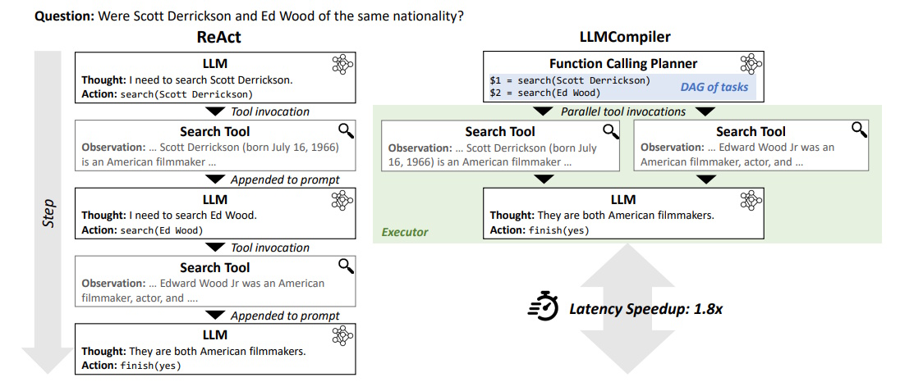
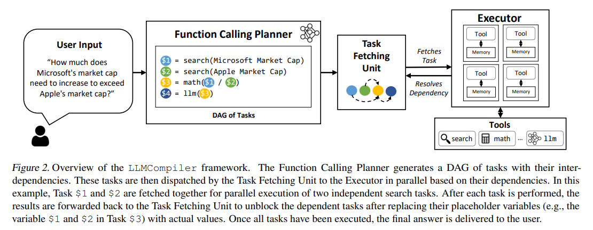
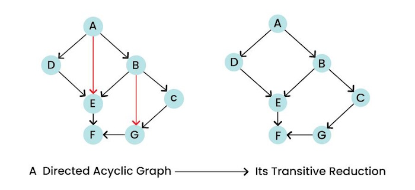

# LLM Compiler: Enhancing Large Language Models with Parallel Function Calling

## Table of Contents

- [Introduction](#introduction)
- [What is an LLM Compiler?](#what-is-an-llm-compiler)
- [Why Parallel Function Calling?](#why-parallel-function-calling)
- [LLMCompiler: A Deep Dive](#llmcompiler-a-deep-dive)
- [How LLMCompiler Works: An Example](#how-llmcompiler-works-an-example)
- [Comparing LLMCompiler with ReAct](#comparing-llmcompiler-with-react)
- [Performance and Results](#performance-and-results)
- [Summary](#summary)
- [References](#references)

## Introduction

Large Language Models (LLMs) like GPT-4 have revolutionized the way we interact with technology, enabling advanced reasoning and problem-solving capabilities. However, these models have limitations, such as outdated knowledge, poor arithmetic skills, and restricted access to private data. To overcome these challenges, LLMs can execute external function calls, leveraging tools like calculators or web search APIs to enhance their performance.

Traditionally, function calls in LLMs are handled sequentially. This means the model executes one function at a time, waits for the result, and then proceeds to the next step. While effective, this approach can be slow and costly, especially for complex tasks that require multiple function calls.

Enter **LLMCompiler**, a groundbreaking framework designed to optimize how LLMs handle function calls. Inspired by classical compilers in computer science, LLMCompiler enables the parallel execution of multiple functions, significantly improving efficiency, reducing costs, and enhancing accuracy.

## What is an LLM Compiler?

An **LLM Compiler** is a specialized tool that optimizes the execution of function calls made by Large Language Models. Just as a traditional compiler translates and optimizes code for better performance, an LLM Compiler manages and orchestrates multiple function calls to ensure they are executed in the most efficient manner possible.

### **How LLMCompiler Works:**

1. **Function Calling Planner:**
   - The **Planner** decomposes the user query into smaller, independent tasks with dependencies. 
   - In this example, the Planner identifies two tasks:
     - **Task $1:** Search for Scott Derrickson's nationality.
     - **Task $2:** Search for Ed Wood's nationality.
   - These tasks are represented as a **Directed Acyclic Graph (DAG)**, where the tasks are independent and can be executed in parallel.

2. **Parallel Tool Invocations:**
   - The **Executor** dispatches the tasks to the appropriate tools (e.g., a search tool) for parallel execution.
   - Both tasks ($1 and $2) are executed simultaneously:
     - The search tool retrieves information about Scott Derrickson and Ed Wood concurrently.
     - Observations from both searches are stored in memory.

3. **Dependency Resolution:**
   - Once the parallel tasks are completed, their results are used to resolve dependencies.
   - In this case, the results of both searches (confirming that both are American filmmakers) are combined to answer the original question.

4. **Final Response Generation:**
   - The LLM processes the observations from the parallel tasks and generates the final response: *"They are both American filmmakers."*
   - The action `finish(yes)` is triggered to deliver the final answer to the user.

### Key Features:

- **Parallel Execution**: Executes multiple functions at the same time rather than one after the other.
- **Task Dependency Management**: Identifies and manages dependencies between different function calls.
- **Dynamic Replanning**: Adjusts the execution plan based on intermediate results to handle complex tasks.

---

## Why Parallel Function Calling?

Sequential function calling, as used in frameworks like ReAct, involves executing one function at a time. While simple, this approach has several drawbacks:

- **High Latency**: Waiting for each function to complete before starting the next increases the overall time taken.
- **Increased Costs**: More function calls lead to higher usage of computational resources, driving up costs.
- **Potential Accuracy Issues**: Repetitive function calls and early stopping based on partial results can reduce the model's accuracy.

Parallel function calling addresses these issues by allowing multiple functions to run simultaneously. This leads to faster processing times, lower costs, and improved accuracy.

## LLMCompiler: A Deep Dive

LLMCompiler introduces a novel approach to handling function calls in LLMs by enabling parallel execution. It consists of three main components:

1. **Function Calling Planner**
2. **Task Fetching Unit**
3. **Executor**

### Function Calling Planner

The Function Calling Planner is responsible for breaking down a user query into a series of tasks and identifying any dependencies between them. It uses the reasoning capabilities of the LLM to create an execution plan, forming a Directed Acyclic Graph (DAG) of tasks.

**Example:**

For the query, "How much does Microsoft's market cap need to increase to exceed Apple's market cap?", the planner identifies the following tasks:

1. **Task 1**: Search for Microsoft's market cap.
2. **Task 2**: Search for Apple's market cap.
3. **Task 3**: Perform a mathematical calculation to determine the required increase.
4. **Task 4**: Generate the final answer.

Tasks 1 and 2 are independent and can be executed in parallel, while Task 3 depends on the results of Tasks 1 and 2.

### Task Fetching Unit

Inspired by instruction fetching in computer architectures, the Task Fetching Unit manages the execution order of tasks. It dispatches tasks to the Executor as soon as they are ready, ensuring that independent tasks run in parallel. Additionally, it replaces placeholder variables in dependent tasks with actual results from preceding tasks.

**Example:**

In the previous example, once Tasks 1 and 2 complete, their results replace placeholders in Task 3, which can then proceed with the calculation.

### Executor

The Executor handles the actual execution of tasks. It runs tasks asynchronously, leveraging user-provided tools such as calculators, search APIs, or other specialized functions. Each task has dedicated memory to store its intermediate results, ensuring that the final output is accurate and complete.

**Example:**

After Task 3 completes the calculation, Task 4 generates the final answer using the results from Task 3.

## How LLMCompiler Works: An Example

Let's walk through a practical example to see how LLMCompiler enhances efficiency compared to traditional sequential approaches.

**Question:** "How much does Microsoft's market cap need to increase to exceed Apple's market cap?"

### ReAct Framework (Sequential Approach)

1. **Thought**: Initiates a search for Microsoft's market cap.
2. **Action**: Executes the search and retrieves the result.
3. **Thought**: Initiates a search for Apple's market cap.
4. **Action**: Executes the search and retrieves the result.
5. **Thought**: Performs the mathematical calculation to determine the required increase.
6. **Final Answer**: Provides the result.

*Latency Speedup:* 1.8× slower due to sequential execution.

### LLMCompiler Framework (Parallel Approach)

1. **Function Calling Planner**: Breaks down the question into four tasks, identifying that Tasks 1 and 2 can run in parallel.
2. **Task Fetching Unit**: Dispatches Tasks 1 and 2 simultaneously.
3. **Executor**: Runs both searches at the same time, retrieves results faster.
4. **Task 3**: Uses the results from Tasks 1 and 2 to perform the calculation.
5. **Task 4**: Generates the final answer.

*Latency Speedup:* 1.8× faster due to parallel execution.

## Comparing LLMCompiler with ReAct

To better understand the advantages of LLMCompiler, let's compare it directly with the ReAct framework.

| Feature                     | LLMCompiler                                                                 | ReAct                                                                 |
|-----------------------------|-----------------------------------------------------------------------------|-----------------------------------------------------------------------|
| **Parallel Execution**      | Supports `parallel` execution of tasks, enabling faster processing.           | Executes tasks `sequentially`, leading to higher latency.               |
| **Task Dependency Handling**| Uses a Directed Acyclic Graph (DAG) to manage task dependencies efficiently.| Handles tasks sequentially, without explicit dependency management.   |
| **Latency**                 | Significantly reduces latency by executing independent tasks in parallel.   | Higher latency due to sequential execution of tasks.                  |
| **Cost Efficiency**         | Reduces cost by minimizing the number of LLM invocations through parallelism.| Higher cost due to frequent LLM invocations for each reasoning step.  |
| **Accuracy**                | Improves accuracy by avoiding repetitive function calls and early stopping. | May suffer from accuracy issues due to repetitive calls and early stops. |
| **Dynamic Replanning**      | Supports dynamic replanning based on intermediate results.                  | Does not support dynamic replanning; follows a fixed sequential flow. |
| **Tool Integration**        | Efficiently integrates multiple tools and executes them in parallel.        | Integrates tools but executes them one at a time.                     |
| **Complexity Handling**     | Handles complex tasks with multiple dependencies and parallelizable steps.  | Struggles with complex tasks due to sequential execution.             |
| **Failure Cases**           | Minimizes failure cases like repetitive calls and incomplete information.   | Prone to failure cases like repetitive calls and premature stopping.  |
| **Use Case Flexibility**    | Suitable for a wide range of tasks, including parallel and dynamic workflows.| Best suited for simpler tasks with fewer dependencies.                |

### Summary of Comparison

- **LLMCompiler** excels in handling multiple tasks simultaneously, reducing both time and costs while maintaining or improving accuracy.
- **ReAct** is simpler to implement but falls short in efficiency and scalability, especially for complex tasks.

## Performance and Results

LLMCompiler has been rigorously tested across various models and problem types, showcasing its ability to handle different patterns of function calling effectively.

### Embarrassingly Parallel Function Calling

**Definition:** Tasks are completely independent and can run simultaneously without any dependencies.

**Benchmarks:**

- **HotpotQA**: Evaluates multi-hop reasoning with 1.5k questions, each requiring two parallel searches.
- **Movie Recommendation**: Involves 500 examples where eight parallel searches determine the most similar movie.

**Results:**

LLMCompiler identifies and executes independent tasks concurrently, achieving significant speedups and cost reductions compared to ReAct, which handles these tasks sequentially.

### Parallel Function Calling with Dependencies

**Definition:** Tasks have dependencies, where some tasks must wait for others to complete before starting.

**Benchmark: ParallelQA**

- **Description**: 113 examples involving mathematical questions requiring two tools (search and math).
- **Pattern**: The second tool depends on the output of the first.

**Results:**

LLMCompiler efficiently manages these dependencies, executing independent tasks in parallel while correctly sequencing dependent tasks, leading to improved performance over sequential methods.

### Parallel Function Calling with Replanning

**Definition:** The execution plan changes dynamically based on intermediate results.

**Benchmark: Game of 24**

- **Task**: Generate the number 24 using four numbers and basic arithmetic operations.
- **Approach**: Tree-of-Thoughts (ToT) strategy with iterative LLM processes.

**Results:**

LLMCompiler adapts the execution plan in real-time, handling dynamic dependencies and replanning as needed, resulting in higher accuracy and faster completion compared to static sequential approaches.

### Application in Interactive Decision Making

**Benchmark: WebShop**

- **Task**: Navigate a diverse interactive environment to purchase the most appropriate item.
- **Challenge**: Requires extensive exploration with minimal latency.

**Results:**

LLMCompiler enables broader and faster exploration by executing multiple decision-making steps in parallel. This leads to a success rate improvement and a remarkable speedup of up to 101.7× compared to traditional sequential exploration methods.

## Summary

**LLMCompiler** represents a significant advancement in optimizing the function-calling capabilities of Large Language Models. By enabling parallel execution of tasks, it addresses the inherent inefficiencies of sequential approaches like ReAct. The key benefits of LLMCompiler include:

- **Faster Processing**: Parallel execution reduces overall latency.
- **Cost Savings**: Fewer LLM invocations lower operational costs.
- **Enhanced Accuracy**: Minimizes errors from repetitive calls and early stopping.
- **Flexibility**: Handles a wide range of tasks, from simple parallel operations to complex, dynamically changing workflows.

In contrast, while frameworks like ReAct offer simplicity, they lag in performance and scalability, making LLMCompiler a superior choice for modern, complex applications.

## References

- **An LLM Compiler for Parallel Function Calling**  
  [https://arxiv.org/abs/2312.04511](https://arxiv.org/abs/2312.04511)

- **Implement LLMCompiler with LangGraph**  
  [https://langchain-ai.github.io/langgraph/tutorials/llm-compiler/LLMCompiler/](https://langchain-ai.github.io/langgraph/tutorials/llm-compiler/LLMCompiler/)

