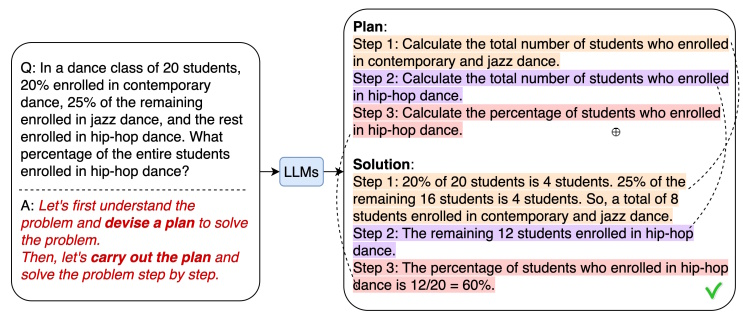
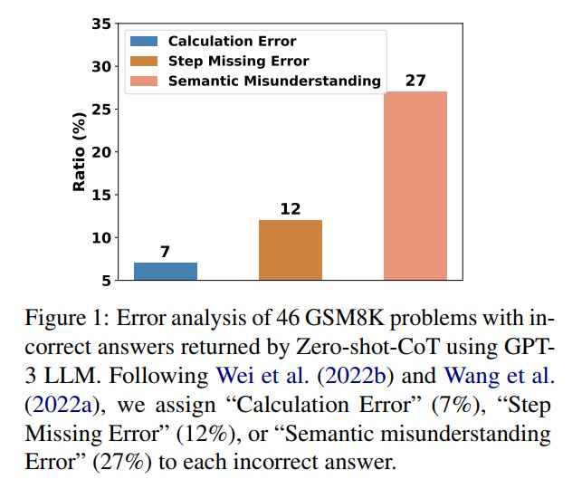
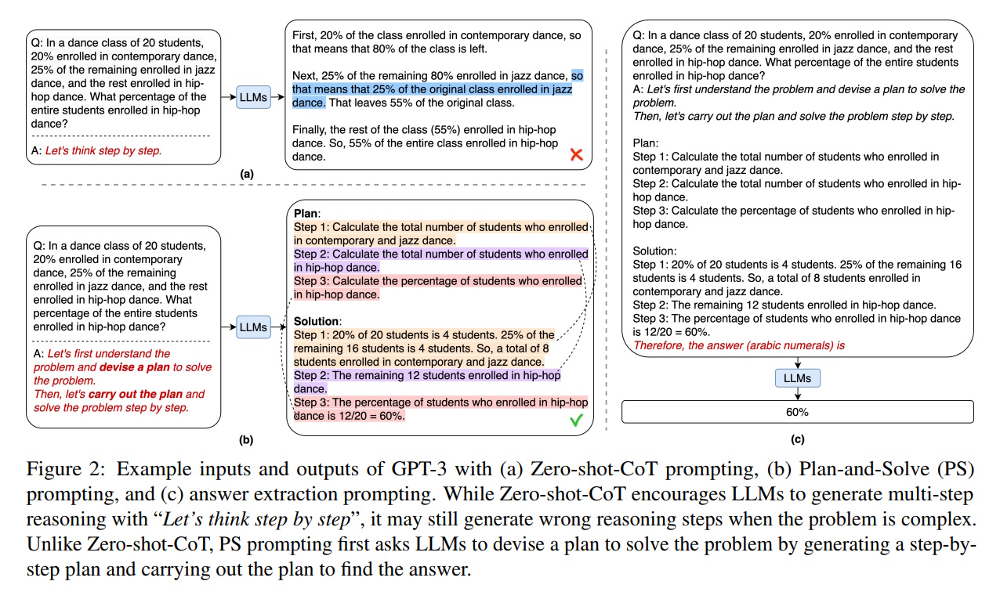
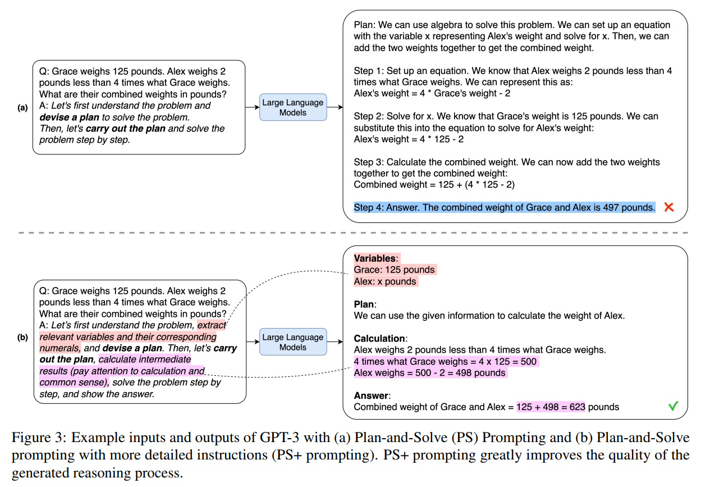
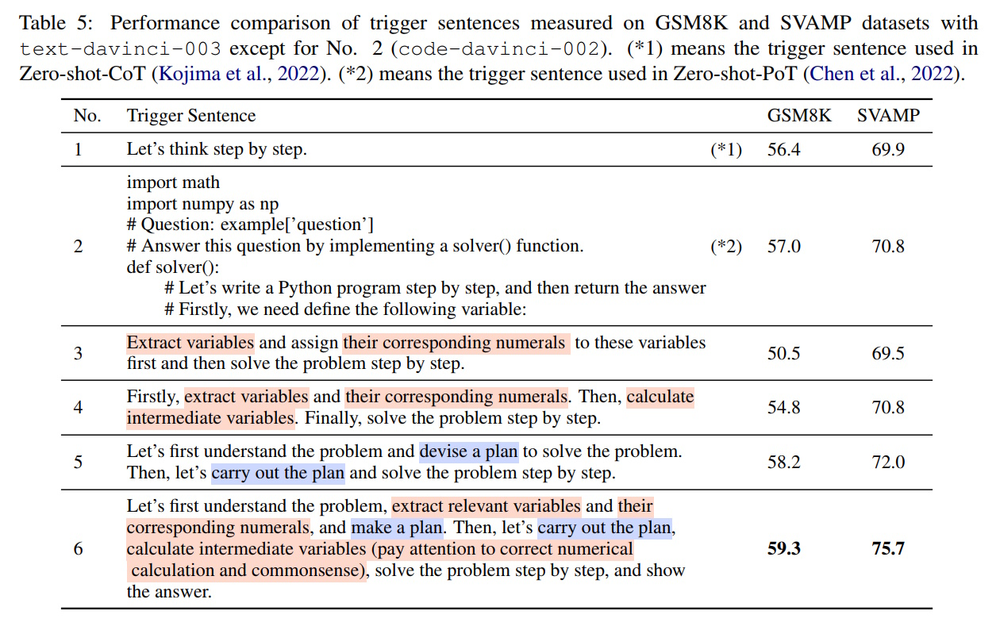

# Plan-and-Solve Prompting: Enhancing Reasoning in AI Language Models

## Table of Contents

1. [**Introduction**](#1-introduction)  
2. [**What is Plan-and-Solve Prompting?**](#2-what-is-plan-and-solve-prompting)  
3. [**How It Works**](#3-how-it-works)  
4. [**Results and Improvements**](#4-results-and-improvements)  
   - [4.1 Arithmetic Reasoning](#41-arithmetic-reasoning)  
   - [4.2 Commonsense and Symbolic Reasoning](#42-commonsense-and-symbolic-reasoning)  
   - [4.3 Overall Performance](#43-overall-performance)  
5. [**Understanding the Methodology**](#5-understanding-the-methodology)  
   - [5.1 Basic Plan-and-Solve (PS) Prompting](#51-basic-plan-and-solve-ps-prompting)  
   - [5.2 Enhanced Plan-and-Solve (PS+) Prompting](#52-enhanced-plan-and-solve-ps-prompting)  
   - [5.3 Examples in Action](#53-examples-in-action)  
6. [**Analyzing Errors and Solutions**](#6-analyzing-errors-and-solutions)  
   - [6.1 Common Errors in Traditional Methods](#61-common-errors-in-traditional-methods)  
   - [6.2 How Plan-and-Solve Reduces Errors](#62-how-plan-and-solve-reduces-errors)
   - [6.3 Trigger Sentences and Their Effectiveness](#63-trigger-sentences-and-their-effectiveness)
7. [**Conclusion**](#7-conclusion)  
8. [**References**](#8-references)

---

## 1. Introduction

Artificial Intelligence (AI) has made significant strides in understanding and generating human language. Large Language Models (LLMs) like GPT-3 have been instrumental in tasks such as translation, summarization, and answering questions. However, when it comes to solving complex, multi-step problems, these models sometimes struggle. To address this, researchers have developed new techniques to improve the reasoning abilities of these AI systems. One such technique is **Plan-and-Solve Prompting**.

---

## 2. What is Plan-and-Solve Prompting?

Plan-and-Solve Prompting is a strategy designed to enhance the reasoning capabilities of AI language models, especially in situations where the model needs to solve problems step by step without prior examples. Traditional methods like Zero-shot Chain-of-Thought (Zero-shot-CoT) prompting instruct the model to think through problems sequentially by adding phrases like "Let’s think step by step." While effective to some extent, these methods can still lead to mistakes in calculations or missing important reasoning steps.

Plan-and-Solve (PS) and its enhanced version, Plan-and-Solve Plus (PS+), aim to overcome these limitations by breaking down tasks into smaller, manageable parts. This approach helps the model reason more accurately and consistently, leading to better performance on various types of problems.

---

## 3. How It Works

The Plan-and-Solve method involves two main steps:

1. **Planning:** The model first creates a detailed plan outlining how to approach and solve the problem.
2. **Solving:** Using the plan, the model then works through each step to reach the final solution.

The enhanced version, PS+, adds more detailed instructions to ensure each part of the process is handled correctly, such as extracting relevant information and verifying calculations.

---

## 4. Results and Improvements

Researchers tested Plan-and-Solve Prompting on several datasets to measure its effectiveness. The results showed significant improvements compared to traditional Zero-shot-CoT methods.

### 4.1 Arithmetic Reasoning

Arithmetic problems often involve multiple calculations. The study tested PS+ on six arithmetic datasets, including GSM8K and MultiArith.

- **GSM8K Dataset:** Accuracy improved from 56.4% with Zero-shot-CoT to 59.3% with PS+.
- **MultiArith Dataset:** Accuracy increased from 83.8% to 91.8%.

### 4.2 Commonsense and Symbolic Reasoning

For tasks requiring understanding of everyday logic or symbolic manipulation:

- **CommonsenseQA:** Accuracy rose from 65.2% to 71.9%.
- **Symbolic Tasks (e.g., Coin Flip):** PS+ achieved 99.6% accuracy, nearly matching the perfect score of Few-shot-CoT.

### 4.3 Overall Performance

Here’s a summary of how different methods performed across various datasets:

| Dataset         | Zero-shot-CoT | Zero-shot-PS+ | Few-shot-CoT |
|-----------------|---------------|---------------|--------------|
| GSM8K           | 56.4%         | 59.3%         | 58.4%        |
| MultiArith      | 83.8%         | 91.8%         | 93.6%        |
| CommonsenseQA   | 65.2%         | 71.9%         | 78.3%        |
| Last Letters    | 64.8%         | 75.2%         | 70.6%        |
| Coin Flip       | 96.8%         | 99.6%         | 100%         |

*Table 1: Performance Comparison Across Datasets*

PS+ consistently outperformed Zero-shot-CoT and even rivaled Few-shot-CoT in many cases, demonstrating its effectiveness in enhancing reasoning abilities.

---

## 5. Understanding the Methodology

### 5.1 Basic Plan-and-Solve (PS) Prompting

In the basic PS approach, the model is guided to:

1. **Plan:** Create a step-by-step plan to tackle the problem.
2. **Solve:** Follow the plan to find the solution.

**Example Prompt:**
*"Let’s first understand the problem and devise a plan. Then, let’s carry out the plan step by step."*

**Generated Plan:**
1. Identify variables.
2. Determine necessary operations.
3. Compute the results.

### 5.2 Enhanced Plan-and-Solve (PS+) Prompting

PS+ adds more detailed instructions to the basic PS method, such as:

- Extracting relevant numbers and variables.
- Ensuring each calculation is accurate.
- Verifying each step to prevent errors.

**Example Prompt:**
*"Let’s first understand the problem, extract variables, and devise a plan. Then, calculate intermediate results and solve step by step."*

This extra detail helps the model avoid mistakes and maintain logical consistency.

### 5.3 Examples in Action

**Arithmetic Example (GSM8K):**

**Problem:** James runs 3 sprints 3 times a week. Each sprint is 60 meters. How many meters does he run in total?

**Steps:**
1. Identify variables:
   - Sprints per session: 3
   - Sessions per week: 3
   - Meters per sprint: 60
2. Plan:
   - Total distance = sprints × sessions × meters per sprint
3. Calculate:
   - 3 × 3 × 60 = 540

**Answer:** James runs **540 meters** in a week.

---

## 6. Analyzing Errors and Solutions

### 6.1 Common Errors in Traditional Methods

Figure 1 shows the types of errors made by Zero-shot-CoT in solving GSM8K problems:

1. **Calculation Errors (7%)**: Mistakes in numerical computations.
2. **Step Missing Errors (12%)**: Omitting important reasoning steps.
3. **Semantic Misunderstanding Errors (27%)**: Misinterpreting the problem's meaning or logic.

Semantic errors were the most common, highlighting challenges in understanding complex problems.

### 6.2 How Plan-and-Solve Reduces Errors

Figure 2 compares the performance of Zero-shot-CoT and Plan-and-Solve Prompting:

- **Zero-shot-CoT:** Often skipped key steps, leading to incorrect answers.
- **Plan-and-Solve (PS):** Improved accuracy by following a structured plan.
- **Answer Extraction Prompting:** Further enhanced results by focusing on extracting the final answer correctly.

Figure 3 illustrates the difference between PS and PS+ in solving a weight problem:

**Problem:** Grace weighs 125 pounds. Alex weighs 2 pounds less than 4 times what Grace weighs. Calculate their combined weight.

- **PS Prompting:** Made a calculation error, resulting in an incorrect total.
- **PS+ Prompting:** Followed detailed steps and achieved the correct total of 623 pounds.

These examples show that detailed planning and step-by-step instructions significantly reduce errors.

### 6.3 Trigger Sentences and Their Effectiveness

**Table 5** evaluates the impact of various trigger sentences on reasoning accuracy across two datasets: **GSM8K** (focused on arithmetic reasoning) and **SVAMP** (math word problems). Each trigger sentence acts as a prompt to guide the language model’s reasoning process.

#### Key Observations from Table 5:

1. **Trigger Sentences and Their Variations**:
   - Trigger sentences range from generic instructions like *"Let’s think step by step"* to more specific guidance such as *"Extract relevant variables and make a plan."*
   - The specificity of the trigger sentence directly influences the model’s reasoning capabilities.

2. **Performance Metrics**:
   - Accuracy results from the GSM8K and SVAMP datasets highlight how different prompts impact problem-solving success.
   - For example, simple prompts like *"Let’s think step by step"* provide basic guidance but often lack the detail needed for complex reasoning tasks.

---

## 7. Conclusion

Plan-and-Solve Prompting, especially its enhanced version PS+, provides a powerful method to improve the reasoning abilities of AI language models. By breaking down problems into manageable steps and providing detailed instructions, PS and PS+ help models achieve higher accuracy and consistency in their solutions. The significant improvements across various datasets demonstrate the potential of these methods in making AI more reliable and effective in solving complex problems.

Future research may focus on further refining these prompts and expanding their application to other areas beyond reasoning tasks, making AI even more versatile and accurate.

---

## 8. References

- **Plan-and-Solve Prompting: Improving Zero-Shot Chain-of-Thought Reasoning by Large Language Models**  
  [https://arxiv.org/abs/2305.04091](https://arxiv.org/abs/2305.04091)

- **Plan-and-Execute (Coding)**  
  [https://langchain-ai.github.io/langgraph/tutorials/plan-and-execute/plan-and-execute/](https://langchain-ai.github.io/langgraph/tutorials/plan-and-execute/plan-and-execute/)