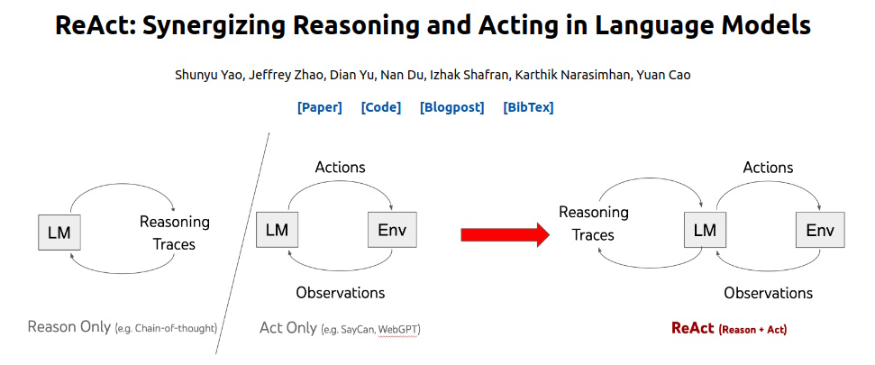
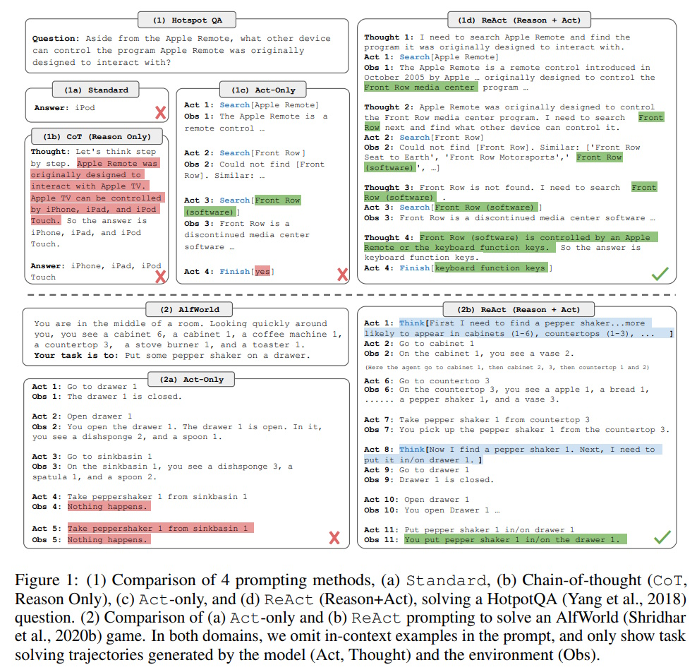
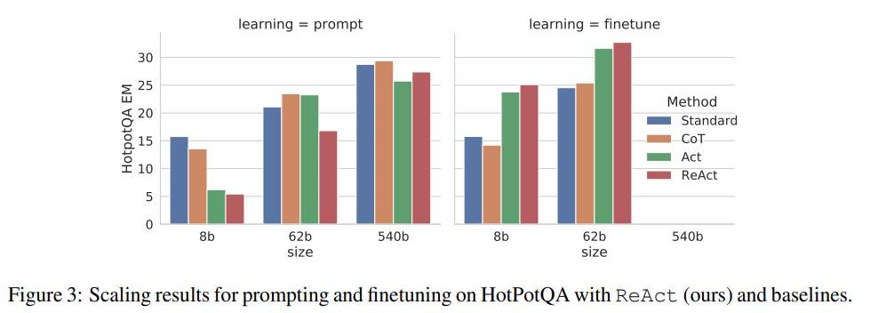

# REACT: Synergizing Reasoning and Acting in Language Models

## Table of Contents

- [Introduction](#introduction)
- [Methodology](#methodology)
  - [What is ReAct?](#what-is-react)
  - [How ReAct Works](#how-react-works)
  - [Action Space](#action-space)
  - [Comparison with Other Methods](#comparison-with-other-methods)
- [Results and Observations](#results-and-observations)
  - [Performance on Different Tasks](#performance-on-different-tasks)
  - [Scaling with Model Size](#scaling-with-model-size)
- [Examples](#examples)
  - [Figure 1: Comparison of Prompting Methods](#figure-1-comparison-of-prompting-methods)
  - [HotpotQA Example](#hotpotqa-example)
  - [ALFWorld Example](#alfworld-example)
  - [Tool-Use Example: Using a Calculator](#tool-use-example-using-a-calculator)
  - [Figure 3: Scaling Results for HotPotQA](#figure-3-scaling-results-for-hotpotqa)
- [Conclusion](#conclusion)
- [References](#references)

## Introduction

Large Language Models (LLMs) like ChatGPT have shown they can understand language and make decisions interactively. However, they usually handle reasoning (thinking through problems) and acting (taking actions) separately. The REACT paper introduces a new approach that combines both reasoning and acting together, making these models work better and more reliably.

## Methodology

### What is ReAct?

ReAct stands for **Reason + Act**. It’s a way to make language models do two things at the same time:

1. **Reasoning:** Thinking through a problem step-by-step.
2. **Acting:** Taking actions based on that reasoning, like searching for information or performing tasks.

By doing both together, ReAct helps the model solve problems more effectively.

### How ReAct Works

ReAct uses prompts to guide the language model to alternate between reasoning and acting. Here’s how it works in simple steps:

1. **Prompt the Model:** Start with a question or task.
2. **Generate Reasoning:** The model thinks through the problem and writes down its thoughts.
3. **Take Action:** Based on its thoughts, the model performs an action, like searching a database.
4. **Observe Results:** The model looks at the results of its action.
5. **Repeat:** The model continues this process until it arrives at an answer.

### Action Space

When using ReAct, the model can perform specific actions. For example, when interacting with Wikipedia, the actions include:

- **Search:** Look up a topic.
- **Lookup:** Find specific information.
- **Finish:** Conclude the task.

### Comparison with Other Methods

ReAct is compared to three other methods:

| Method                  | Description                                                           |
|-------------------------|-----------------------------------------------------------------------|
| **Standard Prompting**  | The model answers directly without extra reasoning or actions.       |
| **Chain-of-Thought (CoT)** | The model thinks through the problem step-by-step but doesn’t take actions. |
| **Act-Only Prompting**  | The model takes actions without reasoning through the problem.       |

ReAct combines the strengths of CoT and Act-Only prompting, leading to better performance.

## Results and Observations

### Performance on Different Tasks

ReAct was tested on four tasks:

1. **HotpotQA:** A question-answering task.
2. **Fever:** Fact verification.
3. **ALFWorld:** Interactive decision-making in a virtual environment.
4. **WebShop:** Online shopping tasks.

**Findings:**

- **HotpotQA & Fever:** ReAct was better at finding correct answers by reasoning and using Wikipedia effectively.
- **ALFWorld & WebShop:** ReAct outperformed other methods by 34% and 10% respectively, showing its strength in decision-making tasks.

### Scaling with Model Size

ReAct works well with different sizes of language models:

| Model Size | Standard Prompting | CoT Prompting | Act-Only Prompting | ReAct           |
|------------|--------------------|---------------|--------------------|-----------------|
| 8B         | Low Performance    | Medium        | Medium             | High            |
| 62B        | Improved           | Better        | Better             | Best            |
| 540B       | Higher             | High          | High               | Highest         |

**Key Points:**

- Larger models perform better across all methods.
- ReAct consistently outperforms other methods, especially as the model size increases.
- Fine-tuning (training the model further) boosts performance for all methods, with ReAct benefiting the most.

## Examples

### Figure 1: Comparison of Prompting Methods

### HotpotQA Example

**Question:** *Aside from the Apple Remote, what other device can control the program Apple Remote was originally designed to interact with?*

| **Method**                  | **Process**                                      | **Answer**                      |
|-----------------------------|--------------------------------------------------|---------------------------------|
| **Standard Prompting**      | Direct answer without reasoning.                | iPod                            |
| **Chain-of-Thought (CoT)**  | Step-by-step reasoning internally.              | iPhone, iPad, iPod Touch        |
| **Act-Only Prompting**      | Searches Wikipedia but lacks reasoning.         | Yes (incorrect)                 |
| **ReAct**                   | Combines reasoning and searches Wikipedia.      | Keyboard function keys          |

**Summary:** ReAct uses both thinking and searching to find the correct answer.

### ALFWorld Example

**Task:** *Put some pepper shaker on a drawer.*

| **Method**                  | **Process**                                      | **Outcome**                     |
|-----------------------------|--------------------------------------------------|---------------------------------|
| **Act-Only Prompting**      | Tries actions without reasoning.                | Fails to find the pepper shaker.|
| **ReAct**                   | Thinks about where to find the pepper shaker and acts accordingly. | Successfully places the pepper shaker in the drawer. |

**Summary:** ReAct effectively combines reasoning with actions to complete the task.

### Tool-Use Example: Using a Calculator

**Problem:** *What is the result of (15 * 3) + (20 / 4)?*

**ReAct Workflow:**

1. **Thought:** Need to calculate 15 * 3 and 20 / 4 first.
   - **Action:** Use calculator for **15 * 3**.
   - **Observation:** 45
2. **Thought:** Now calculate 20 / 4.
   - **Action:** Use calculator for **20 / 4**.
   - **Observation:** 5
3. **Thought:** Add 45 and 5.
   - **Action:** Use calculator for **45 + 5**.
   - **Observation:** 50
4. **Thought:** Final answer is 50.
   - **Action:** Finish with **50**.

**Summary:** ReAct breaks down the problem, uses the calculator for each step, and arrives at the correct answer.

### Figure 3: Scaling Results for HotPotQA

**Key Observations:**

1. **Model Size Impact:**
   - **Prompting:** Performance improves as model size increases.
   - **Fine-Tuning:** Larger models benefit more, showing significant performance gains.

2. **Method Comparison:**
   - **Standard Prompting:** Lowest performance across all sizes.
   - **Chain-of-Thought (CoT) Prompting:** Better than Standard but below ReAct.
   - **Act-Only Prompting:** Moderate performance, better with fine-tuning.
   - **ReAct (Reason + Act) Prompting:** Consistently outperforms others across all sizes.

3. **Prompting vs. Fine-Tuning:**
   - **Prompting:** ReAct shows significant improvements, especially with larger models.
   - **Fine-Tuning:** Further enhances all methods, with ReAct achieving the highest scores.

## Conclusion

ReAct introduces a powerful way to combine reasoning and acting in large language models. By interleaving thinking and actions, ReAct improves performance on various tasks, makes models more interpretable, and builds trust. The approach works well across different model sizes and tasks, showing that combining reasoning with actions is a promising direction for future AI development.

## References

1. **REACT: Synergizing Reasoning and Acting in Language Models**  
   [https://arxiv.org/pdf/2210.03629](https://arxiv.org/pdf/2210.03629)

2. **How to use the pre-built ReAct agent**  
   [https://langchain-ai.github.io/langgraph/how-tos/create-react-agent/](https://langchain-ai.github.io/langgraph/how-tos/create-react-agent/)

3. **How to create a ReAct agent from scratch**  
   [https://langchain-ai.github.io/langgraph/how-tos/react-agent-from-scratch/](https://langchain-ai.github.io/langgraph/how-tos/react-agent-from-scratch/)
