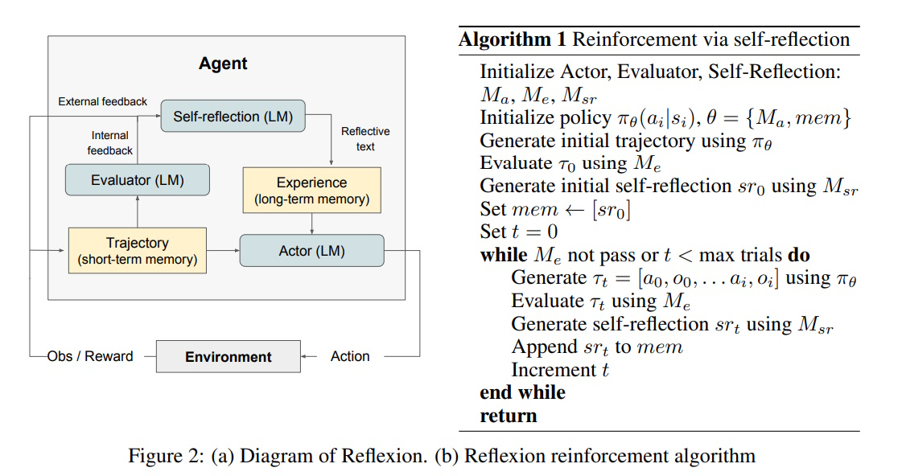
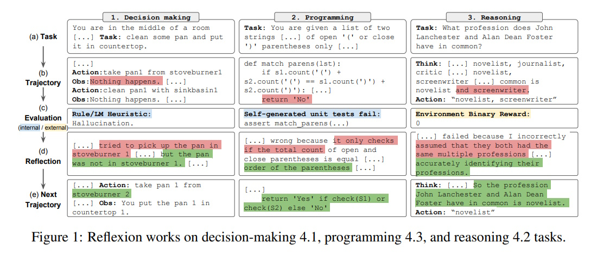
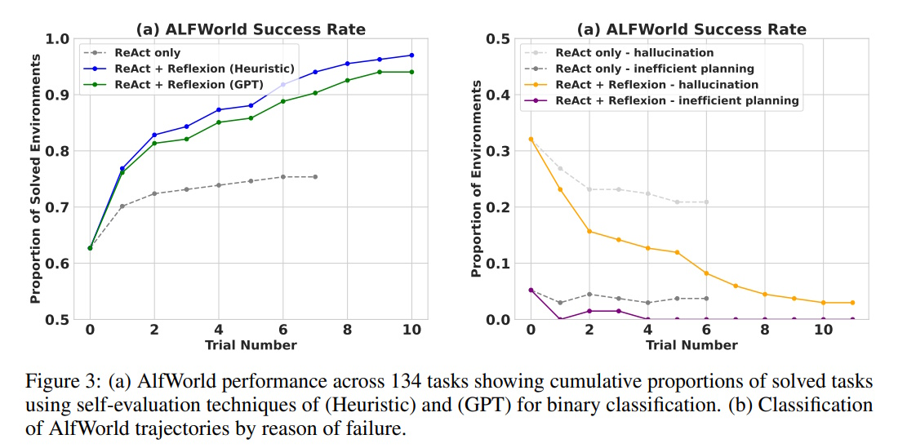

# Reflexion: Language Agents with Verbal Reinforcement Learning

## Table of Contents

1. [Abstract](#abstract)
2. [Introduction](#introduction)
3. [Understanding Reflexion](#understanding-reflexion)
4. [How Reflexion Works](#how-reflexion-works)
5. [Experiments and Results](#experiments-and-results)
6. [Example of Reflexion in Action](#example-of-reflexion-in-action)
7. [Comparison: Reflexion vs. Self-Refine](#comparison-reflexion-vs-self-refine)
8. [Conclusion](#conclusion)
9. [References](#references)

---

## Abstract

Large language models (LLMs) are increasingly used as goal-driven agents to interact with environments like games, compilers, and APIs. However, traditional reinforcement learning (RL) methods require many training samples and costly model adjustments. We introduce **Reflexion**, a new framework that improves language agents through verbal feedback instead of weight updates. Reflexion agents reflect verbally on task feedback and store these reflections in memory to make better decisions in future attempts. This method is flexible, supporting various feedback types and sources, and shows significant improvements across tasks like decision-making, coding, and reasoning. For instance, Reflexion achieves a 91% accuracy on the HumanEval coding benchmark, outperforming GPT-4's 80%. We also explore different feedback methods and their impact on performance. All code and resources are available [here](https://github.com/noahshinn024/reflexion).

## Introduction

Recent advancements have shown that large language models (LLMs) can function as autonomous agents, making decisions and performing tasks by generating text and actions. Examples include ReAct, SayCan, Toolformer, HuggingGPT, generative agents, and WebGPT. These methods leverage LLMs to interact with APIs and environments but are limited by the need for extensive training and computational resources when using traditional RL techniques.

In this paper, we present **Reflexion**, an alternative approach that uses verbal reinforcement to help agents learn from their mistakes without updating the model's weights. Instead of relying on gradient-based learning, Reflexion agents receive verbal feedback and store reflections in memory to guide future actions. This method mirrors how humans learn by reflecting on past errors to improve future performance.

## Understanding Reflexion



Reflexion is built around a modular framework comprising three main components: the `Actor`, `Evaluator`, and `Self-Reflection` models. Additionally, memory plays a crucial role in storing reflections for long-term learning.

### Core Components

#### Actor

The Actor is an LLM tasked with generating text and actions based on the current state. Similar to policy-based RL, the Actor selects an action from its policy and interacts with the environment to receive observations. Different Actor models, such as Chain of Thought and ReAct, can be utilized within this framework.

#### Evaluator

The Evaluator assesses the quality of the Actor's outputs. It takes the generated actions and trajectories as input and assigns a reward score that reflects the agent's performance in the given task.

#### Self-Reflection

The Self-Reflection model, also an LLM, generates verbal feedback based on the Evaluator's scores and the agent's experiences. This feedback helps the Actor understand its mistakes and guides it to improve in future attempts.

#### Memory

Memory is divided into short-term and long-term components. The Actor uses both types of memory to inform its decisions, allowing it to remember recent details and retain important lessons from past experiences.

## How Reflexion Works



Reflexion enables agents to learn from mistakes through **self-reflection** and **verbal reinforcement**, improving performance across diverse tasks like decision-making, programming, and reasoning.

### 1. **Decision-Making**
**Task**: Clean a pan and place it on the countertop.
- **Initial Attempt**: The agent tries to take the pan from `stoveburner1` but fails because the pan is not there (hallucination error).
- **Reflection**: The agent reflects on the mistake and realizes the pan is actually on `stoveburner2`.
- **Improved Action**: The agent successfully takes the pan from `stoveburner2` and completes the task.

**How Reflexion Works**:
- The agent uses **self-reflection** to identify the hallucination error (incorrect assumption about the pan's location).
- It updates its strategy and retries, leading to successful task completion.

### 2. **Programming**
**Task**: Write a function to check if parentheses in two strings are balanced.
- **Initial Implementation**: The function only checks if the total count of open and close parentheses is equal, but it fails to consider the order of parentheses.
- **Unit Test Failure**: Self-generated unit tests reveal the flaw in the implementation.
- **Reflection**: The agent reflects on the error and realizes the need to validate the order of parentheses.
- **Improved Implementation**: The agent revises the function to check both the count and order of parentheses, passing all unit tests.

**How Reflexion Works**:
- The agent uses **self-generated unit tests** to evaluate its code.
- It reflects on the test failures and improves the implementation iteratively.

### 3. **Reasoning**
**Task**: Identify the common profession between John Lanchester and Alan Dean Foster.
- **Initial Attempt**: The agent incorrectly assumes both are novelists and screenwriters.
- **Binary Reward**: The environment provides a failure signal (reward = 0).
- **Reflection**: The agent reflects on the mistake and realizes it incorrectly assumed multiple professions.
- **Improved Answer**: The agent correctly identifies "novelist" as the common profession.

**How Reflexion Works**:
- The agent uses **binary feedback** (success/failure) to guide its reasoning.
- It reflects on the error and refines its answer, leading to the correct solution.

### Summary of Reflexion Workflow:
1. **Initial Attempt**: The agent performs the task based on its current knowledge.
2. **Feedback**: The environment provides feedback (e.g., binary reward, unit test results).
3. **Self-Reflection**: The agent reflects on the feedback to identify mistakes and generate actionable insights.
4. **Improved Attempt**: The agent applies the insights to refine its strategy and retries the task.
5. **Iteration**: This process repeats until the task is successfully completed.

---

## Experiments and Results



We evaluate the Reflexion framework on the **ALFWorld benchmark**, a text-based environment that requires agents to solve multi-step tasks in interactive household settings. The results demonstrate the effectiveness of Reflexion in improving agent performance through self-reflection and verbal reinforcement. Below, we present the results and analysis based on the provided figure.

### 1. **ALFWorld Success Rate (Figure 3a)**
**Task**: ALFWorld tasks involve complex, multi-step decision-making, such as finding objects, moving items, or manipulating objects with tools. Agents must navigate the environment using natural language commands and observations.

**Setup**:
- **Baseline**: ReAct (Reasoning and Acting) without Reflexion.
- **Reflexion**: ReAct enhanced with Reflexion, using either heuristic-based or GPT-based self-evaluation.
- **Evaluation Metrics**: Success rate (proportion of tasks solved) over multiple trials.

**Results**:
- Reflexion significantly outperforms the baseline ReAct approach. After 10 trials, Reflexion achieves a **success rate of approximately 90%**, compared to **around 70% for ReAct alone**.
- Both Reflexion variants (Heuristic and GPT) show steady improvement over trials, indicating that the agent effectively learns from its mistakes through self-reflection.
- By the 10th trial, Reflexion nearly solves all tasks, demonstrating its ability to iteratively refine decision-making strategies.

**Key Insight**: Reflexion enables agents to learn from past mistakes and improve their performance over multiple trials, even in complex, multi-step environments.

### 2. **Classification of ALFWorld Trajectories by Reason of Failure (Figure 3b)**
**Analysis**: We categorize the reasons for task failures into two main types:
1. **Hallucination**: Errors where the agent incorrectly assumes the presence or state of objects.
2. **Inefficient Planning**: Errors due to suboptimal action sequences or prolonged task execution.

**Results**:
- The baseline ReAct approach shows a **higher proportion of failures** due to both hallucination and inefficient planning. For example, hallucination errors account for **~20% of failures**, and inefficient planning accounts for **~15%**.
- Reflexion significantly reduces these errors. By the 10th trial, hallucination errors drop to **~5%**, and inefficient planning errors drop to **~3%**.
- Reflexion agents learn to avoid repeating mistakes by reflecting on past failures and refining their action plans.

**Key Insight**: Reflexion reduces both hallucination and inefficient planning errors, enabling agents to execute tasks more effectively and efficiently.

---

## Example of Reflexion in Action

### Prompt for a Programming Task:

```plaintext
You are a Python programming assistant. You will be given your previous implementation of a function, a series of unit test results, and your self-reflection on your previous implementation. Apply the necessary changes below by responding only with the improved body of the function. Do not include the signature in your response. The first line of your response should have 4 spaces of indentation so that it fits syntactically with the user-provided signature.

**Previous Implementation:**
def match_parens(lst):
    if s1.count('(') + s2.count('(') == s1.count(')') + s2.count(')'):
        return 'Yes'
    return 'No'

**Unit Test Results:**
assert match_parens(['(()', ')())']) == 'No'  # Failed
assert match_parens(['()', '()']) == 'Yes'    # Passed

**Self-Reflection:**
The previous implementation only checks if the total count of open and close parentheses is equal, but it does not consider the order of the parentheses. This leads to incorrect results when the parentheses are not properly nested.

**Improved Implementation:**
    def check(s):
        balance = 0
        for char in s:
            if char == '(':
                balance += 1
            else:
                balance -= 1
            if balance < 0:
                return False
        return balance == 0
    return 'Yes' if check(lst[0]) or check(lst[1]) else 'No'
```

### Explanation of How the Example Works

1. **Initial Implementation**: The function `match_parens` checks if the number of open and close parentheses in two strings is equal. However, it doesn't verify the correct order, causing errors in cases where parentheses are not properly nested.
2. **Unit Test Results**: The tests show that the function fails for `['(()', ')())']` because the parentheses are not correctly ordered, despite having balanced counts.
3. **Self-Reflection**: The self-reflection identifies the flaw: the function ignores the order of parentheses, which is essential for determining proper nesting.
4. **Improved Implementation**: The revised function includes a helper `check` that verifies the balance and order of parentheses. This change ensures that the function correctly handles nested parentheses and passes all tests.

### How Reflexion Works in This Example

- **Actor (LM)**: Creates the initial function implementation.
- **Evaluator (LM)**: Runs unit tests and provides feedback on success or failure.
- **Self-Reflection (LM)**: Analyzes the feedback to identify specific issues in the implementation.
- **Memory**: Stores the reflection to guide improvements in future attempts.

Through this iterative process, Reflexion enables the agent to learn from mistakes and enhance its performance effectively.

## Comparison: Reflexion vs. Self-Refine

| Workflow Step              | Reflexion                          | Self-Refine [15]                  |
|----------------------------|------------------------------------|-----------------------------------|
| **1. Initial Generation**   | The **Actor (LM)** generates an initial action or output (e.g., code, decision, or reasoning) based on the task. | The model generates an initial output (e.g., text or response) based on the task. |
| **2. Evaluation**           | The **Evaluator (LM)** assesses the output using binary rewards (success/failure) or unit tests (for programming tasks). | The model evaluates its own output based on predefined criteria or constraints (e.g., "make the text more positive"). |
| **3. Feedback**             | The **Self-Reflection (LM)** generates verbal feedback (reflective text) to identify mistakes and suggest improvements. | The model generates self-feedback to refine the output, but without explicit verbal reflection. |
| **4. Memory Update**        | The reflective text is stored in **episodic memory** for future reference, enabling long-term learning. | No memory is used; each refinement is independent of previous iterations. |
| **5. Iterative Refinement** | The **Actor (LM)** uses the reflective text and memory to generate an improved output in the next trial. | The model iteratively refines the output based on self-feedback, but without memory or long-term learning. |
| **6. Termination**          | The process continues until the **Evaluator** deems the output correct or a maximum number of trials is reached. | The process stops when the output meets the refinement criteria or after a fixed number of iterations. |

### Key Differences in Workflow:

1. **Feedback Mechanism**:
   - **Reflexion**: Uses **verbal self-reflection** to provide detailed, interpretable feedback on mistakes and improvements.
   - **Self-Refine**: Relies on **direct refinement** without explicit verbal feedback, making it less interpretable.

2. **Memory**:
   - **Reflexion**: Maintains **episodic memory** to store past reflections and experiences, enabling long-term learning across trials.
   - **Self-Refine**: Does not use memory; each refinement is independent of previous iterations.

3. **Evaluation**:
   - **Reflexion**: Uses **binary rewards** (success/failure) or **unit tests** (for programming tasks) to evaluate outputs.
   - **Self-Refine**: Evaluates outputs based on **task-specific constraints** (e.g., "make the text more positive") without binary rewards.

4. **Scope of Application**:
   - **Reflexion**: Works across **multi-step tasks** (e.g., decision-making, reasoning, programming) by leveraging memory and self-reflection.
   - **Self-Refine**: Focuses on **single-generation tasks** (e.g., text refinement) and does not handle multi-step decision-making or programming tasks.

5. **Interpretability**:
   - **Reflexion**: Provides **interpretable self-reflections**, making it easier to understand why and how the agent improves.
   - **Self-Refine**: Less interpretable, as it directly refines outputs without explicit explanations.

### Summary of Workflows:
- **Reflexion**: 
  - Iteratively improves outputs through **verbal self-reflection** and **memory**.
  - Suitable for **complex, multi-step tasks** like decision-making, reasoning, and programming.
  - Provides **interpretable feedback** and long-term learning.

- **Self-Refine**:
  - Iteratively refines outputs through **self-feedback** without memory or verbal reflection.
  - Focused on **single-generation tasks** like text refinement.
  - Less interpretable and does not support long-term learning or multi-step tasks.

---

## Conclusion

Reflexion presents a novel approach to enhancing language agents by leveraging verbal reinforcement and self-reflection instead of traditional reinforcement learning methods. By integrating components like the Actor, Evaluator, and Self-Reflection models, and utilizing memory for storing reflections, Reflexion enables agents to learn efficiently from their experiences. Our experiments demonstrate significant performance improvements across diverse tasks, showcasing Reflexion's potential as a powerful tool for developing intelligent and adaptive language agents. Future work can explore further enhancements and applications of this framework to even more complex environments.

## References

1. **Reflexion: Language Agents with Verbal Reinforcement Learning**  
   [https://arxiv.org/abs/2303.11366](https://arxiv.org/abs/2303.11366)

2. **Implement Reflexion with LangGraph**  
   [https://langchain-ai.github.io/langgraph/tutorials/reflexion/reflexion/](https://langchain-ai.github.io/langgraph/tutorials/reflexion/reflexion/)

3. **Implement Reflexion with AutoGen**  
   [https://microsoft.github.io/autogen/stable/user-guide/core-user-guide/design-patterns/reflection.html](https://microsoft.github.io/autogen/stable/user-guide/core-user-guide/design-patterns/reflection.html)

