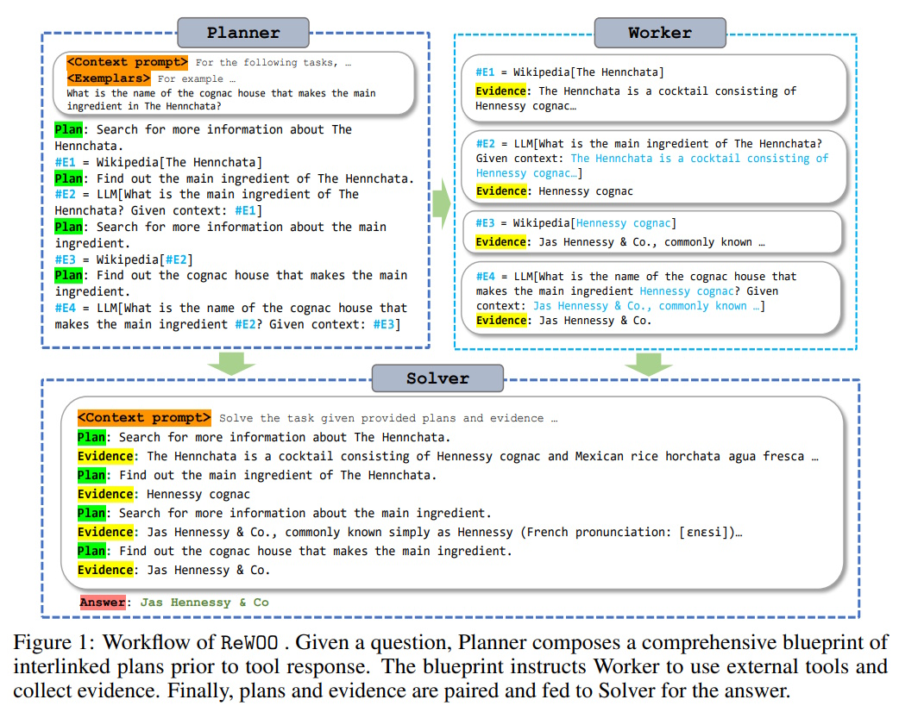
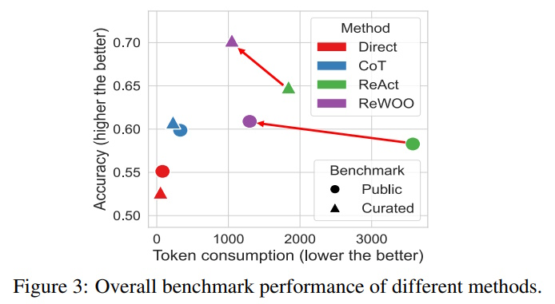

# ReWOO: Enhancing Augmented Language Models with Efficient Reasoning

## Table of Contents

- [Introduction](#introduction)
- [What is ReWOO?](#what-is-rewoo)
  - [Planner, Worker, and Solver](#planner-worker-and-solver)
  - [Plan-Work-Solve Paradigm](#plan-work-solve-paradigm)
  - [Figure 1: ReWOO Workflow](#figure-1-rewoo-workflow)
- [Key Features of ReWOO](#key-features-of-rewoo)
  - [Prompt Redundancy Reduction](#prompt-redundancy-reduction)
    - [Figure 2: Reasoning Approaches](#figure-2-reasoning-approaches)
  - [Parameter Efficiency by Specialization](#parameter-efficiency-by-specialization)
- [Experiments and Results](#experiments-and-results)
  - [Experimental Setup](#experimental-setup)
    - [Tasks and Datasets](#tasks-and-datasets)
    - [Baselines](#baselines)
    - [Exemplars](#exemplars)
    - [Action Space](#action-space)
    - [Evaluation Metrics](#evaluation-metrics)
    - [Fine-tuning](#fine-tuning)
  - [Results and Observations](#results-and-observations)
    - [ReWOO vs ReAct](#rewoo-vs-react)
      - [Figure 3: Performance Comparison](#figure-3-performance-comparison)
    - [Performance on Curated Tasks](#performance-on-curated-tasks)
    - [Effect of Extraneous Tools](#effect-of-extraneous-tools)
    - [Robustness to Tool Failures](#robustness-to-tool-failures)
- [Comparison: ReWOO vs ReAct](#comparison-rewoo-vs-react)
- [Conclusion](#conclusion)
- [References](#references)

## Introduction

In recent years, **Large Language Models (LLMs)** like GPT-4 have revolutionized natural language processing by enabling advanced reasoning and language understanding. To further enhance their capabilities, a new paradigm has emerged: **Augmented Language Models (ALMs)**. ALMs combine the reasoning power of LLMs with external tools, allowing models to interact with their environment, retrieve up-to-date information, and perform actions.

However, existing ALM systems often face challenges related to high computational costs and inefficiency due to redundant prompts and repeated executions. This is where **ReWOO (Reasoning Without Observation)** comes into play, offering a novel approach to make ALMs more efficient and scalable.

## What is ReWOO?

ReWOO stands for **Reasoning Without Observation**, a modular framework designed to enhance the efficiency of ALMs by decoupling the reasoning process from external observations. Unlike traditional ALM systems that interleave reasoning with tool interactions, ReWOO separates these components into distinct modules, reducing token consumption and improving performance.

### Planner, Worker, and Solver

ReWOO organizes the ALM into three main components:

1. **Planner**: Breaks down the task into a series of interdependent plans.
2. **Worker**: Executes the plans by interacting with external tools to retrieve necessary evidence.
3. **Solver**: Synthesizes the plans and evidence to generate the final answer.

This separation allows each module to operate independently, enhancing efficiency and scalability.

### Plan-Work-Solve Paradigm

ReWOO introduces the **Plan-Work-Solve** paradigm:

- **Planner**: Creates a blueprint of steps needed to solve the task.
- **Worker**: Fetches evidence from external tools based on the planner's instructions.
- **Solver**: Combines the plans and evidence to provide the final solution.

For example, if the task is to determine the main ingredient in "The Henochata" and identify the cognac house that produces it:

1. **Planner** generates plans to:
   - Search for information about "The Henochata."
   - Identify its main ingredient.
   - Find the cognac house producing that ingredient.
2. **Worker** executes these plans using tools like Wikipedia or search engines.
3. **Solver** synthesizes the retrieved information to conclude that "Jas Hennessy & Co." produces the main ingredient.

### Figure 1: ReWOO Workflow

## Key Features of ReWOO

ReWOO offers several advantages over traditional ALM systems, primarily focusing on efficiency and scalability.

### Prompt Redundancy Reduction

Traditional ALMs interleave reasoning and tool interactions, leading to repetitive prompts that consume a large number of tokens. ReWOO addresses this by:

- **Decoupling Reasoning and Observation**: Plans and evidence are handled separately, avoiding the need to repeat context and exemplars.
- **Reducing Token Consumption**: By eliminating redundant prompts, ReWOO significantly lowers the number of tokens used, which translates to reduced computational costs.

**Comparison of Token Usage:**

| **Method**         | **Token Consumption** | **Accuracy Improvement** |
|--------------------|-----------------------|--------------------------|
| Traditional ALM    | High                  | -                        |
| ReWOO              | Reduced by 64%        | Increased by 4.4%        |

#### Figure 2: Reasoning Approaches

### Parameter Efficiency by Specialization

ReWOO enhances parameter efficiency by allowing smaller language models to perform tasks traditionally handled by larger models. This is achieved through:

- **Decoupled Modules**: Separating reasoning from tool interactions allows for the specialization of each module.
- **Instruction Fine-Tuning**: Smaller models like LLaMA 7B can be fine-tuned to handle specific tasks, reducing the need for massive models like GPT-3.5.

For instance, ReWOO successfully offloaded reasoning from a 175B GPT-3.5 model to a 7B LLaMA model, maintaining performance while significantly reducing model size.

## Experiments and Results

To validate the effectiveness of ReWOO, comprehensive experiments were conducted across various NLP benchmarks and a specially curated dataset.

### Experimental Setup

#### Tasks and Datasets

ReWOO was tested on a variety of tasks to assess its versatility:

- **Common Knowledge and Reasoning**:
  - *HotpotQA*: Multi-hop reasoning questions.
  - *TriviaQA*: Reading comprehension and challenging Q&A.
  - *SportsUnderstanding*: Factual QA in sports.
  - *StrategyQA*: Open-domain QA requiring reasoning steps.

- **Arithmetic and Scientific Reasoning**:
  - *GSM8K*: Grade school math problems.
  - *PhysicsQuestions*: High school physics questions.

- **Curated**:
  - *SOTUQA*: QA based on the State of the Union Address 2023, requiring up-to-date knowledge.

#### Baselines

ReWOO was compared against several prompting paradigms:

- **Direct Prompt**: Zero-shot approach without reasoning or tool usage.
- **Chain-of-Thought (CoT)**: Step-by-step reasoning without tool interactions.
- **ReAct**: Traditional ALM that interleaves reasoning and tool interactions.

#### Exemplars

For effective planning, ReWOO's Planner was provided with exemplars—examples of reasoning steps tailored to each dataset. These exemplars included instructions like "Find out..." or "Compare... with..." to guide the Planner in generating effective plans.

#### Action Space

ReWOO utilized a variety of tools to assist in information retrieval and interaction:

- **Wikipedia[query]**: Search Wikipedia.
- **Google[query]**: Retrieve Google search snippets.
- **WolframAlpha[query]**: Access computational results.
- **Calculator[prompt]**: Perform calculations.
- **SearchDoc[query]**: Search within private documents.

Additional tools were used for more complex tasks, such as restaurant recommendations or stock trading.

#### Evaluation Metrics

Performance was measured using:

- **Accuracy**: Exact match and semantic accuracy via GPT-4-based scoring.
- **Token Consumption**: Total tokens used by the LLMs, including tool interactions.
- **Cost**: Average token expense in USD for processing 1,000 queries.

#### Fine-tuning

Smaller models like LLaMA 7B were fine-tuned using LoRA (Low-Rank Adaptation) to specialize in planning and reasoning tasks, demonstrating ReWOO's ability to operate with reduced model sizes.

### Results and Observations

#### ReWOO vs ReAct

ReWOO consistently outperformed ReAct across all benchmarks:

| **Method** | **Token Usage Reduction** | **Accuracy Gain** |
|------------|---------------------------|--------------------|
| ReWOO      | 64% less than ReAct       | +4.4%              |

ReWOO achieved a **5× token efficiency** and a **4% accuracy improvement** on the HotpotQA benchmark, highlighting its superior efficiency and effectiveness.

##### Figure 3: Performance Comparison

#### Performance on Curated Tasks

On the **SOTUQA** dataset, ReWOO outperformed ReAct by **8% in accuracy** while using **43% fewer tokens**. This demonstrates ReWOO's capability in handling real-world tasks that require up-to-date knowledge.

#### Effect of Extraneous Tools

Introducing unnecessary tools can negatively impact performance. An experiment adding more tools to ReWOO and ReAct showed that accuracy decreased as more tools were added. This was mainly due to tool misuse, where irrelevant tools introduced noise into the reasoning process.

#### Robustness to Tool Failures

ReWOO proved to be more robust than ReAct when tools failed. In scenarios where all tools returned "No evidence found":

| **Scenario**            | **ReAct Accuracy** | **ReWOO Accuracy** |
|-------------------------|--------------------|---------------------|
| Normal Operation        | 40.8%              | 42.4%               |
| Tool Failure            | **-40.8%**         | **-29.2%**          |
| LLM Replacement Impact  | +1.7% ReAct        | +2.6% ReWOO         |

ReWOO maintained better performance and efficiency even when tools failed, showcasing its robustness.

## Comparison: ReWOO vs ReAct

| **Aspect**                     | **ReAct**                                                                 | **ReWOO**                                                                 |
|--------------------------------|---------------------------------------------------------------------------|---------------------------------------------------------------------------|
| **Reasoning Approach**         | Interleaves reasoning (Thought) and observation (Action-Observation) loop.| Decouples reasoning from observations. Generates plans upfront and collects evidence separately. |
| **Workflow**                   | Iterative: Thought → Action → Observation → Repeat.                       | Modular: Planner → Worker → Solver. Executes plans in parallel and synthesizes evidence at the end. |
| **Token Efficiency**           | High token consumption due to repeated context and exemplar inputs.       | Significantly reduces token consumption by avoiding redundant prompts.    |
| **Scalability**                | Less scalable for complex tasks due to high token usage and iterative nature.| More scalable: Efficient for multi-step tasks with reduced token overhead. |
| **Tool Usage**                 | Tools are called iteratively within the reasoning loop.                   | Tools are called in parallel based on pre-generated plans.                |
| **Cost**                       | Higher cost due to repeated LLM calls and token consumption.              | Lower cost: Fewer LLM calls and reduced token usage.                      |

### Key Takeaways

- **Efficiency**: ReWOO significantly reduces token usage, leading to lower costs.
- **Accuracy**: ReWOO achieves higher accuracy across various benchmarks.
- **Robustness**: ReWOO is more resilient to tool failures and misuse.
- **Scalability**: The modular design of ReWOO makes it more suitable for complex, multi-step reasoning tasks.

## Conclusion

ReWOO presents a groundbreaking approach to enhancing Augmented Language Models by decoupling the reasoning process from external observations. This modular framework not only improves token efficiency and reduces computational costs but also boosts accuracy and robustness. By enabling smaller models to perform complex reasoning tasks, ReWOO paves the way for more scalable and cost-effective ALM systems. As demonstrated through extensive experiments, ReWOO consistently outperforms traditional paradigms like ReAct, making it a promising solution for the future of language model applications.

## References

1. **ReWOO: Decoupling Reasoning from Observations for Efficient Augmented Language Models**  
   [https://arxiv.org/abs/2305.18323](https://arxiv.org/abs/2305.18323)

2. **Reasoning without Observation**  
   [https://langchain-ai.github.io/langgraph/tutorials/rewoo/rewoo/](https://langchain-ai.github.io/langgraph/tutorials/rewoo/rewoo/)

