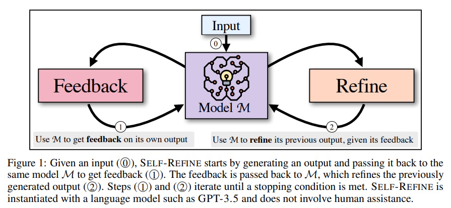
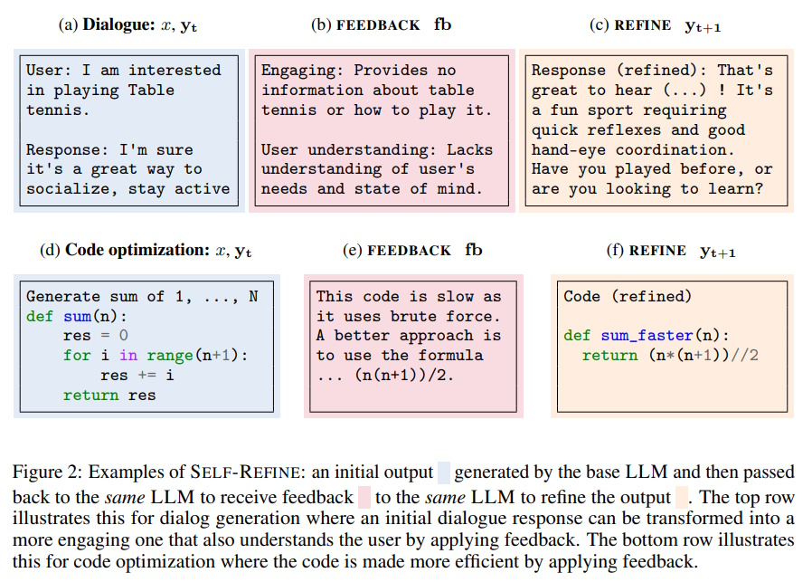

# Self-Refine: Iterative Refinement with Self-Feedback

**Self-Refine** is a groundbreaking approach that enhances the performance of large language models (LLMs) like GPT-3.5 and GPT-4. Inspired by how humans improve their work through feedback and revision, Self-Refine allows LLMs to iteratively refine their outputs without requiring additional training or external data. This article explores the Self-Refine methodology, its evaluation across various tasks, and its impact on improving the quality of generated content.

## Table of Contents

1. [Introduction](#introduction)
2. [What is Self-Refine?](#what-is-self-refine)
3. [How Self-Refine Works](#how-self-refine-works)
    - [Key Steps](#key-steps)
    - [Key Features](#key-features)
4. [Evaluation of Self-Refine](#evaluation-of-self-refine)
    - [Tasks Evaluated](#tasks-evaluated)
    - [Results](#results)
5. [Analysis of Self-Refine](#analysis-of-self-refine)
    - [Impact of Feedback Quality](#impact-of-feedback-quality)
    - [Importance of Iterative Refinement](#importance-of-iterative-refinement)
    - [Comparison with Multiple Output Generation](#comparison-with-multiple-output-generation)
    - [Performance with Weaker Models](#performance-with-weaker-models)
6. [Examples of Self-Refine in Action](#examples-of-self-refine-in-action)
    - [Dialogue Response Generation](#dialogue-response-generation)
    - [Code Optimization](#code-optimization)
7. [Conclusion](#conclusion)
8. [References](#references)

## Introduction

Large Language Models (LLMs) like GPT-3.5 and GPT-4 have revolutionized the field of artificial intelligence by generating human-like text across various applications. However, these models do not always produce the best output on their first attempt. **Self-Refine** is an innovative approach that mimics the human process of drafting, receiving feedback, and revising to enhance the quality of LLM outputs. This method leverages the same model to generate content, provide feedback, and refine the output iteratively, resulting in significant improvements without the need for additional training.

## What is Self-Refine?

**Self-Refine** is a technique designed to improve the initial outputs of large language models through a cycle of self-generated feedback and iterative refinement. Unlike traditional methods that might require supervised training or external feedback mechanisms, Self-Refine operates solely within the capabilities of a single LLM. This approach enables the model to assess its own work, identify areas for improvement, and make necessary adjustments to enhance the final output.

## How Self-Refine Works



Self-Refine functions through a series of steps that allow the model to continuously improve its outputs. Here's a detailed look at the methodology:

### Key Steps

1. **Initial Generation:**
    - **Input:** The `LLM` receives an `input sequence`.
    - **Process:** Using a **"generation prompt"**, the `LLM` produces an `initial output`.
    - **Example:**
      ```
      User: How can I improve my coding skills?
      Response: Practice regularly and read books.
      ```

2. **Feedback Generation:**
    - **Input:** The `initial output` is fed back into the `LLM`.
    - **Process:** Using a **"feedback prompt"**, the `LLM` generates constructive `feedback` on its own output.
    - **Example:**
      ```
      Feedback: The response is generic and lacks actionable advice. Suggest specific resources like online platforms or coding challenges.
      ```

3. **Refinement:**
    - **Input:** The `LLM` takes the `feedback` and the `initial output`.
    - **Process:** Using a **"refinement prompt"**, the `LLM` revises the `initial output` to address the feedback.
    - **Example:**
      ```
      User: How can I improve my coding skills?
      Response: Practice regularly on platforms like LeetCode or HackerRank. Also, consider reading books like "Clean Code" by Robert C. Martin. Have you tried any coding challenges before?
      ```

4. **Iteration:**
    - **Process:** Steps 2 and 3 are repeated, with the `LLM` continuously refining the output until a desired level of quality is achieved or a maximum number of iterations is reached.

### Key Features

1. **Self-Feedback:** The model uses its own capabilities to generate feedback, eliminating the need for external supervision.
2. **Iterative Refinement:** Continuous improvement through multiple cycles of feedback and revision.
3. **Task-Agnostic:** Applicable to a wide range of tasks without requiring specific training.
4. **No Additional Training:** Operates using pre-trained models and simple prompting techniques.

## Evaluation of Self-Refine

Self-Refine was tested across seven diverse tasks to assess its effectiveness. These tasks range from dialogue generation to mathematical reasoning, demonstrating the versatility of the approach.

### Tasks Evaluated

1. **Dialogue Response Generation:** Crafting engaging and relevant responses in conversations.
2. **Code Optimization:** Enhancing the efficiency of code snippets.
3. **Code Readability Improvement:** Making code easier to understand and maintain.
4. **Math Reasoning:** Solving mathematical problems accurately.
5. **Sentiment Reversal:** Changing the sentiment of a given text.
6. **Acronym Generation:** Creating concise and memorable acronyms.
7. **Constrained Generation:** Generating content that meets multiple keyword constraints.

### Results

The performance improvements achieved by Self-Refine across different tasks and models are summarized in the tables below.

#### Table 1: SELF-REFINE Results on Various Tasks Using GPT-3.5, ChatGPT, and GPT-4 as Base LLM

| Task                  | GPT-3.5 Base | GPT-3.5 + SELF-REFINE | ChatGPT Base | ChatGPT + SELF-REFINE | GPT-4 Base | GPT-4 + SELF-REFINE |
|-----------------------|--------------|-----------------------|--------------|-----------------------|------------|---------------------|
| Sentiment Reversal    | 8.8          | 30.4 (↑21.6)          | 11.4         | 43.2 (↑31.8)          | 3.8        | 36.2 (↑32.4)        |
| Dialogue Response     | 36.4         | 63.6 (↑27.2)          | 40.1         | 59.9 (↑19.8)          | 25.4       | 74.6 (↑49.2)        |
| Code Optimization     | 14.8         | 23.0 (↑8.2)           | 23.9         | 27.5 (↑3.6)           | 27.3       | 36.0 (↑8.7)         |
| Code Readability      | 37.4         | 51.3 (↑13.9)          | 27.7         | 63.1 (↑35.4)          | 27.4       | 56.2 (↑28.8)        |
| Math Reasoning        | 64.1         | 64.1 (0)              | 74.8         | 75.0 (↑0.2)           | 92.9       | 93.1 (↑0.2)         |
| Acronym Generation    | 41.6         | 56.4 (↑14.8)          | 27.2         | 37.2 (↑10.0)          | 30.4       | 56.0 (↑25.6)        |
| Constrained Generation| 28.0         | 37.0 (↑9.0)           | 44.0         | 67.0 (↑23.0)          | 15.0       | 45.0 (↑30.0)        |

## Analysis of Self-Refine

The analysis delves into the factors contributing to the success of Self-Refine, highlighting the importance of feedback quality and the iterative nature of the process.

### Impact of Feedback Quality

Feedback quality is crucial for the effectiveness of Self-Refine. Comparing specific, actionable feedback with generic feedback and no feedback shows significant differences in performance.

#### Table 2: Impact of Feedback Quality on SELF-REFINE Performance

| Task                  | SELF-REFINE Feedback | Generic Feedback | No Feedback |
|-----------------------|----------------------|-------------------|-------------|
| **Code Optimization** | **27.5**             | 26.0              | 24.8        |
| **Sentiment Reversal**| **43.2**             | 31.2              | 0           |
| **Acronym Generation**| **56.4**             | 54.0              | 48.0        |

**Conclusion:** Specific feedback leads to better performance improvements compared to generic feedback or no feedback, emphasizing the need for detailed and actionable critiques in the refinement process.

### Importance of Iterative Refinement

Multiple iterations of feedback and refinement enhance the quality of outputs. For example, in code optimization, repeated refinements increased the efficiency of the code significantly over several iterations.

### Comparison with Multiple Output Generation

Self-Refine was compared with generating multiple outputs without refinement. The results indicated that iterative refinement outperforms simply generating multiple samples, as it systematically improves the quality based on feedback rather than relying on randomness.

### Performance with Weaker Models

Self-Refine was also tested with smaller models like Vicuna-13B. The approach proved effective even with less powerful models, demonstrating its robustness and wide applicability.

## Examples of Self-Refine in Action



To better understand how Self-Refine works, let's look at concrete examples in dialogue response generation and code optimization.

### Dialogue Response Generation

**Initial Output:**
```
User: How can I improve my coding skills?
Response: Practice regularly and read books.
```

**Feedback:**
```
The response is generic and lacks actionable advice. Suggest specific resources like online platforms or coding challenges.
```

**Refined Output:**
```
User: How can I improve my coding skills?
Response: Practice regularly on platforms like LeetCode or HackerRank. Also, consider reading books like "Clean Code" by Robert C. Martin. Have you tried any coding challenges before?
```

**Summary:** The initial response was vague, but after receiving specific feedback, the model provided detailed and actionable advice, making the response more helpful and engaging.

### Code Optimization

**Initial Output:**
```python
def sum(n):
    res = 0
    for i in range(n + 1):
        res += i
    return res
```

**Feedback:**
```
This code is inefficient for large `n`. Use the formula (n(n+1))/2 for better performance.
```

**Refined Output:**
```python
def sum(n):
    return (n * (n + 1)) // 2
```

**Summary:** The initial loop-based function was inefficient for large inputs. The feedback suggested a mathematical optimization, which the model successfully implemented, resulting in a more efficient function.

## Conclusion

**Self-Refine** offers a simple yet powerful method to enhance the outputs of large language models through self-generated feedback and iterative refinement. By mimicking the human process of drafting, receiving feedback, and revising, Self-Refine significantly improves the quality of generated content across various tasks. The approach is versatile, task-agnostic, and does not require additional training, making it an invaluable tool for leveraging the full potential of LLMs like GPT-3.5 and GPT-4.

## References

- **Self-Refine: Iterative Refinement with Self-Feedback**  
  [https://arxiv.org/abs/2303.17651](https://arxiv.org/abs/2303.17651)

- **Reflection & Critique**  
  [https://langchain-ai.github.io/langgraph/tutorials/reflection/reflection/](https://langchain-ai.github.io/langgraph/tutorials/reflection/reflection/)

