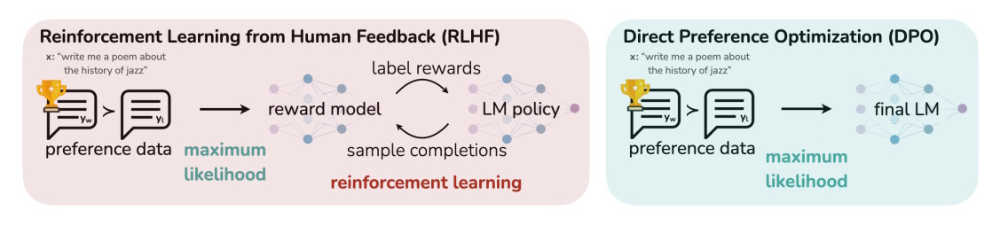
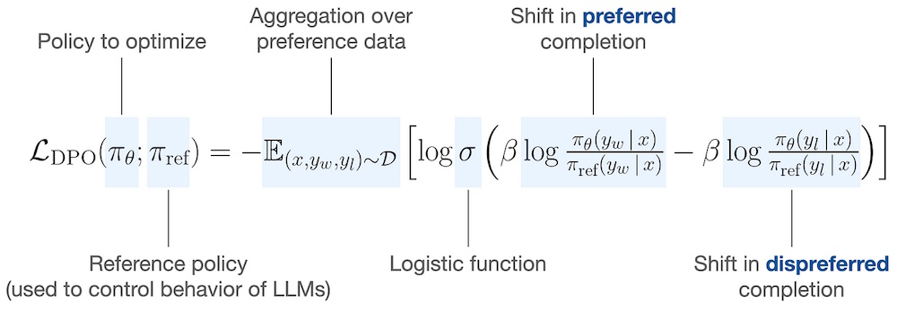
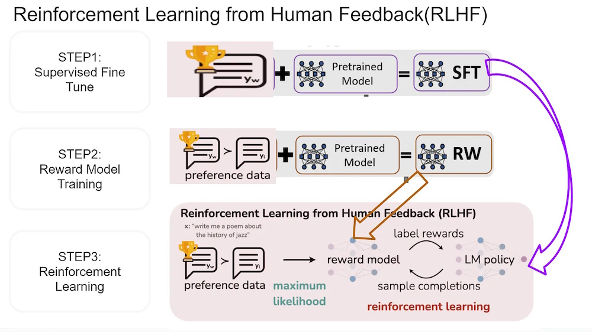
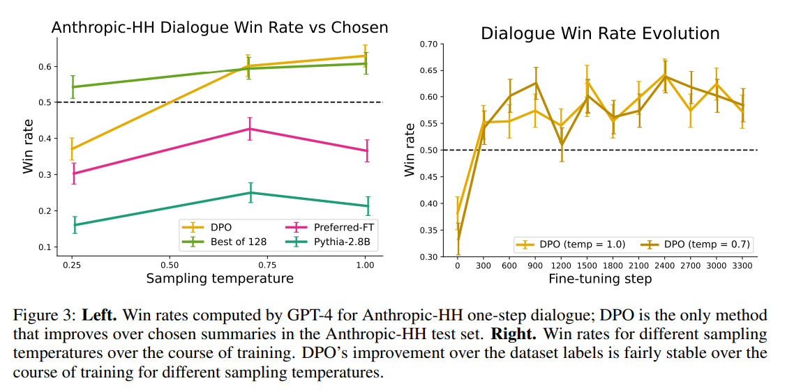

# Direct Preference Optimization (DPO): Simplifying Language Model Alignment

## Table of Contents
1. [Introduction](#introduction)
2. [What is DPO?](#what-is-dpo)
3. [How Does DPO Work?](#how-does-dpo-work)
4. [Loss Function of DPO](#loss-function-of-dpo)
5. [DPO vs. Traditional RLHF](#dpo-vs-traditional-rlhf)
6. [Experiments and Results](#experiments-and-results)
7. [Examples](#examples)
   - [Using DPOConfig and DPOTrainer](#using-dpoconfig-and-dpotrainer)
   - [Calculate Probabilities of Preferred Tokens](#calculate-probabilities-of-preferred-tokens)
8. [Conclusion](#conclusion)
9. [References](#references)

---

## Introduction

Large language models (LMs) like GPT-3 and GPT-4 have shown impressive capabilities in understanding and generating human-like text. However, controlling their behavior to align with human preferences is challenging. Traditional methods use **Reinforcement Learning from Human Feedback (RLHF)**, which involves training a reward model and then fine-tuning the LM using reinforcement learning. While effective, RLHF is complex and computationally expensive.

**Direct Preference Optimization (DPO)** is a new approach that simplifies this process. Instead of using reinforcement learning, DPO directly optimizes the language model to align with human preferences using a simple classification loss. This article will explain what DPO is, how it works, and why it’s a game-changer for aligning language models.

---

## What is DPO?



**Direct Preference Optimization (DPO)** is a method for fine-tuning language models to align with human preferences without the need for reinforcement learning. Unlike traditional RLHF, which involves training a separate reward model and then optimizing the LM using reinforcement learning, DPO directly optimizes the LM using a binary classification loss.

### Key Idea:
- DPO uses a dataset of human preferences over pairs of model responses.
- It optimizes the LM to increase the likelihood of preferred responses and decrease the likelihood of dispreferred ones.
- This is done using a simple **binary cross-entropy loss**, making the process more stable and computationally efficient.

---

## How Does DPO Work?

### Step-by-Step Process:

1. **Collect Preference Data**: 
   - Start with a dataset of prompts and pairs of model responses, where humans have indicated which response they prefer.
   - Example: For a prompt like "Write a summary of this article," you might have two summaries, and humans choose the better one.

2. **Define the DPO Objective**:
   - DPO uses a **Bradley-Terry model** to represent human preferences. This model assumes that the probability of preferring one response over another depends on the difference in their rewards.
   - The DPO objective is to maximize the likelihood of the preferred responses while minimizing the likelihood of the dispreferred ones.

3. **Optimize the Language Model**:
   - Instead of training a separate reward model, DPO directly optimizes the language model using a binary cross-entropy loss.
   - The loss function increases the probability of the preferred response and decreases the probability of the dispreferred response.

### Example:

| Prompt | Preferred Response | Dispreferred Response |
|--------|---------------------|-----------------------|
| "Write a summary of this article" | "The article discusses the benefits of renewable energy..." | "Renewable energy is good..." |

In this example, DPO would adjust the model to make the preferred response more likely and the dispreferred response less likely.

---

## Loss Function of DPO

### Introduction to Loss Function

DPO **adjusts the probability of generating preferred responses** while decreasing the probability of dispreferred ones. Given a dataset **D** of **(prompt, preferred response, dispreferred response)** pairs, the model is optimized so that:  
- The preferred response **($y_w$)** is **more likely**.  
- The dispreferred response **($y_l$)** is **less likely**.  



**Key Components Explained Simply:**  
- **$\pi_{\theta}$**: The policy (language model) we are optimizing.  
- **$\pi_{\text{ref}}$**: The reference policy (initial model before fine-tuning).  
- **$\mathbb{E}_{(x, y_w, y_l) \sim D}$**: Aggregation over all preference data points in the dataset **D**.
- The negative expectation **(-)** in the DPO loss function ensures that we maximize the likelihood of preferred responses while minimizing the likelihood of dispreferred ones.
- **$\log \sigma(\cdot)$**: A logistic function to convert outputs into probabilities.  
- **$\beta \log \frac{\pi_{\theta}(y_w | x)}{\pi_{\text{ref}}(y_w | x)}$**: **Encourages** the model to increase the likelihood of preferred responses (**$y_w$**).  
- **$\beta \log \frac{\pi_{\theta}(y_l | x)}{\pi_{\text{ref}}(y_l | x)}$**: **Discourages** the model from selecting dispreferred responses (**$y_l$**). 
- **If $\pi_{\theta}(y_w | x)$ is larger than $\pi_{\text{ref}}(y_w | x)$**, the term increases the model’s preference for ($y_w$).
- **If $\pi_{\theta}(y_l | x)$ is smaller than $\pi_{\text{ref}}(y_l | x)$**, the term encourages the model to **reduce** the likelihood of generating ($y_l$).
- The **hyperparameter $\beta$ controls the strength** of these updates (increase more likely, descress less likely).

**Why Does This Work?**  
- The **difference in log probabilities** between preferred and dispreferred responses determines the shift in model behavior.  
- Instead of training a separate **reward model**, DPO **directly shifts the LM's probability distribution** toward human preferences.  
- The **logistic function ($\sigma$)** ensures that preference optimization remains stable.  

---

### DPO Loss Explained: Preferred vs. Dispreferred

#### **Case 1: Preferred ≫ Dispreferred**
- $\pi_{\theta}(y_w | x) \gg \pi_{\theta}(y_l | x)$, meaning the model assigns much higher probability to the preferred response than the dispreferred one.
- The term inside the sigmoid is **strongly positive**, leading $\sigma(\cdot)$ to be close to **1**.
- Since $\log(1) = 0$, the DPO loss approaches **zero** (i.e., the model is already well-aligned with preference data).
- This means the policy model has successfully learned to favor the preferred response.

👉 **Result**: **Loss is low** → No further adjustment needed.

#### **Case 2: Preferred ≈ Dispreferred**
- $\pi_{\theta}(y_w | x) \approx \pi_{\theta}(y_l | x)$, meaning the model assigns similar probabilities to both completions.
- The term inside the sigmoid is **close to zero**, so $\sigma(\cdot) \approx 0.5$.
- Since $\log(0.5)$ is **negative**, the DPO loss is **nonzero and contributes to optimization**.
- The model is **uncertain** in distinguishing between the better and worse completions.

👉 **Result**: **Loss is moderate** → Model is pushed to **increase probability of the preferred response** and decrease probability of the dispreferred one.

#### **Case 3: Preferred ≪ Dispreferred**
- $\pi_{\theta}(y_w | x) \ll \pi_{\theta}(y_l | x)$, meaning the model assigns higher probability to the **dispreferred** completion.
- The term inside the sigmoid is **strongly negative**, making $\sigma(\cdot)$ close to **0**.
- Since $\log(\text{small value})$ is **highly negative**, the loss becomes **large**.
- The optimizer is strongly **penalized** for assigning high probability to the dispreferred response.

👉 **Result**: **Loss is high** → Strong gradient updates to **correct the model’s behavior** by increasing the probability of the preferred response and decreasing that of the dispreferred one.

#### **Summary**

| Case | Preferred vs Dispreferred | Logits Ratio | Loss Value | Training Effect |
|------|---------------------------|--------------|------------|----------------|
| **Preferred ≫ Dispreferred** | $\pi_{\theta}(y_w \| x) \gg \pi_{\theta}(y_l \| x)$     | **Large positive** | **Low** | Model is aligned |
| **Preferred ≈ Dispreferred**  | $\pi_{\theta}(y_w \| x) \approx \pi_{\theta}(y_l \| x)$ | **Close to zero** | **Moderate** | Model is adjusted |
| **Preferred ≪ Dispreferred** | $\pi_{\theta}(y_w \| x) \ll \pi_{\theta}(y_l \| x)$     | **Large negative** | **High** | Model is corrected |

Thus, the DPO loss effectively **encourages the model to prefer better responses over worse ones** while aligning with a base reference model.

---

### **Example: AI Writing Assistant**
Imagine you are training a **chatbot** to answer user queries politely and informatively.

**Input Prompt ($x$)**: "What is the capital of France?"

#### **Two Model Responses**:
1. **Preferred Response ($y_w$)**:  
   _"The capital of France is Paris. It is known for its history, culture, and landmarks like the Eiffel Tower."_  
   _(Well-structured and informative, preferred by human annotators.)_

2. **Dispreferred Response ($y_l$)**:  
   _"Paris."_  
   _(Technically correct but lacks explanation, making it a dispreferred response.)_

### **Computing the DPO Loss for This Example**  

1. **Step 1: Compare Model Probabilities**
   - Suppose the original reference model ($\pi_{\text{ref}}$) assigns the following probabilities:  
     - $\pi_{\text{ref}}(y_w | x) = 0.3$  
     - $\pi_{\text{ref}}(y_l | x) = 0.7$  
   - The fine-tuned model ($(\pi_{\theta}$)) adjusts its probabilities after training:  
     - $\pi_{\theta}(y_w | x) = 0.7$  
     - $\pi_{\theta}(y_l | x) = 0.3$  

2. **Step 2: Compute the Log Ratios**
   - The model shift in probability is computed as:

     $[
     \log \frac{\pi_{\theta}(y_w | x)}{\pi_{\text{ref}}(y_w | x)}
     = \log \frac{0.7}{0.3} = \log(2.33) \approx 0.84
     ]$

     $[
     \log \frac{\pi_{\theta}(y_l | x)}{\pi_{\text{ref}}(y_l | x)}
     = \log \frac{0.3}{0.7} = \log(0.43) \approx -0.36
     ]$

3. **Step 3: Compute the Shift in Preferences**
   - The difference between the preferred and dispreferred response shifts is:
     $[
     0.84 - (-0.36) = 0.84 + 0.36 = 1.20
     ]$
   - After applying the **logistic function $\sigma$**, we get a probability value **between 0 and 1**.

4. **Step 4: Compute Final Loss**
   - Taking the **logarithm** and negating the expectation results in a **minimization objective** that encourages the model to **increase the probability of $(y_w$) and decrease the probability of $(y_l$)**.
   - The negative sign ensures that training moves in the right direction.

### **What This Means for Training**
- The model **learns to assign higher probability to better responses**.
- It **moves away from poor responses** by reducing their probability.
- The **logistic function ensures stability**, preventing extreme updates.
- The **hyperparameter $\beta$ controls the strength** of these updates.

---

## DPO vs. Traditional RLHF

### **1. Reinforcement Learning from Human Feedback (RLHF)**



RLHF is a widely used approach for fine-tuning language models using human feedback. It consists of three main steps:

1. **Preference Data Collection**:  
   - A dataset of prompts and response pairs is created, where human annotators select the preferred response.  
   
2. **Training a Reward Model**:  
   - A reward model is trained to predict human preferences based on the labeled data.  
   
3. **Reinforcement Learning**:  
   - The language model (LM) is fine-tuned using reinforcement learning to maximize the learned reward function.  

#### **Challenges of RLHF:**
- Requires training a **separate reward model**, adding complexity.  
- Uses **reinforcement learning**, which is computationally expensive and unstable.  
- Needs careful **hyperparameter tuning** for stable training.  

### **2. Direct Preference Optimization (DPO)**
DPO is a **simpler alternative** to RLHF that directly optimizes the model to align with human preferences **without reinforcement learning**.

1. **Preference Data Collection**:  
   - Like RLHF, DPO uses a dataset of prompts and human-labeled response pairs.  

2. **Direct Optimization**:  
   - Instead of training a reward model and using reinforcement learning, DPO directly fine-tunes the LM using a **classification loss**.  

3. **Final LM**:  
   - The optimized model aligns with human preferences **without requiring RL**.  

#### **Advantages of DPO:**
- **No need for a separate reward model** → reduces complexity.  
- **No reinforcement learning required** → more stable and computationally efficient.  
- **Easier to implement** → minimal hyperparameter tuning needed.  

### Comparison Table:

| Feature | DPO | Traditional RLHF |
|---------|-----|------------------|
| **Reward Model** | **No separate reward model needed** | Requires training a reward model |
| **Optimization** | **Directly optimizes the LM using a classification loss** | **Uses reinforcement learning to optimize the LM** |
| **Complexity** | Simpler and **more stable** | More complex and computationally expensive |
| **Hyperparameter Tuning** | Minimal tuning required | Requires significant hyperparameter tuning |
| **Performance** | Matches or exceeds RLHF in many tasks | Effective but harder to implement |

### Key Difference:
- **RLHF** requires two steps: training a reward model and then fine-tuning the LM using reinforcement learning.
- **DPO** skips the reward model and directly optimizes the LM using a simple loss function.

### Advantages of DPO

1. **Simplicity**: DPO eliminates the need for a separate reward model and reinforcement learning, making it easier to implement.
2. **Stability**: The binary cross-entropy loss used in DPO is more stable than the reinforcement learning algorithms used in RLHF.
3. **Computational Efficiency**: DPO requires fewer computational resources since it doesn’t involve sampling from the LM during fine-tuning.
4. **Performance**: DPO matches or exceeds the performance of RLHF in tasks like sentiment control, summarization, and dialogue.

---

## Experiments and Results



**Key Insight (Left)**: 
- DPO is the **only method** that surpasses the **50% win rate** (dashed line), indicating that it produces **better-than-chosen** responses consistently.

**Key Insight (Right)**:  
- The **win rate quickly improves** in the early stages of training.  
- DPO maintains a **stable performance** over different temperatures, indicating **robust alignment to human preferences**.  
- The win rate remains **above 50%**, proving that **DPO consistently improves dialogue responses**.  

### Definition of Win Rate:
- **Win Rate** is the percentage of times a model's response is preferred over another model’s response in human or automated evaluations.  
- A higher **Win Rate** means that a model generates responses that are **more aligned with human preferences** compared to its competitor (e.g., RLHF).  
- In these experiments, **GPT-4 or human evaluators** were used to compare outputs from **DPO-trained** and **RLHF-trained** models.


## Examples

### Using DPOConfig and DPOTrainer

DPO can be easily implemented using the **HuggingFace TRL (Transformer Reinforcement Learning)** library. Below is an example of how to fine-tune a model using DPO with the `DPOTrainer`:

```python
# train_dpo.py
from datasets import load_dataset
from trl import DPOConfig, DPOTrainer
from transformers import AutoModelForCausalLM, AutoTokenizer

# Load the model and tokenizer
model = AutoModelForCausalLM.from_pretrained("Qwen/Qwen2-0.5B-Instruct")
tokenizer = AutoTokenizer.from_pretrained("Qwen/Qwen2-0.5B-Instruct")

# Load the dataset with human preferences
train_dataset = load_dataset("trl-lib/ultrafeedback_binarized", split="train")

# Define DPO training arguments
training_args = DPOConfig(output_dir="Qwen2-0.5B-DPO", logging_steps=10)

# Initialize the DPOTrainer
trainer = DPOTrainer(model=model, args=training_args, tokenizer=tokenizer, train_dataset=train_dataset)

# Train the model
trainer.train()
```

### Explanation:
- **Model and Tokenizer**: We load a pre-trained language model (`Qwen/Qwen2-0.5B-Instruct`) and its corresponding tokenizer.
- **Dataset**: We use the `ultrafeedback_binarized` dataset, which contains human preferences over pairs of model responses.
- **DPOConfig**: This configures the training process, including the output directory and logging frequency.
- **DPOTrainer**: This is the main class that handles the DPO training process. It takes the model, tokenizer, and dataset as inputs and optimizes the model using the DPO objective.

---

### Calculate Probabilities of Preferred Tokens

This Python script defines a function `compute_dpo_logprobs` that calculates **log probabilities** for **preferred (chosen) and dispreferred (rejected) responses** using a **policy model** (fine-tuned model) and a **reference model** (original base model). The computed log-probabilities are used for **Direct Preference Optimization (DPO)**.

```python
import torch
import torch.nn.functional as F
from transformers import AutoModelForCausalLM, AutoTokenizer
from typing import Dict, Tuple

def compute_dpo_logprobs(
    policy_model: AutoModelForCausalLM,
    reference_model: AutoModelForCausalLM,
    tokenizer: AutoTokenizer,
    prompt: str,
    chosen: str,
    rejected: str,
    max_length: int = 512,
    device: str = "cuda"
) -> Tuple[torch.Tensor, torch.Tensor, torch.Tensor, torch.Tensor]:
    """
    Compute log probabilities for chosen and rejected responses using policy and reference models.
    
    Args:
        policy_model: The policy model (usually fine-tuned model)
        reference_model: The reference model (usually base model)
        tokenizer: Tokenizer for both models
        prompt: Input prompt text
        chosen: Chosen/preferred completion
        rejected: Rejected/non-preferred completion
        max_length: Maximum sequence length
        device: Device to run computation on
        
    Returns:
        Tuple containing:
        - policy_chosen_logprobs: Log probs of chosen completion from policy model
        - policy_rejected_logprobs: Log probs of rejected completion from policy model
        - ref_chosen_logprobs: Log probs of chosen completion from reference model
        - ref_rejected_logprobs: Log probs of rejected completion from reference model
    """
    # Tokenize inputs
    chosen_tokens = tokenizer(chosen, return_tensors="pt", max_length=max_length, truncation=True)
    rejected_tokens = tokenizer(rejected, return_tensors="pt", max_length=max_length, truncation=True)
    prompt_tokens = tokenizer(prompt, return_tensors="pt", max_length=max_length, truncation=True)
    
    # Move inputs to device
    chosen_tokens = {k: v.to(device) for k, v in chosen_tokens.items()}
    rejected_tokens = {k: v.to(device) for k, v in rejected_tokens.items()}
    prompt_tokens = {k: v.to(device) for k, v in prompt_tokens.items()}
    
    # Helper function to compute log probabilities
    def get_logprobs(model: AutoModelForCausalLM, input_ids: torch.Tensor) -> torch.Tensor:
        """
        Compute the log probabilities for the sequence of tokens.
        
        Args:
            model: The language model
            input_ids: Input token IDs (shape: [1, seq_len])
        
        Returns:
            Log probabilities for the input sequence (shape: [1])
        """
        with torch.no_grad():
            outputs = model(input_ids=input_ids, labels=input_ids)
            logits = outputs.logits[:, :-1, :]  # Remove last token prediction (shape: [1, seq_len-1, vocab_size])
            labels = input_ids[:, 1:]           # Shift labels to the right (shape: [1, seq_len-1])
            
            # Compute log probabilities
            log_probs = F.log_softmax(logits, dim=-1)  # Log probs for each token (shape: [1, seq_len-1, vocab_size])
            token_log_probs = log_probs.gather(-1, labels.unsqueeze(-1)).squeeze(-1)  # Log probs of correct tokens (shape: [1, seq_len-1])
            
            # Mask padding tokens
            attention_mask = (labels != tokenizer.pad_token_id).float()  # Mask for non-padding tokens (shape: [1, seq_len-1])
            token_log_probs = token_log_probs * attention_mask           # Masked log probs (shape: [1, seq_len-1])
            
            # Sum log probs over sequence to get sequence log prob
            return token_log_probs.sum(dim=-1)  # Sequence log prob (shape: [1])
    
    # Get sequence log probabilities for both models
    with torch.no_grad():
        # Policy model log probs
        policy_chosen_logprobs = get_logprobs(policy_model, chosen_tokens["input_ids"])      # Shape: [1]
        policy_rejected_logprobs = get_logprobs(policy_model, rejected_tokens["input_ids"])  # Shape: [1]
        
        # Reference model log probs
        ref_chosen_logprobs = get_logprobs(reference_model, chosen_tokens["input_ids"])      # Shape: [1]
        ref_rejected_logprobs = get_logprobs(reference_model, rejected_tokens["input_ids"])  # Shape: [1]
    
    return (
        policy_chosen_logprobs,
        policy_rejected_logprobs,
        ref_chosen_logprobs,
        ref_rejected_logprobs
    )

# Example usage
def main():
    # Load models and tokenizer
    policy_model = AutoModelForCausalLM.from_pretrained("path/to/policy/model").to("cuda")
    reference_model = AutoModelForCausalLM.from_pretrained("path/to/reference/model").to("cuda")
    tokenizer = AutoTokenizer.from_pretrained("path/to/tokenizer")
    
    # Example inputs
    prompt = "What is the capital of France?"
    chosen = "The capital of France is Paris."
    rejected = "The capital of France is London."
    
    # Compute log probabilities
    logprobs = compute_dpo_logprobs(
        policy_model=policy_model,
        reference_model=reference_model,
        tokenizer=tokenizer,
        prompt=prompt,
        chosen=chosen,
        rejected=rejected
    )
    
    policy_chosen_logprobs, policy_rejected_logprobs, ref_chosen_logprobs, ref_rejected_logprobs = logprobs
    
    # Print results
    print(f"Policy model chosen logprob: {policy_chosen_logprobs.item():.4f}")
    print(f"Policy model rejected logprob: {policy_rejected_logprobs.item():.4f}")
    print(f"Reference model chosen logprob: {ref_chosen_logprobs.item():.4f}")
    print(f"Reference model rejected logprob: {ref_rejected_logprobs.item():.4f}")

if __name__ == "__main__":
    main()
```

## Conclusion

**Direct Preference Optimization (DPO)** is a promising new method for aligning language models with human preferences. By simplifying the fine-tuning process and eliminating the need for reinforcement learning, DPO makes it easier to train models that are both safe and effective. While there are still challenges to address, DPO represents a significant step forward in the field of AI alignment.

## References

1. **Direct Preference Optimization: Your Language Model is Secretly a Reward Model**  
   [https://arxiv.org/abs/2305.18290](https://arxiv.org/abs/2305.18290)

2. **DPO Trainer Documentation (HuggingFace TRL)**  
   [https://huggingface.co/docs/trl/main/en/dpo_trainer](https://huggingface.co/docs/trl/main/en/dpo_trainer)

By using DPO, researchers and developers can create language models that better align with human values, making AI systems more useful and trustworthy.

