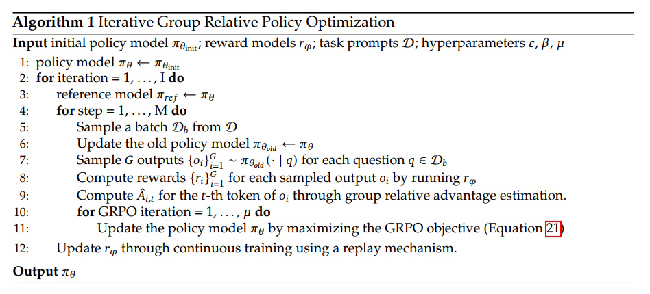

# Understanding GRPO: A Simple Guide to Group Relative Policy Optimization

## Table of Contents

- [Introduction](#introduction)
- [Background on Reinforcement Learning](#background-on-reinforcement-learning)
- [What is GRPO?](#what-is-grpo)
- [How GRPO Works](#how-grpo-works)
- [Example: Format-Based Reward](#example-format-based-reward)
- [Training and Evaluating GRPO](#training-and-evaluating-grpo)
- [Insights and Future Directions](#insights-and-future-directions)
- [Conclusion](#conclusion)
- [References](#references)

## Introduction

Reinforcement Learning (RL) has revolutionized how machines learn to make decisions by rewarding them for good actions. One of the latest advancements in this field is **Group Relative Policy Optimization (GRPO)**. GRPO is an efficient and effective RL algorithm designed to improve the performance of language models, especially in mathematical reasoning tasks. This article breaks down GRPO into simple terms, explains how it works, and highlights its benefits compared to other RL methods.

## Background on Reinforcement Learning

Before diving into GRPO, it's essential to understand the basics of Reinforcement Learning. In RL, an agent learns to make decisions by interacting with an environment. The agent performs actions, receives rewards based on those actions, and aims to maximize the total reward over time. Traditional RL methods, like **Proximal Policy Optimization (PPO)**, use a critic model to estimate the value of actions, which can be resource-intensive.

## What is GRPO?

**Group Relative Policy Optimization (GRPO)** is a novel RL algorithm that simplifies the training process by removing the need for a critic model. Instead of relying on a separate model to estimate action values, GRPO uses group scores to determine the baseline for rewards. This approach reduces the computational resources required and enhances the performance of language models.

### From PPO to GRPO

PPO is a popular RL algorithm that optimizes policies by maximizing a surrogate objective. However, PPO requires training a value function alongside the policy model, which can be memory and computation-heavy. GRPO addresses this by:

- **Eliminating the Critic Model**: GRPO does not use a separate value function.
- **Using Group Scores**: It estimates the baseline from the average rewards of multiple outputs for the same input, simplifying the training process.

**Table 1: Comparison between PPO and GRPO**

| Feature               | PPO                                    | GRPO                                 |
|-----------------------|----------------------------------------|--------------------------------------|
| Critic Model          | Required                               | Not required                         |
| Baseline Estimation   | Value function                         | Group average of rewards             |
| Computational Load    | High                                   | Lower                                |
| Training Efficiency   | Moderate to low                        | High                                 |


### Advantages of GRPO

GRPO offers several benefits over traditional RL methods:

- **Efficiency**: By removing the critic model, GRPO reduces computational and memory requirements.
- **Performance**: GRPO significantly improves model performance, especially in mathematical reasoning tasks.
- **Simplified Training**: Using group scores simplifies the baseline estimation process.
- **Enhanced Out-of-Domain Performance**: Models trained with GRPO perform better on tasks outside their training data.

**Table 2: Performance Comparison**

| Model                | GSM8K Accuracy | MATH Accuracy | Out-of-Domain Performance |
|----------------------|----------------|---------------|---------------------------|
| Open-Source Models   | Lower          | Lower         | Moderate                  |
| PPO                  | High           | Moderate      | Good                      |
| **GRPO**             | **88.2%**      | **51.7%**     | **Enhanced**              |


## How GRPO Works

GRPO enhances the training of language models through several key mechanisms: iterative optimization, generating completions, computing advantages, estimating KL divergence, and computing the loss. Understanding these steps provides insight into why GRPO is both efficient and effective.

### Iterative Group Relative Policy Optimization

GRPO operates as an **online learning algorithm**, meaning it improves iteratively by using data generated by the trained model itself during training. The core idea is to maximize the advantage of generated completions while ensuring that the model remains close to a reference policy. This iterative process is formalized in **Algorithm 1: Iterative Group Relative Policy Optimization**.

### Algorithm 1: Iterative Group Relative Policy Optimization



### **Step-by-Step Breakdown of Algorithm 1**

#### **1. Input Parameters**
- **$ \pi_{\theta_{init}} $** → The **initial policy model** (starting point of training).
- **$ r_{\varphi} $** → The **reward model**, used to score outputs.
- **$ \mathcal{D} $** → A **dataset of task prompts** (e.g., math problems, instructions).
- **Hyperparameters**:
  - $ \epsilon $ → Clipping parameter for **stable updates**.
  - $ \beta $ → Weight for **KL divergence regularization**.
  - $ \mu $ → Number of **GRPO iterations per step**.

#### **2. Outer Training Loop**
The main training consists of **two nested loops**:
- **Outer loop (line 2):** Runs for **$ I $ iterations**, refining the model at each cycle.
- **Inner loop (line 4):** Runs for **$ M $ steps per iteration**, improving performance on different prompts.

#### **3. Setting Up the Training Iteration**
- **Step 3:** A **reference policy** $ \pi_{\text{ref}} $ is set to the current policy $ \pi_{\theta} $.
  - The reference model acts as a baseline to compare new updates.
- **Step 5:** A **batch** $ \mathcal{D}_b $ of prompts (e.g., math problems, text instructions) is sampled from the dataset $ \mathcal{D} $.

#### **4. Generating Outputs and Computing Rewards**
- **Step 6:** The **old policy** $ \pi_{\theta_{\text{old}}} $ is updated to store the previous policy.
- **Step 7:** For each question $ q $, the model **samples $ G $ different outputs** $ \{o_i\}_{i=1}^{G} $ using the old policy.
- **Step 8:** Each output **$ o_i $ is evaluated** using the reward model $ r_{\varphi} $, generating rewards $ \{r_i\}_{i=1}^{G} $.

👉 **Example**
- **Prompt:** "What is 3 + 5?"
- **Sampled outputs:**  
  1. **"7"** (incorrect) → Reward = -1  
  2. **"8"** (correct) → Reward = 2  
  3. **"10"** (incorrect) → Reward = -2  

#### **5. Computing Group Relative Advantage**
- **Step 9:** Compute the **advantage $ \hat{A}_{i,t} $ for each token** in the output, using **group relative advantage estimation**:

  $$
  \hat{A}_{i,t} = \frac{r_i - \text{mean}(r)}{\text{std}(r)}
  $$

  This **normalizes rewards** so that the best output gets a higher advantage.

👉 **Example Calculation**
- Given rewards: **[-1, 2, -2]**
- Mean reward: **$-0.33$**
- Standard deviation: **$\approx 1.99$**
- Normalized advantages:
  - "7" → **$ \hat{A}_1 = -0.34 $** (should decrease probability)
  - "8" → **$ \hat{A}_2 = 1.17 $** (should increase probability)
  - "10" → **$ \hat{A}_3 = -0.84 $** (should decrease probability)

#### **6. Updating the Policy Model (GRPO Objective)**
- **Step 10:** Perform **$ \mu $ iterations of GRPO updates**.
- **Step 11:** The policy model $ \pi_{\theta} $ is **updated** by maximizing the **GRPO objective**:

  $$
  L_{GRPO}(\theta) = -\frac{1}{G} \sum_{i=1}^G \frac{1}{|o_i|} \sum_{t=1}^{|o_i|} \left[ \pi_{\theta}(o_{i,t} | q, o_i,<t) \cdot \hat{A}_{i,t} - \beta D_{KL}[\pi_{\theta} \| \pi_{ref}] \right]
  $$

- **First term**: Maximizes **advantage** by increasing probabilities of high-reward completions.
- **Second term**: Applies **KL divergence penalty** to keep the policy **close to the reference policy**.

👉 **Why KL Regularization?**
- Ensures **smooth learning** by preventing large, sudden changes in policy.
- The hyperparameter **$ \beta $** controls how much deviation is allowed.

#### **7. Updating the Reward Model**
- **Step 12:** The **reward model $ r_{\varphi} $** is updated **continuously** using a **replay mechanism**.
- Updating the **reward model $ r_{\varphi} $** continuously is **essential** for ensuring that:
  - **Rewards remain meaningful** as the policy improves.  
  - **The model doesn’t exploit loopholes** in the reward function.  
  - **Newer, more sophisticated responses** are recognized and rewarded correctly.  
  - **The learning process remains stable and efficient.**  


#### **8. Output**
At the end of training:
- The **policy model $ \pi_{\theta} $ has been optimized** through multiple reinforcement learning cycles.
- The **reward model $ r_{\varphi} $ is continuously refined**.
- The **model is better at generating high-reward outputs**.

---

### **Summary of Algorithm 1**

| **Step** | **Description** |
|---------|--------------|
| **1** | Initialize the policy model $ \pi_{\theta} $. |
| **2-3** | Set the reference model $ \pi_{\text{ref}} $ to the current policy. |
| **4-5** | Sample a batch of prompts $ \mathcal{D}_b $. |
| **6** | Store the previous policy model $ \pi_{\theta_{\text{old}}} $. |
| **7** | Sample $ G $ different outputs per prompt. |
| **8** | Compute rewards for each sampled output. |
| **9** | Calculate **group relative advantage** for each output. |
| **10-11** | Perform **GRPO updates** using the objective function. |
| **12** | Update the **reward model $ r_{\varphi} $** using a replay mechanism. |
| **Output** | The improved **policy model $ \pi_{\theta} $**. |

---

## GRPO Loss Function

### Definitions of GRPO Loss Function

The GRPO loss function is:

$$
L_{GRPO}(\theta) = -\frac{1}{G} \sum_{i=1}^G \frac{1}{|o_i|} \sum_{t=1}^{|o_i|} \left[ \pi_{\theta}(o_{i,t} | q, o_i,<t) \cdot \hat{A}_{i,t} - \beta D_{KL}[\pi_{\theta} \| \pi_{ref}] \right]
$$

Each element in the formula is defined as follows:

- $ L_{GRPO}(\theta) $: The loss function for Group Relative Policy Optimization (GRPO).
- $ G $: The number of sampled outputs (or completions) for each query.
- $ q $: The prompt (or question) given as input.
- $ o $: The sampled outputs for the given prompt (generated).
- $ o_i $: The $ i $-th sampled output (completion).
- $ |o_i| $: The length of the sampled output $ o_i $.
- $ \pi_{\theta}(o_{i,t} | q, o_i,<t) $: The probability of selecting token $ o_{i,t} $ at timestep $ t $ in the sampled output $ o_i $, given the previous tokens.
- $ \hat{A}_{i,t} $: The estimated **advantage** at timestep $ t $ for output $ o_i $, which represents the relative reward benefit of selecting $ o_{i,t} $ over other alternatives.
- $ D_{KL}[\pi_{\theta} \| \pi_{ref}] $: The **Kullback-Leibler (KL) divergence** between the learned policy $ \pi_{\theta} $ and the reference policy $ \pi_{ref} $, which ensures the updated policy does not diverge too much from the reference.
- $ \beta $: A hyperparameter that controls how much penalty is applied for deviating from the reference policy.

---

### Step-by-Step Breakdown of the GRPO Loss Function

The loss function consists of two major components: the **advantage maximization** term and the **KL divergence regularization** term. Let's analyze them step by step.

#### **Step 1: Averaging Over Sampled Outputs**
$$
-\frac{1}{G} \sum_{i=1}^G
$$
- GRPO samples $ G $ outputs for each query.
- The loss is computed for each sampled output and then averaged across all $ G $ completions.

#### **Step 2: Normalization Over Output Length**
$$
\frac{1}{|o_i|} \sum_{t=1}^{|o_i|}
$$
- Instead of treating all sampled outputs equally, the loss is normalized by the length $ |o_i| $ of each output $ o_i $.
- This ensures that shorter completions do not disproportionately affect the loss.

#### **Step 3: Maximizing the Advantage (Policy Optimization Term)**
$$
\pi_{\theta}(o_{i,t} | q, o_i,<t) \cdot \hat{A}_{i,t}
$$
- The policy $ \pi_{\theta} $ learns to favor outputs with higher advantages $ \hat{A}_{i,t} $.
- The advantage $ \hat{A}_{i,t} $ is computed as:

  $$
  \hat{A}_{i,t} = \frac{r_i - \text{mean}(r)}{\text{std}(r)}
  $$

  where $ r_i $ is the reward of the completion, and it is normalized relative to other completions in the group.

- Intuition: If the advantage $ \hat{A}_{i,t} $ is positive, then selecting $ o_{i,t} $ should be encouraged (increase probability). If negative, then selecting $ o_{i,t} $ should be discouraged (decrease probability).

#### **Step 4: Applying KL Regularization (Preventing Divergence from Reference Policy)**
$$
- \beta D_{KL}[\pi_{\theta} \| \pi_{ref}]
$$
- This term prevents the new policy from deviating too far from the reference policy $ \pi_{ref} $.
- The KL divergence measures how different the two probability distributions are.
- The hyperparameter $ \beta $ controls how strictly the policy should stay close to $ \pi_{ref} $.
- This ensures that updates are **smooth and stable**, preventing drastic changes in policy behavior.


### **Summary of Key Intuitions**

1. **GRPO optimizes the policy by maximizing the expected advantage**: It encourages the model to generate outputs with higher rewards relative to other outputs in the group.
2. **The loss is computed per token, normalized over all tokens in an output, and then averaged across multiple sampled completions**.
3. **A KL regularization term ensures that the policy does not deviate too much from the reference model**, helping maintain stability in training.
4. **The hyperparameter $ \beta $ determines how much weight is given to staying close to the reference policy**, balancing between exploration (optimizing advantages) and exploitation (sticking to known good policies).

---

## **GRPO Loss Function with Examples**

To better understand **Group Relative Policy Optimization (GRPO)**, let's go through each step of the **loss function** with **intuitive examples**.

### **Example Setup**
Imagine we are training a language model to **solve math problems**, and we use **GRPO** to fine-tune it.

Let's consider a simple **question prompt**:

**Prompt:**  
*"What is 3 + 5?"*

The model generates **three possible answers**:
1. **"7"** (incorrect)
2. **"8"** (correct)
3. **"10"** (incorrect)

Each of these completions is assigned a **reward** by a trained reward model:
- **"7" → Reward = -1** (incorrect)
- **"8" → Reward = 2** (correct)
- **"10" → Reward = -2** (incorrect)

Now, let's break down the loss function **step by step** using this example.

---

### **Step 1: Averaging Over Sampled Outputs**
#### **Mathematical Formula**
$$
-\frac{1}{G} \sum_{i=1}^G
$$

#### **Explanation**
- GRPO samples **$ G $ outputs** for each prompt (in our case, $ G = 3 $).
- The **loss is calculated for each output**, then **averaged** across all $ G $ completions.

#### **Example Calculation**
We have 3 completions:
1. **"7" → Reward = -1**
2. **"8" → Reward = 2**
3. **"10" → Reward = -2**

Instead of computing loss for just one answer, we compute it for all three and **average** their contributions.

---

### **Step 2: Normalization Over Output Length**
#### **Mathematical Formula**
$$
\frac{1}{|o_i|} \sum_{t=1}^{|o_i|}
$$

#### **Explanation**
- Some completions are **shorter**, and some are **longer**.
- Without normalization, longer completions would contribute **more** to the loss.
- Dividing by **$ |o_i| $** ensures that **each token is treated fairly**.

#### **Example**
Suppose the generated completions are:
1. **"7"** (1 token)
2. **"8"** (1 token)
3. **"10"** (1 token)

Each has a length **$ |o_i| = 1 $**, so in this case, normalization **doesn't change much**.

However, if one completion were **longer**, say **"The answer is eight"** (4 tokens), normalizing ensures it doesn't dominate the loss calculation.

---

### **Step 3: Maximizing the Advantage (Policy Optimization Term)**
#### **Mathematical Formula**
$$
\pi_{\theta}(o_{i,t} | q, o_i,<t) \cdot \hat{A}_{i,t}
$$

#### **Explanation**
- The policy **$ \pi_{\theta} $** should favor outputs that **have high rewards**.
- The **advantage $ \hat{A}_{i,t} $** is computed relative to the group of completions:

  $$
  \hat{A}_{i,t} = \frac{r_i - \text{mean}(r)}{\text{std}(r)}
  $$

  where:
  - $ r_i $ is the reward of completion $ o_i $.
  - **mean(r)** is the **average reward** of all completions.
  - **std(r)** is the **standard deviation** of rewards.

#### **Example Calculation**
Given rewards:
- "7" → **$ r_1 = -1 $**
- "8" → **$ r_2 = 2 $**
- "10" → **$ r_3 = -2 $**

**Step 1: Compute Mean and Standard Deviation**
$$
\text{mean}(r) = \frac{-1 + 2 + (-2)}{3} = -\frac{1}{3} \approx -0.33
$$

$$
\text{std}(r) = \sqrt{\frac{(-1 + 0.33)^2 + (2 + 0.33)^2 + (-2 + 0.33)^2}{3}}
$$

Approximating:

$$
\text{std}(r) \approx 1.99
$$

**Step 2: Compute Normalized Advantages**

$$
\hat{A}_1 = \frac{-1 - (-0.33)}{1.99} = \frac{-0.67}{1.99} \approx -0.34
$$

$$
\hat{A}_2 = \frac{2 - (-0.33)}{1.99} = \frac{2.33}{1.99} \approx 1.17
$$

$$
\hat{A}_3 = \frac{-2 - (-0.33)}{1.99} = \frac{-1.67}{1.99} \approx -0.84
$$

👉 **Interpretation**:
- The correct answer ("8") has a **high positive advantage** → **its probability should increase**.
- Incorrect answers ("7" and "10") have **negative advantages** → **their probabilities should decrease**.

---

### **Step 4: Applying KL Regularization (Preventing Divergence from Reference Policy)**
#### **Mathematical Formula**
$$
- \beta D_{KL}[\pi_{\theta} \| \pi_{ref}]
$$

#### **Explanation**
- Ensures the **new policy $ \pi_{\theta} $** does not drift **too far** from the previous policy $ \pi_{ref} $.
- This prevents the model from **overfitting** or making **large, unstable updates**.
- The **KL divergence** is computed as:

  $$
  D_{KL}[\pi_{\theta} \| \pi_{ref}] =
  \frac{\pi_{\text{ref}}(o_{i,t} | q, o_i,<t)}{\pi_{\theta}(o_{i,t} | q, o_i,<t)}
  - \log \frac{\pi_{\text{ref}}(o_{i,t} | q, o_i,<t)}{\pi_{\theta}(o_{i,t} | q, o_i,<t)} - 1
  $$

- **$ \beta $** controls **how much** to penalize divergence from $ \pi_{ref} $.

#### **Example Calculation**
Assume:
- **Old policy $ \pi_{\text{ref}} $ assigned probabilities**:
  - "7" → 30%
  - "8" → 40%
  - "10" → 30%

- **New policy $ \pi_{\theta} $ assigns**:
  - "7" → 20%
  - "8" → 50%
  - "10" → 30%

Now, computing **KL divergence**:

$$
D_{KL} = \left( \frac{0.30}{0.20} - \log \frac{0.30}{0.20} - 1 \right)
+ \left( \frac{0.40}{0.50} - \log \frac{0.40}{0.50} - 1 \right)
+ \left( \frac{0.30}{0.30} - \log \frac{0.30}{0.30} - 1 \right)
$$

After calculation:

$$
D_{KL} \approx 0.02
$$

👉 **Interpretation**:
- The **KL divergence is small**, meaning the new policy is **not too different** from the reference policy.
- If the KL divergence were **too large**, the update would be **penalized more**, preventing drastic policy changes.

---

## Example: Format-Based Reward

### **Use Case:**  
- We want to train a conversational AI **to follow a specific response format**, using `<think>` for reasoning and `<answer>` for the final answer.
- This ensures **logical, structured** responses for **math problem-solving, coding, or general QA tasks**.

### **Step 1: Define the Format-Based Reward Function**
This function **checks whether the completion follows the structured format**:
- `<think>...</think><answer>...</answer>`

```python
import re

def format_reward_func(completions, **kwargs):
    """Reward function that checks if the completion follows the structured format."""
    pattern = r"^<think>.*?</think><answer>.*?</answer>$"
    completion_contents = [completion[0]["content"] for completion in completions]
    matches = [re.match(pattern, content) for content in completion_contents]
    return [1.0 if match else 0.0 for match in matches]
```

### **Step 2: Prepare Sample Data for Testing the Reward Function**
Before training, we test the reward function with **sample prompts and completions**.

```python
# Sample inputs for testing
prompts = [
    [{"role": "assistant", "content": "Solve (2 + 3) * 5?"}],
    [{"role": "assistant", "content": "What is 8 / 2?"}],
]

completions = [
    [{"role": "assistant", "content": "<think>(2+3) is 5. Multiplying by 5 gives 25.</think><answer>25</answer>"}],
    [{"role": "assistant", "content": "8 divided by 2 is 4."}],  # Incorrect format
]

# Run the reward function
print(format_reward_func(completions=completions))
```

### **Expected Output**
```
[1.0, 0.0]  # First response follows the format, second does not.
```

✅ The first completion **follows the required format** → **Reward = 1.0**  
❌ The second completion **lacks `<think>` and `<answer>` tags** → **Reward = 0.0**

### **Step 3: Train with GRPOTrainer (Including Beta Setting for KL Regularization)**

- We use the **GRPOTrainer** to train the model.
- **β (beta) controls KL divergence regularization**, ensuring stable updates.
- **Higher β** → The model **stays closer** to its previous behavior.  
- **Lower β** → The model **adapts faster** but may become unstable.

```python
from trl import GRPOTrainer, GRPOConfig

# Define training configuration with KL coefficient (beta)
config = GRPOConfig(
    learning_rate=1e-6,  # Fine-tuning learning rate
    beta=0.02,           # KL coefficient to control divergence
    max_prompt_length=512,
    max_completion_length=256,
    num_generations=8,
    temperature=0.9,
)

# Initialize trainer with the reward function
trainer = GRPOTrainer(
    model="mistralai/Mistral-7B-Instruct",
    reward_funcs=format_reward_func,
    train_dataset=my_dataset,  # Replace with your dataset
    args=config,               # Apply custom GRPOConfig settings
)

# Start training
trainer.train()
```

### **Step 4: Explanation of Key Settings**
| **Parameter** | **Value** | **Explanation** |
|--------------|----------|----------------|
| **`reward_funcs`** | `format_reward_func` | Ensures model follows `<think>...</think><answer>...</answer>` format |
| **`learning_rate`** | `1e-6` | Controls how fast the model updates |
| **`beta`** | `0.02` | Controls how much the policy stays close to previous versions |
| **`max_prompt_length`** | `512` | Limits the length of prompts for efficiency |
| **`max_completion_length`** | `256` | Ensures model does not generate overly long responses |
| **`num_generations`** | `8` | Samples multiple outputs per prompt for better training |
| **`temperature`** | `0.9` | Adjusts randomness in response generation |

### **Expected Outcome After Training**
- The model **learns to generate structured responses** like:
  ```
  <think>(2+3) is 5. Multiplying by 5 gives 25.</think><answer>25</answer>
  ```
- **Incorrect responses** (missing tags) are **penalized**, encouraging adherence to format.
- The **KL regularization (β = 0.02)** ensures the model **evolves gradually without diverging too much from its previous behavior**.

### **Final Thoughts**
✅ This **Format-Based Reward Training** ensures **logical and structured responses**.  
✅ **KL regularization (β setting)** stabilizes training, preventing wild policy changes.  
✅ Ideal for **math tutoring bots, legal reasoning, scientific explanations, or AI assistants** needing structured answers.  

🚀 **Next Steps?**  
Try adjusting **β (beta)** values:
- **Lower (0.01-0.02)** → Slow adaptation, more stable.
- **Higher (0.05-0.1)** → Faster adaptation, riskier changes.

This example **demonstrates how GRPOTrainer + custom rewards** can **optimize AI outputs** for specific needs! 🎯

---

## Training and Evaluating GRPO

### DeepSeekMath-RL

**DeepSeekMath-RL** is a language model trained using GRPO. Here's an overview of its training and evaluation:

- **Training Data**: Chain-of-thought questions related to GSM8K and MATH, totaling around 144K questions.
- **Reward Model**: Trained using DeepSeekMath-Base 7B with a learning rate of $2 \times 10^{-5}$.
- **Policy Model**: Trained with a learning rate of $1 \times 10^{-6}$ and a KL coefficient of 0.04.
- **Sampling**: For each question, 64 outputs are sampled.
- **Evaluation**: Tested on both in-domain (GSM8K, MATH) and out-of-domain benchmarks.

**Table 3: DeepSeekMath-RL Performance**

| Benchmark          | DeepSeekMath-RL 7B | Other Open-Source Models | Closed-Source Models |
|--------------------|---------------------|--------------------------|----------------------|
| GSM8K              | 88.2%               | < 88.2%                  | Comparable or lower  |
| MATH               | 51.7%               | < 51.7%                  | Comparable or lower  |
| Out-of-Domain      | Enhanced            | Moderate                 | Varied               |

DeepSeekMath-RL outperforms other models despite being trained solely on chain-of-thought instruction-tuning data, highlighting the effectiveness of GRPO.

## Insights and Future Directions

### Towards a Unified Paradigm

GRPO fits into a broader framework that includes various training methods like SFT, RFT, DPO, and PPO. These methods can be analyzed based on three key components:

1. **Data Source (D)**: Determines the training data.
2. **Reward Function ($\pi_r f$)**: Provides the training signal.
3. **Algorithm (A)**: Processes the data and reward to update the model.

**Table 4: Unified Paradigm Components**

| Method                  | Data Source       | Reward Function         | Algorithm    |
|-------------------------|-------------------|-------------------------|--------------|
| Supervised Fine-Tuning  | Human-selected    | N/A                     | SFT          |
| RFT                     | Filtered outputs  | Rule-based              | Fine-Tuning  |
| DPO                     | Augmented outputs | Pair-wise preferences   | DPO Loss     |
| GRPO                    | Group sampled     | Reward model scores     | GRPO         |

### Why RL Works

Reinforcement Learning enhances the model's ability by making the output distribution more robust. It focuses on boosting correct responses within the top K outputs rather than improving fundamental capabilities alone. This robustness is crucial for tasks requiring precise reasoning and accurate information retrieval.

### How to Achieve More Effective RL

Future directions to improve RL with GRPO include:

- **Data Source Enhancements**: Using diverse and advanced sampling strategies.
- **Algorithm Improvements**: Developing methods robust against noisy reward signals.
- **Reward Function Development**: Building reward models with better generalization and uncertainty estimation.

These improvements aim to make RL more adaptable and effective across a wider range of tasks and datasets.

## Conclusion

Group Relative Policy Optimization (GRPO) represents a significant advancement in Reinforcement Learning for language models. By simplifying the training process and enhancing performance, GRPO offers a more efficient alternative to traditional RL methods like PPO. Its ability to improve both in-domain and out-of-domain performance makes it a valuable tool for developing sophisticated language models capable of complex reasoning tasks.

## References

1. **DeepSeekMath: Pushing the Limits of Mathematical Reasoning in Open Language Models**  
   [https://arxiv.org/abs/2402.03300](https://arxiv.org/abs/2402.03300)

2. **GRPO Trainer**  
   [https://huggingface.co/docs/trl/main/en/grpo_trainer](https://huggingface.co/docs/trl/main/en/grpo_trainer)

3. **Schulman, J., et al. (2017). Proximal Policy Optimization Algorithms.**  
   [https://arxiv.org/abs/1707.06347](https://arxiv.org/abs/1707.06347)

4. **Schulman, J., et al. (2015). High-Dimensional Continuous Control Using Generalized Advantage Estimation.**  
   [https://arxiv.org/abs/1506.02438](https://arxiv.org/abs/1506.02438)
