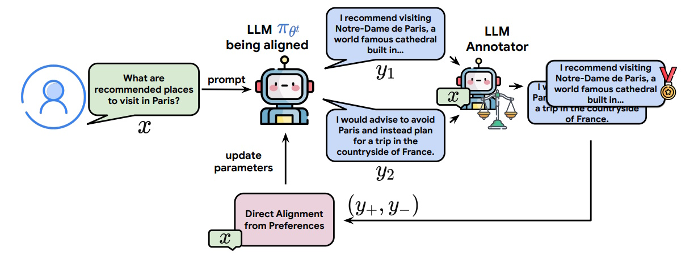
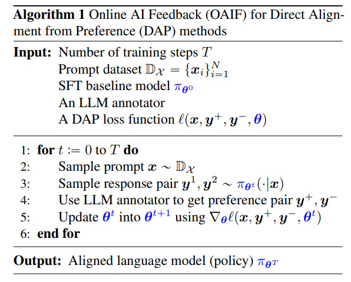

# Direct Language Model Alignment from Online AI Feedback (OAIF)

## Table of Contents

- [Introduction](#introduction)
- [Background](#background)
- [Direct Alignment from Online AI Feedback](#direct-alignment-from-online-ai-feedback)
  - [OAIF Approach for DAP](#oaif-approach-for-dap)
  - [Proposed Algorithm](#proposed-algorithm)
- [Experiments](#experiments)
- [Implementation Examples](#implementation-examples)
  - [Using a Judge in Online DPO Training](#using-a-judge-in-online-dpo-training)
  - [Using a Reward Model in Online DPO Training](#using-a-reward-model-in-online-dpo-training)
  - [Key Differences](#key-differences)
- [Conclusion](#conclusion)
- [References](#references)

## Introduction

Aligning large language models (LLMs) with human expectations and values is crucial for maximizing their benefits to society. Traditional methods like Reinforcement Learning from Human Feedback (RLHF) involve training a separate reward model based on human preferences and then optimizing the language model using reinforcement learning. However, recent methods known as Direct Alignment from Preferences (DAP), such as Direct Preference Optimization (DPO), offer a simpler and more efficient alternative by directly updating the language model without needing a separate reward model.

Despite their advantages, DAP methods typically rely on pre-collected, offline preference data, which doesn't adapt as the model evolves during training. This can lead to mismatches between the data used for training and the model's current state, known as distribution shifts. To address this, we introduce Online AI Feedback (OAIF), a method that integrates real-time feedback from an AI annotator during training, enhancing the alignment process.

## Background

### Pairwise Preference Collection

Before aligning a language model, a dataset of pairwise preferences is collected. This involves:

1. **Sampling a Prompt**: A prompt $x$ is selected from a distribution $p_X$.
2. **Generating Responses**: Two distinct responses, $y_1$ and $y_2$, are generated independently by an existing LLM $\rho$.
3. **Ranking Responses**: Human or AI annotators rank these responses, determining a preferred response $y'$ and a less preferred one $y''$.

This process results in a preference dataset $D = \{(x_i, y'_i, y''_i)\}_{i=1}^N$, where each entry contains a prompt and its corresponding pairwise preference.

### Direct Alignment from Preference (DAP) Methods

DAP methods update the target language model $\pi_\theta$ directly using the preference pairs from the dataset $D$. Unlike RLHF, which requires training a separate reward model, DAP methods simplify the alignment by using loss functions based on the preferences. Three main DAP methods are:

- **DPO Loss**:
  
  $$\ell_{\text{DPO}}(x, y', y'', \theta) = -\log \sigma\left(\beta \log \frac{\pi_\theta(y'|x)}{\pi_{\theta_0}(y'|x)} - \beta \log \frac{\pi_\theta(y''|x)}{\pi_{\theta_0}(y''|x)}\right)$$

- **IPO Loss**:
  
  $$\ell_{\text{IPO}}(x, y', y'', \theta) = \frac{1}{2\beta} \left(\log \frac{\pi_\theta(y'|x)}{\pi_{\theta_0}(y''|x)} - \log \frac{\pi_\theta(y''|x)}{\pi_{\theta_0}(y'|x)}\right)^2$$

- **SLiC Loss**:
  
  $$\ell_{\text{SLiC}}(x, y', y'', \theta) = \max\left(0, 1 - \beta \log \frac{\pi_\theta(y'|x)}{\pi_{\theta_0}(y''|x)} - \beta \log \frac{\pi_\theta(y''|x)}{\pi_{\theta_0}(y'|x)}\right)$$

Here, $\pi_{\theta_0}$ is the baseline model, $\sigma$ is the logistic function, and $\beta$ is a hyperparameter.

### Offline Feedback

DAP methods usually rely on a fixed, pre-collected dataset $D$ for alignment. This offline feedback means the model doesn't receive real-time updates based on its current outputs during training, leading to potential mismatches between the training data distribution and the model's evolving distribution.

### Off-policy Learning

When using offline datasets, the alignment becomes off-policy because the data is generated by a different model ($\rho$) than the one being trained ($\pi_\theta$). This discrepancy can hinder the model's performance, as the preferences may not accurately reflect the current state of $\pi_\theta$.

### Comparison between OAIF and existing DAP methods

| Method         | No RM needed | On-policy generation | Online feedback |
|--------------|--------------|----------------------|----------------|
| **Offline DPO** (Rafailov et al., 2023) | ✅ | ❌ | ❌ |
| **Offline IPO** (Azar et al., 2023) | ✅ | ❌ | ❌ |
| **Offline SLiC** (Zhao et al., 2023) | ✅ | ❌ | ❌ |
| **RSO** (Liu et al., 2023) | ❌ | ✅ | ✅ |
| **Iterative DPO** (Xu et al., 2023) | ❌ | ✅ | ✅ |
| **OAIF (proposed)** | ✅ | ✅ | ✅ |

This table provides a comparison between **OAIF** and existing **DAP methods**, evaluating three key properties:

1. **No RM Needed** – Whether the method requires a separate Reward Model (RM).
2. **On-Policy Generation** – Whether the model is trained using responses sampled from its current policy, avoiding distribution shifts.
3. **Online Feedback** – Whether the model receives real-time feedback during training.

---

## Direct Alignment from Online AI Feedback

To overcome the limitations of offline DAP methods, we propose Online AI Feedback (OAIF). OAIF integrates real-time feedback from an AI annotator during the training process, ensuring that the preferences are always aligned with the current state of the model. This approach combines the simplicity of DAP methods with the adaptability of RLHF.

### OAIF Approach for DAP



The **OAIF approach** introduces an online, on-policy mechanism for aligning language models using AI-generated feedback rather than pre-collected human annotations. **Figure 1** illustrates the key steps in this process:

1. **Prompting the Language Model**  
   - A user provides a **prompt** ($x$) (e.g., *"What are recommended places to visit in Paris?"*).  
   - The **LLM being aligned** (denoted as $\pi_{\theta^t}$ generates **two candidate responses**, ($y_1$) and ($y_2$).

2. **Generating Response Candidates**  
   - The model under alignment produces two different answers:  
     - **$y_1$** (*"I recommend visiting Notre-Dame de Paris, a world-famous cathedral built in..."*).  
     - **$y_2$** (*"I would advise to avoid Paris and instead plan for a trip in the countryside of France."*).  

3. **Annotating Preferences with an AI Evaluator**  
   - An **LLM annotator** evaluates the responses based on their quality and alignment with expected behavior.  
   - The annotator **assigns a preference**, selecting the better response as ($y^+$) and the weaker response as ($y^-$).  
   - In the figure, the annotator **prefers** ($y_1$) (highlighted with a medal icon), meaning ($y_1$) is labeled as ($y^+$) and ($y_2$) as ($y^-$).

4. **Updating the Model using Direct Alignment from Preferences**  
   - The preference pair $(y^+, y^-)$ is fed into the **DAP loss function** $\ell(x, y^+, y^-, \theta)$.  
   - The model parameters ($\theta$) are updated accordingly to reinforce preferred responses.

**Note: When and How Do We Get $ \theta $?**

- **At the start ($ t = 0 $)**, $ \theta^0 $ is initialized from the **SFT model**.
- **During training**, $ \theta^t $ evolves as the model is updated through **DAP loss optimization**.
- **At the end ($ t = T $)**, $ \theta^T $ represents the **fully aligned model** after multiple rounds of OAIF updates.

### Proposed Algorithm

The OAIF algorithm follows a three-step procedure for each training iteration:

1. **Sample Responses**: Two responses are generated from the current model ($\pi_\theta$) based on a prompt ($x$).
2. **Obtain Feedback**: An AI annotator (another LLM) evaluates the two responses and determines the preferred one.
3. **Update Model**: The model ($\pi_\theta$) is updated using the preference pair ($y', y''$) through a standard DAP loss function.

This process ensures on-policy learning, as the feedback is directly based on the model's current outputs.

---

### Algorithm Overview (OAIF Process)



#### **Inputs**

1. **Number of Training Steps $T$**:
   - **Definition**: The total number of iterations the training process will run.
   - **Purpose**: Determines how long the model will be trained and updated.

2. **Prompt Dataset $\mathbb{D}_x = \{x_i\}_{i=1}^{N}$**:
   - **Definition**: A collection of $N$ prompts or questions that the model will respond to during training.
   - **Purpose**: Provides the basis for generating responses that the model will learn to improve upon.

3. **SFT Baseline Model $\pi_{\theta_0}$**:
   - **Definition**: The starting point of the language model before alignment begins, typically obtained through supervised fine-tuning (SFT).
   - **Purpose**: Serves as the reference model whose behavior the aligned model will initially mimic.

4. **LLM Annotator**:
   - **Definition**: Another large language model used to evaluate and rank the responses generated by the main model.
   - **Purpose**: Acts as an automated annotator to provide preference feedback without human intervention.

5. **DAP Loss Function $\ell(x, y^+, y^-, \theta)$**:
   - **Definition**: A mathematical function that quantifies how well the model's responses align with the preferred responses.
   - **Purpose**: Guides the model's updates by indicating the direction and magnitude of parameter adjustments needed for better alignment.

#### **Procedure**

The algorithm proceeds through a loop that runs for $T$ training steps. Each iteration involves generating responses, obtaining feedback, and updating the model accordingly.

1. **For Each Training Step $t = 0$ to $T$**:
   
   - **Step 1: Sample a Prompt ($x$)**
     - **Operation**: Randomly select a prompt $x$ from the prompt dataset $\mathbb{D}_x$.
     - **Example**: If $\mathbb{D}_x$ contains prompts like "Explain photosynthesis," the algorithm might select this prompt for the current iteration.
     - **Purpose**: Provides a specific question or topic for the model to generate responses to.

   - **Step 2: Generate a Response Pair ($y^1, y^2$)**
     - **Operation**: Use the current state of the model $\pi_{\theta_t}$ to generate two distinct responses $y^1$ and $y^2$ to the prompt $x$.
     - **Example**:
       - $y^1$: "Photosynthesis is the process by which green plants use sunlight to synthesize nutrients from carbon dioxide and water."
       - $y^2$: "Plants convert light energy into chemical energy through photosynthesis, producing oxygen and glucose."
     - **Purpose**: Provides two different answers that the model will evaluate to determine which is better aligned with desired outcomes.

   - **Step 3: Obtain Preference Pair ($y^+, y^-$)**
     - **Operation**: Utilize the LLM annotator to evaluate and rank the two responses ($y^1$) and ($y^2$). The annotator selects ($y^+$) as the preferred response and ($y^-$) as the less preferred one.
     - **Example**: The annotator might determine that ($y^1$) is more accurate and clear, thus setting ($y^+ = y^1$) and ($y^- = y^2$).
     - **Purpose**: Provides feedback on which response is better, guiding the model to favor more preferred answers in future generations.

   - **Step 4: Update Model Parameters ($\theta$)**
     - **Operation**: Adjust the model's parameters ($\theta_t$) to ($\theta_{t+1}$) by computing the gradient of the loss function $\ell(x, y^+, y^-, \theta^t)$ with respect to ($\theta$) and applying this gradient to minimize the loss.
     - **Mathematical Representation**:

       $[
       \theta^{t+1} = \theta^t - \eta \nabla_\theta \ell(x, y^+, y^-, \theta^t)
       ]$

       where $\eta$ is the learning rate.
     - **Purpose**: Updates the model to increase the likelihood of generating responses similar to ($y^+$) and decrease the likelihood of generating responses like ($y^-$).

2. **End of Loop**

   - After completing all $T$ training steps, the loop terminates.

#### **Output**

- **Aligned Language Model $\pi_{\theta_T}$**:
  - **Definition**: The final state of the language model after $T$ training steps.
  - **Purpose**: Represents the aligned model that has been fine-tuned to generate responses more in line with the preferred outputs as determined by the LLM annotator.

---

## Experiments

### Effectiveness of OAIF for LLM Alignment

We compared OAIF with offline DAP methods and RLHF/RLAIF methods. The key findings are:

- **Win Rate**: OAIF consistently achieved higher win rates compared to offline methods across all tasks.
- **Overfitting**: Offline DAP methods showed signs of overfitting, whereas OAIF maintained improving performance throughout training.
- **Quality Scores**: Human evaluations indicated that OAIF not only outperformed in win rates but also produced higher quality responses.

#### Table 1: Win/Tie/Loss Rates and Quality Scores

| Method         | TL;DR Win Rate (%) | Helpfulness Win Rate (%) | Harmlessness Win Rate (%) | Quality Score |
|----------------|---------------------|--------------------------|----------------------------|---------------|
| Online DPO     | 63.74               | 58.60                    | 60.26                      | 3.95          |
| Offline DPO    | 7.69                | 20.20                    | 3.84                       | 3.46          |
| Online IPO     | 64.81               | -                        | -                          | 3.84          |
| Offline IPO    | 3.71                | -                        | 2.93                       | -             |
| Online SLiC    | 71.43               | -                        | -                          | 3.85          |
| Offline SLiC   | 1.59                | -                        | 3.23                       | -             |

*Human raters judged the quality of responses, with higher scores indicating better quality.*

---

## Implementation Examples

This section provides practical examples of implementing **Online DPO Training** using either a **LLM Judge** or a **Reward Model**. These examples demonstrate how real-time preference collection and model updates can be performed efficiently.

**LLM Judge** based on the PairRM model from AllenAI. This judge uses the PairRM model to rank pairs of completions for given prompts. It’s designed for pairwise comparison of language model outputs. The PairRM model is loaded using the `llm-blender` library and runs on the default Accelerator device.

### Using a Judge in Online DPO Training

In this approach, a **judge model** (e.g., `PairRMJudge`) is used to determine which response is preferable between two candidates. The judge assigns preference labels, simplifying training by avoiding the need for a separate reward model.

```python
from datasets import load_dataset
from trl import OnlineDPOConfig, OnlineDPOTrainer, PairRMJudge
from transformers import AutoModelForCausalLM, AutoTokenizer

# Load base model and tokenizer
model = AutoModelForCausalLM.from_pretrained("Qwen/Qwen2-0.5B-Instruct")
tokenizer = AutoTokenizer.from_pretrained("Qwen/Qwen2-0.5B-Instruct")

# Use a Pairwise Reward Model Judge
judge = PairRMJudge()

# Load dataset
train_dataset = load_dataset("trl-lib/ultrafeedback-prompt", split="train")

# Define training arguments
training_args = OnlineDPOConfig(output_dir="Qwen2-0.5B-OnlineDPO", logging_steps=10)

# Initialize trainer with the Judge
trainer = OnlineDPOTrainer(
    model=model, 
    judge=judge,  # Using the judge to determine preferences
    args=training_args, 
    processing_class=tokenizer, 
    train_dataset=train_dataset
)

# Start training
trainer.train()
```

### Using a Reward Model in Online DPO Training

Instead of a judge, this approach utilizes a **reward model** that scores each response numerically. The model then learns based on these reward scores.

```python
from datasets import load_dataset
from trl import OnlineDPOConfig, OnlineDPOTrainer
from transformers import AutoModelForCausalLM, AutoTokenizer, AutoModelForSequenceClassification

# Load base model and tokenizer
model = AutoModelForCausalLM.from_pretrained("Qwen/Qwen2-0.5B-Instruct")
tokenizer = AutoTokenizer.from_pretrained("Qwen/Qwen2-0.5B-Instruct")

# Load Reward Model for scoring responses
reward_model = AutoModelForSequenceClassification.from_pretrained("trl-lib/Qwen2-0.5B-Reward", num_labels=1)
reward_tokenizer = AutoTokenizer.from_pretrained("trl-lib/Qwen2-0.5B-Reward")

# Load dataset
train_dataset = load_dataset("trl-lib/ultrafeedback-prompt", split="train")

# Define training arguments
training_args = OnlineDPOConfig(output_dir="Qwen2-0.5B-OnlineDPO", logging_steps=10)

# Initialize trainer with Reward Model
trainer = OnlineDPOTrainer(
    model=model, 
    reward_model=reward_model,  # Using a reward model instead of a judge
    reward_processing_class=reward_tokenizer,  
    args=training_args, 
    processing_class=tokenizer, 
    train_dataset=train_dataset
)

# Start training
trainer.train()
```

### Key Differences

The table below summarizes the differences between using a **Judge** and a **Reward Model** for Online DPO Training.

| Feature | **Judge (`PairRMJudge`)** | **Reward Model (`AutoModelForSequenceClassification`)** |
|---------|----------------|---------------------------|
| Output  | Preference labels (e.g., which response is better) | Numerical reward score for each response |
| Model Complexity | Simpler | More complex, requires a separate model |
| Customization | Limited to pairwise comparisons | Can be fine-tuned for different scoring strategies |
| Use Case | When ranking responses in pairs is sufficient | When a numerical reward function is needed for optimization |

---

## Conclusion

Online AI Feedback (OAIF) presents a significant advancement in the alignment of large language models. By integrating real-time feedback from an AI annotator, OAIF addresses the limitations of offline DAP methods, such as distribution shifts and overfitting. Our experiments show that OAIF not only enhances the performance of DAP methods across multiple tasks but also offers controllability and adaptability without additional computational burdens. This makes OAIF a promising approach for future developments in language model alignment.

## References

1. **Direct Language Model Alignment from Online AI Feedback**  
   [https://arxiv.org/abs/2402.04792](https://arxiv.org/abs/2402.04792)  

2. **Online DPO Trainer**  
   [https://huggingface.co/docs/trl/main/en/online_dpo_trainer](https://huggingface.co/docs/trl/main/en/online_dpo_trainer)  

