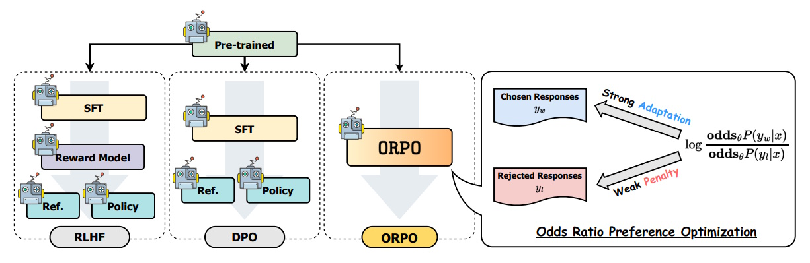

# ORPO: Monolithic Preference Optimization Without a Reference Model

## Table of Contents

- [Introduction](#introduction)
- [Background](#background)
- [Understanding ORPO](#understanding-orpo)
- [ORPO Loss Function Explanation](#orpo-loss-function-explanation)
- [Example: ORPO Loss in Action](#example-orpo-loss-in-action)
- [Results and Analysis](#results-and-analysis)
- [Using ORPOTrainer in HuggingFace](#using-orpotrainer-in-huggingface)
- [Conclusion](#conclusion)
- [References](#references)

## Introduction

In the rapidly evolving field of Natural Language Processing (NLP), pre-trained language models (PLMs) have demonstrated remarkable abilities across various tasks. However, to ensure these models align with human preferences and values, additional training is often necessary. Traditional methods involve multi-stage processes that can be resource-intensive. This article explores **ORPO (Odds Ratio Preference Optimization)**, a novel approach that simplifies preference alignment by eliminating the need for a reference model.

## Background

### Pre-trained Language Models

Pre-trained language models like GPT-4, Llama-2, and Mistral have shown exceptional performance in understanding and generating human-like text. These models are trained on vast amounts of data from sources such as web texts and textbooks, enabling them to perform a wide range of NLP tasks effectively.

### Preference Alignment

Despite their capabilities, PLMs can sometimes produce outputs that are harmful or unethical. To mitigate this, **preference alignment** techniques are employed. These methods adjust the model's behavior to align with human values by using techniques like:

- **Reinforcement Learning with Human Feedback (RLHF)**: Models are fine-tuned using human feedback to prefer certain outputs over others.
- **Direct Preference Optimization (DPO)**: Integrates reward modeling directly into the preference learning stage.

---

## Understanding ORPO



Above figure visually compares **ORPO (Odds Ratio Preference Optimization)** with other **model alignment techniques**, such as **RLHF (Reinforcement Learning with Human Feedback)** and **DPO (Direct Preference Optimization)**. ORPO introduces a **simplified** preference alignment method that eliminates the need for a **reference model** and directly integrates preference learning into supervised fine-tuning.

### 1. Comparison with RLHF and DPO
#### **1. RLHF (Reinforcement Learning with Human Feedback)**
- RLHF involves **multiple stages**:
  1. **Supervised Fine-Tuning (SFT)** on preferred responses.
  2. A **Reward Model** is trained separately to distinguish good vs. bad responses.
  3. A **Reference Model** is used to compare policy updates.
  4. The model undergoes **reinforcement learning** to optimize behavior.
- **Drawback:** Requires **separate reward modeling and reference policy**, making it computationally expensive.

### 2. DPO (Direct Preference Optimization)
- DPO simplifies RLHF by **removing the explicit reward model**.
- Instead, it **directly optimizes the policy** using a reference model and a comparison-based preference function.
- **Drawback:** Still requires a **reference model** and multi-stage optimization.

### 3. ORPO: A Single-Step Optimization
- ORPO **removes the need for a reference model** entirely.
- Instead, it **applies a weak penalty** to rejected responses $ y_l $ and a **strong adaptation signal** to favored responses $ y_w $.
- This is done using the **log odds ratio** of the chosen and rejected responses:

  $$
  \log \frac{\text{odds}_\theta P(y_w | x)}{\text{odds}_\theta P(y_l | x)}
  $$

- The **log odds ratio** acts as a **preference learning signal**, directly influencing the **negative log-likelihood loss (NLL)**.

### Key Features of ORPO
1. **No Reference Model Required** 🟢  
   - Unlike RLHF and DPO, **ORPO eliminates the need for an additional reference model**, reducing computational costs.
2. **Single-Step Optimization** 🔄  
   - Instead of multiple phases, **ORPO integrates preference learning within supervised fine-tuning**.
3. **Stronger Adaptation for Favored Responses** ✅  
   - The model is encouraged to **strongly prefer chosen responses** $ y_w $ (blue arrow in the figure).
4. **Weak Penalty for Rejected Responses** ❌  
   - Unlike RLHF, ORPO doesn’t aggressively penalize bad responses but instead **gradually decreases their likelihood** (red arrow in the figure).
5. **Mathematically Efficient Loss Function** 📉  
   - ORPO’s loss function **appends the log odds ratio term** to the traditional supervised fine-tuning loss (NLL loss), ensuring efficient preference learning.

---

## ORPO Loss Function Explanation

The **Odds Ratio Preference Optimization (ORPO)** loss function is designed to **differentiate between favored and disfavored responses** during supervised fine-tuning (SFT). It ensures that a model **prefers desirable outputs** while **actively avoiding undesired ones**.

### ORPO Loss Function Formula

The ORPO loss function consists of two main components:

$$
L_{\text{ORPO}} = \mathbb{E}_{(x, y_w, y_l)} [L_{\text{SFT}} + \lambda \cdot L_{\text{OR}}]
$$

Where:
1. **$ L_{\text{SFT}} $ (Supervised Fine-Tuning Loss)**: Encourages the model to generate favored responses by maximizing their probability.
2. **$ L_{\text{OR}} $ (Odds Ratio Loss)**: Penalizes the model when it assigns high probabilities to disfavored responses.
3. **$ \lambda $**: A hyperparameter that controls the trade-off between **favoring desired outputs** and **avoiding undesired outputs**.
   - **Low $ \lambda $ (e.g., 0.05 - 0.1)** → The model relies more on **supervised fine-tuning (SFT)** and learns preferences **more conservatively**.
   - **Moderate $ \lambda $ (e.g., 0.2 - 0.3)** → Balanced preference alignment between **SFT and ORPO loss**.
   - **High $ \lambda $ (e.g., 0.5 - 1.0)** → The model prioritizes **aligning with human preferences** but may overfit to specific examples.

### 1. Supervised Fine-Tuning Loss ( $ L_{\text{SFT}} $ )
The **SFT loss** is a standard **Negative Log-Likelihood (NLL) loss** used in language model training:

$$
L_{\text{SFT}} = - \frac{1}{m} \sum_{t=1}^{m} \log P_\theta(y_{w,t} | x, y_{w,<t})
$$

- **$ x $**: Input prompt provided to the model.  
- **$ y_w $**: The **favored response**, i.e., the desirable output that the model should generate.
- **$ t $**: Time step or token index in the sequence, where **$ t = 1, 2, \dots, m $**.
- **$ \theta $**: Model parameters being optimized.
- **$ P_\theta(y_{w,t} | x, y_{w,<t}) $**: Probability assigned by the model to the next token **$ y_{w,t} $** in the **favored response** sequence, given the input **$ x $** and previous tokens **$ y_{w,<t} $**.  
- **$ m $**: Length of the response sequence.  

✅ **What it does:** 
- Encourages the model to assign **higher probabilities** to correct tokens in the **favored response** sequence.  
- Ensures the model learns to generate **more human-preferred and helpful** responses.  
- The **negative log-likelihood (NLL) loss** punishes incorrect predictions by increasing the loss when the model assigns low probability to correct tokens.  
- The **summation over all time steps** ensures that every token in the response contributes to the total loss.  
- The **$ \frac{1}{m} $ term (mean loss per token)**:
  - Normalizes the loss by sequence length, preventing longer responses from accumulating disproportionately high loss values.  
  - Allows fair comparison across sequences of different lengths.  
  - Ensures stable training dynamics by keeping loss values at a similar scale across different training samples.  

### 2. Odds Ratio Loss ( $ L_{\text{OR}} $ )
The **odds ratio loss** ensures that the model **prefers the favored response over the disfavored response**. It is given by:

$$
L_{\text{OR}} = - \log \sigma \left(\log \frac{\text{odds}_\theta(y_w|x)}{\text{odds}_\theta(y_l|x)}\right)
$$

Where:
- **Odds of generating a response**:

  $$
  \text{odds}_\theta(y|x) = \frac{P_\theta(y|x)}{1 - P_\theta(y|x)}
  $$

- **Odds Ratio**:

  $$
  \text{OR}_\theta(y_w, y_l) = \frac{\text{odds}_\theta(y_w|x)}{\text{odds}_\theta(y_l|x)}
  $$

- **$ \sigma(\cdot) $ is the sigmoid function**, ensuring the loss is bounded between 0 and 1.
- **$ \log \frac{\text{odds}_\theta(y_w|x)}{\text{odds}_\theta(y_l|x)} $ measures how much more likely the model prefers $ y_w $ over $ y_l $.**
- If **$ OR_\theta(y_w, y_l) \gg 1 $** → Log odds ratio is **large** → $ \sigma(\cdot) \approx 1 $ → $ L_{\text{OR}} $ is **small**.
- If **$ OR_\theta(y_w, y_l) \approx 1 $** → Log odds ratio is **near zero** → $ \sigma(\cdot) \approx 0.5 $ → $ L_{\text{OR}} $ is **moderate**.
- If **$ OR_\theta(y_w, y_l) \ll 1 $** → Log odds ratio is **negative** → $ \sigma(\cdot) \approx 0 $ → $ L_{\text{OR}} $ is **high**.

✅ **What it does:** 
- If the model assigns a **high probability** to the **favored response** ($ y_w $) and a **low probability** to the **disfavored response** ($ y_l $), the loss is small (good).
- If the model mistakenly assigns a **higher probability** to the **disfavored response**, the loss increases (bad).

🔢 **Interpreting Odds Ratio Values**:

| **Scenario**                      | **Good Alignment** ✅  | **Uncertain Case** ⚠️ | **Severe Misalignment** 🚨 |
|----------------------------------------------------|--------------------|-----------------------|------------------|
| **Favored Response Probability $ P_\theta(y_w \| x) $**    | **0.90**   | **0.55**              | **0.20**         |
| **Disfavored Response Probability $ P_\theta(y_l \| x) $** | **0.10**   | **0.45**              | **0.80**         |
| **Odds of $ y_w $ $ \frac{P(y_w)}{1 - P(y_w)} $**  | **9.0**            | **1.22**              | **0.25**         |
| **Odds of $ y_l $ $ \frac{P(y_l)}{1 - P(y_l)} $**  | **0.11**           | **0.82**              | **4.0**          |
| **Odds Ratio $ OR_\theta(y_w, y_l) $**             | **81.8** ($ OR \gg 1 $) | **1.49** ($ OR \approx 1 $) | **0.0625** ($ OR \ll 1 $) |
| **Odds Ratio Loss $ L_{\text{OR}} $** | **Low (Near 0) → Model prefers $ y_w $ strongly** ✅ | **Medium (Around 0.5) → Model is uncertain** ⚠️ | **High (Near 1) → Model incorrectly prefers $ y_l $** ❌ |
| **Interpretation**                         | Model strongly favors the correct response, well-aligned. | Model is uncertain about which response is preferred, needs fine-tuning. | Model prefers incorrect response, misaligned and requires correction. |

**Insights**:

- **High Odds Ratio ($ OR \gg 1 $)** → The model **strongly favors the correct response**, leading to **small loss** (✅ Ideal case).
- **Odds Ratio Close to 1 ($ OR \approx 1 $)** → The model is **indecisive**, causing **moderate loss** (⚠️ Needs improvement).
- **Low Odds Ratio ($ OR \ll 1 $)** → The model **favors the wrong response**, leading to **high loss** (🚨 Requires significant correction).

---

## Example: ORPO Loss in Action
Let’s consider a chatbot fine-tuned to **answer customer queries politely**. Suppose we have the following:

#### **Given Input**:
> **User:** *"Where is my order?"*

#### **Two Possible Responses**:
- ✅ **Favored Response ($ y_w $)**: *"Your order is on the way and should arrive soon!"*
- ❌ **Disfavored Response ($ y_l $)**: *"I don’t know, check yourself!"*

Let's assume our model assigns the following probabilities:

| Response | Probability $ P_\theta(y\|x) $ | Odds $ \frac{P}{1-P} $ |
|----------|----------------|----------------|
| **Favored $ y_w $** | $ 0.85 $ | $ \frac{0.85}{1-0.85} = 5.67 $ |
| **Disfavored $ y_l $** | $ 0.30 $ | $ \frac{0.30}{1-0.30} = 0.43 $ |

1. **Compute the Odds Ratio**:

   $$
   \text{OR}_\theta(y_w, y_l) = \frac{5.67}{0.43} = 13.2
   $$

2. **Compute the Loss**:
   - If the odds ratio is high (e.g., 13.2), the loss $ L_{\text{OR}} $ will be **small**, indicating that the model is correctly preferring the good response.
   - If the model mistakenly assigns a **higher probability** to $ y_l $ (e.g., 0.60 instead of 0.30), the **odds ratio will decrease**, leading to **higher loss** and guiding the model to correct its mistake.

### **Why ORPO is Effective**
✅ **No Reference Model Needed**: Unlike **RLHF or DPO**, ORPO doesn’t require a separate reference model, making it computationally efficient.  
✅ **Efficient Preference Learning**: It **penalizes bad responses directly** without complex multi-stage training.
✅ **Improves Model Alignment**: ORPO **ensures alignment** with human preferences while minimizing the risk of producing undesirable outputs.

---

## Results and Analysis

### **Single-turn Instruction Following**

The results from **AlpacaEval2.0** show that **ORPO significantly improves instruction-following abilities** over standard **RLHF and DPO** approaches.

- **Phi-2 (2.7B)** fine-tuned with ORPO achieved **71.80%** on AlpacaEval1.0 and **6.35%** on AlpacaEval2.0, outperforming **SFT-only** and **DPO** models.
- **Llama-2 (7B)** fine-tuned with ORPO scored **81.26%** on AlpacaEval1.0 and **9.44%** on AlpacaEval2.0, surpassing the larger **Llama-2-Chat (13B)** model.
- **Mistral-ORPO-α (7B) and Mistral-ORPO-β (7B)** outperformed Zephyr models, achieving **11.33% and 12.20%** on AlpacaEval2.0, respectively.

#### **Table 1: Instruction-following Performance (AlpacaEval)**
| **Model Name**              | **Size** | **AlpacaEval₁.₀** | **AlpacaEval₂.₀** |
|-----------------------------|---------|-----------------|-----------------|
| Phi-2 + SFT                 | 2.7B    | 48.37% (1.77)  | 0.11% (0.06)   |
| Phi-2 + SFT + DPO           | 2.7B    | 50.63% (1.77)  | 0.78% (0.22)   |
| **Phi-2 + ORPO (Ours)**     | **2.7B** | **71.80% (1.59)** | **6.35% (0.74)** |
| Llama-2 Chat                | 7B      | 71.34% (1.59)  | 4.96% (0.67)   |
| Llama-2 Chat                | 13B     | 81.09% (1.38)  | 7.70% (0.83)   |
| **Llama-2 + ORPO (Ours)**   | **7B**  | **81.26% (1.37)** | **9.44% (0.85)** |
| Zephyr (α)                  | 7B      | 85.76% (1.23)  | 8.35% (0.87)   |
| Zephyr (β)                  | 7B      | 90.60% (1.03)  | 10.99% (0.96)  |
| **Mistral-ORPO-α (Ours)**   | **7B**  | **87.92% (1.14)** | **11.33% (0.97)** |
| **Mistral-ORPO-β (Ours)**   | **7B**  | **91.41% (1.15)** | **12.20% (0.98)** |

As shown in **Figure 1**, **ORPO-trained models consistently outperform state-of-the-art instruction-following models** like Zephyr and Llama-2-Chat.


#### **Figure 1: Win Rate (%) on AlpacaEval2.0**
- **Llama-2 (7B) with ORPO** improves significantly over **Llama-2-Chat (13B)**.
- **Mistral-ORPO-β (7B) reaches the highest performance**, surpassing Zephyr models.
- ORPO fine-tuning achieves **better results in a single epoch** than larger models trained with RLHF.

### **Multi-turn Instruction Following**
While the provided images do not include MT-Bench results, **ORPO's superior instruction-following ability** in **AlpacaEval2.0** suggests strong generalization capabilities across multi-turn conversations. 

ORPO's efficiency allows models like **Mistral-ORPO-β (7B)** to achieve state-of-the-art performance **without additional multi-turn fine-tuning**.

### **Key Takeaways**
✅ **ORPO significantly enhances instruction-following accuracy**, outperforming RLHF and DPO-trained models.  
✅ **Mistral-ORPO-β (7B) surpasses Zephyr (β) and Llama-2-Chat (13B)** in AlpacaEval2.0 with **a single epoch of training**.  
✅ **Lower compute cost** compared to RLHF while achieving superior preference alignment.  

🚀 **ORPO is an efficient, high-performance preference optimization method that enables smaller models to surpass larger, RLHF-trained models.**

---

## Using ORPOTrainer in HuggingFace

To demonstrate how **ORPO (Odds Ratio Preference Optimization)** can be used in practice, we provide a simple example utilizing the **ORPOTrainer** class from the `trl` library. This example fine-tunes a **pre-trained language model** with preference-aligned responses using ORPO.

### **Example: Fine-tuning a Model with ORPOTrainer**  

```python
from transformers import AutoModelForCausalLM, AutoTokenizer
from datasets import load_dataset
from trl import ORPOTrainer, ORPOConfig

# Load a pre-trained model and tokenizer
model_name = "meta-llama/Llama-2-7b-hf"
tokenizer = AutoTokenizer.from_pretrained(model_name)
model = AutoModelForCausalLM.from_pretrained(model_name)

# Load a preference dataset (e.g., UltraFeedback)
dataset = load_dataset("argilla/ultrafeedback-binarized-preferences-cleaned")

# Define ORPO-specific training configuration with 'beta' parameter:
#   Low      (0.05 - 0.10) → The model relies more on supervised fine-tuning (SFT) and learns preferences "more conservatively".
#   Moderate (0.20 - 0.30) → Balanced preference alignment between SFT and ORPO loss.
#   High     (0.50 - 1.00) → The model prioritizes "aligning with human preferences" but may overfit to specific examples.
orpo_config = ORPOConfig(
    output_dir="./orpo_model",
    per_device_train_batch_size=4,
    per_device_eval_batch_size=4,
    learning_rate=1e-6,
    num_train_epochs=3,
    max_length=512,  # Ensures prompt + response fit within this limit
    beta=0.2,        # Controls the preference loss weight in ORPO (λ in the paper, defaults to 0.1)
)

# Initialize ORPOTrainer
trainer = ORPOTrainer(
    model=model,
    args=orpo_config,
    train_dataset=dataset["train"],
    eval_dataset=dataset["validation"],
    processing_class=tokenizer,
)

# Train the model using ORPO
trainer.train()
```

### **Explanation of Key Components**
- **Model & Tokenizer:**  
  - Uses **Llama-2-7B** as the base model.
  - Loads a **preference dataset** (`UltraFeedback`) with paired chosen/rejected responses.
- **ORPOConfig Parameters:**  
  - **Learning Rate:** `1e-6` (default for fine-tuning).  
  - **Batch Size:** `4` (adjustable based on GPU memory).  
  - **Training Epochs:** `3` (can be increased for better results).  
  - **Max Length:** `512` (ensures tokenized inputs fit within model limits).  
  - **Beta (\( \lambda \)):** `0.1` (controls the preference loss weight in ORPO).  
- **ORPOTrainer Execution:**  
  - Initializes and fine-tunes the model using **ORPO’s loss function**, aligning it with human preferences.  

### **Why Use ORPOTrainer?**
✅ **Simplifies preference optimization** by eliminating reference models.  
✅ **Efficient training** with a single-stage fine-tuning process.  
✅ **Better instruction following** as seen in **AlpacaEval2.0 results**.  

This example provides a **straightforward way to apply ORPO** for training preference-aligned language models, making it an **efficient alternative to RLHF and DPO**. 🚀

---

## Conclusion

**ORPO** offers a streamlined approach to preference alignment by eliminating the need for a reference model and simplifying the training process. By incorporating an odds ratio-based penalty, ORPO effectively differentiates between favored and disfavored responses, leading to models that better align with human preferences. Experimental results demonstrate that ORPO not only matches but often surpasses existing state-of-the-art methods in various evaluation benchmarks. This efficiency and effectiveness make ORPO a promising technique for developing aligned language models with reduced computational overhead.

## References

1. ORPO: Monolithic Preference Optimization without Reference Model. [arXiv:2403.07691](https://arxiv.org/abs/2403.07691).
2. Hugging Face [IPO Trainer](https://huggingface.co/docs/trl/v0.7.11/en/dpo_trainer).
