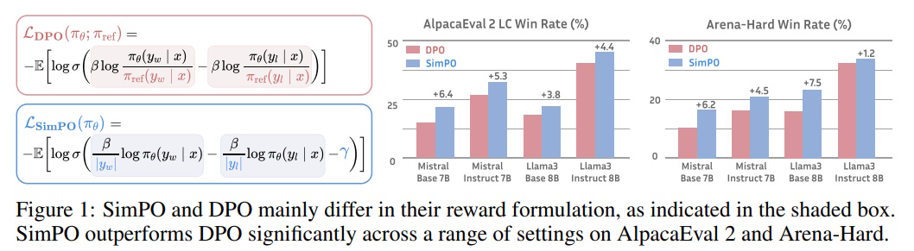

# SimPO: Simple Preference Optimization with a Reference-Free Reward

## Table of Contents
1. [Introduction](#introduction)  
2. [What is SimPO?](#what-is-simpo)  
3. [How Does SimPO Work?](#how-does-simpo-work)
4. [Reward Formulation Explained](#reward-formulation-explained)
5. [Target Reward Margin Explained](#target-reward-margin-explained)
6. [Performance Comparison](#performance-comparison)
7. [Training Example Using SimPO](#training-example-using-simpo)  
8. [Conclusion](#conclusion)  
9. [References](#references)  

---

## Introduction

Preference optimization is an essential part of training large language models (LLMs) to align them with human preferences. SimPO, short for Simple Preference Optimization, is a new approach that improves upon Direct Preference Optimization (DPO) by introducing a **reference-free reward** mechanism. This makes SimPO simpler, faster, and more efficient while achieving state-of-the-art results on benchmarks like AlpacaEval 2 and Arena-Hard.

SimPO focuses on directly aligning the reward function with the likelihood metrics used during generation, making it better suited for training high-quality models with less computational overhead.



SimPO outperforms DPO significantly across different **AlpacaEval 2 LC Win Rate (%)** and **Arena-Hard Win Rate (%)** settings. The results indicate that **SimPO consistently achieves higher win rates** compared to DPO across all tested models. The improvements are especially noticeable in Mistral Base 7B and Llama3 Base 8B for **Arena-Hard** and across all models for **AlpacaEval 2 LC**. This demonstrates **SimPO's effectiveness in optimizing preference-based learning while maintaining computational efficiency**.

### Applications of SimPO

SimPO is versatile and can be applied to various scenarios:
- **Chatbots and Conversational AI**: Aligns responses with user preferences to improve user experience.
- **Instruction-Following Models**: Fine-tunes models like Llama and Mistral for better performance on instruction-based tasks.
- **Efficient Training Pipelines**: Reduces the computational cost of RLHF training.

---

## What is SimPO?

SimPO is a method designed to optimize preferences in LLMs without relying on a reference model. In traditional preference optimization methods like DPO, a reference model is used to calculate rewards. However, this increases computational cost and introduces potential mismatches between training and generation objectives.

SimPO eliminates these issues by:
- Using **average log probabilities** as rewards.
- Introducing a **target reward margin** to enhance the separation between winning and losing responses.
- Removing the dependency on a reference model, making it computationally efficient.

---

## How Does SimPO Work?

### Reward Formulation

SimPO uses a **length-normalized reward** to ensure the reward aligns with the generation metric and avoids biases. The reward for a sequence is calculated as:

$[
r_\text{SimPO}(x, y) = \frac{\beta}{|y|} \sum_{i=1}^{|y|} \log \pi_\theta(y_i \mid x, y_{<i})
$]

Here:
- $( x $): Input prompt
- $( y $): Generated response
- $( \pi_\theta $): Policy model
- $( \beta $): Scaling factor
- $( |y| $): Length of the response

This reward formulation **avoids favoring longer sequences**, a common issue in preference optimization.

### Target Reward Margin

SimPO introduces a **target reward margin** $( \gamma $) to ensure that winning responses have a sufficiently higher reward than losing responses. The objective is defined as:

$[
L_\text{SimPO} = - \mathbb{E}_{(x, y_w, y_l) \sim D} \left[ \log \sigma \left( r_\text{SimPO}(x, y_w) - r_\text{SimPO}(x, y_l) - \gamma \right) \right]
$]

Where:
- $( y_w $): Winning response (Preferred)
- $( y_l $): Losing response (Dis-Preferred)
- $( \gamma $): Target reward margin
- $( \sigma $): Sigmoid function

#### 1. The $(- \mathbb{E}_{(x, y_w, y_l) \sim D}$) Part:
This term represents the negative **expected value** over the dataset $( D $). Specifically:
- The dataset $( D $) consists of triples $((x, y_w, y_l)$), where:
  - $(x$): Input or prompt.
  - $(y_w$): The "winning" response, preferred based on human feedback.
  - $(y_l$): The "losing" response, less preferred based on human feedback.
- The expectation $(\mathbb{E}$) ensures that the objective considers all such triples in the dataset and evaluates the average performance across them.
- The negative sign ensures the objective is minimized, which aligns with the goal of maximizing the probability of the winning response being significantly better than the losing response.

**Example**: If the dataset contains 1,000 input-response pairs (preferred and dis-preferred), this term ensures the model learns to optimize the reward margin across all of them rather than just a single instance.

#### 2. The $[ \log \sigma \left( r_\text{SimPO}(x, y_w) - r_\text{SimPO}(x, y_l) - \gamma \right) $] Part:
This term calculates the **log probability** that the winning response $(y_w$) is significantly better than the losing response $(y_l$), accounting for the target reward margin $( \gamma $).

- **$(\sigma(x)$)**: The sigmoid function maps the value $(x$) (reward difference minus margin) to a range between 0 and 1, indicating the probability that the winning response is better. It is defined as:
  $[
  \sigma(x) = \frac{1}{1 + e^{-x}}
  $]
- **Reward difference**: The term $( r_\text{SimPO}(x, y_w) - r_\text{SimPO}(x, y_l) $) measures how much better the winning response is compared to the losing response.
- **Target margin $( \gamma $)**: The margin ensures that the reward difference is large enough, **encouraging stronger preferences for winning responses**.

Taking the log of this probability $(\log \sigma(...)$) ensures the optimization penalizes cases where the winning response does not achieve a sufficient margin over the losing response.

**Example**:
- $( r_\text{SimPO}(x, y_w) = -0.5 $) (reward for winning response)
- $( r_\text{SimPO}(x, y_l) = -1.2 $) (reward for losing response)
- $( \gamma = 0.5 $)
- Difference: $((-0.5) - (-1.2) - 0.5 = 0.2$)
- Sigmoid: $( \sigma(0.2) = \frac{1}{1 + e^{-0.2}} \approx 0.55 $)
- Log probability: $( \log(0.55) \approx -0.60 $)

---

## Reward Formulation Explained

SimPO uses a **length-normalized reward** mechanism to compute rewards for generated responses. This ensures that the reward aligns with the generation metric and avoids biases such as favoring longer responses. Let's break it down step by step with an example.

### Formula Recap

The reward is calculated using the following formula:

$[
r_\text{SimPO}(x, y) = \frac{\beta}{|y|} \sum_{i=1}^{|y|} \log \pi_\theta(y_i \mid x, y_{<i})
$]

Here:
- $( x $): Input prompt.
- $( y $): Generated response.
- $( \pi_\theta(y_i \mid x, y_{<i}) $): Probability assigned by the model to token $( y_i $), given the input $( x $) and previous tokens $( y_{<i} $).
- $( |y| $): Length of the response $( y $).
- $( \beta $): Scaling factor.

### Step-by-Step Example

Let’s say we have the following:
- **Input prompt ($(x$))**: "Explain the importance of clean water."
- **Generated response ($(y$))**: "Clean water is vital for health and hygiene."
- **Model probabilities ($(\pi_\theta$))**:
  - $( \pi_\theta(\text{"Clean"} \mid x) = 0.7 $)
  - $( \pi_\theta(\text{"water"} \mid x, \text{"Clean"}) = 0.8 $)
  - $( \pi_\theta(\text{"is"} \mid x, \text{"Clean water"}) = 0.9 $)
  - $( \pi_\theta(\text{"vital"} \mid x, \text{"Clean water is"}) = 0.6 $)
  - $( \pi_\theta(\text{"for"} \mid x, \text{"Clean water is vital"}) = 0.5 $)
  - $( \pi_\theta(\text{"health"} \mid x, \text{"Clean water is vital for"}) = 0.9 $)
  - $( \pi_\theta(\text{"and"} \mid x, \text{"Clean water is vital for health"}) = 0.8 $)
  - $( \pi_\theta(\text{"hygiene"} \mid x, \text{"Clean water is vital for health and"}) = 0.7 $)

The response $(y$) consists of 8 tokens: ["Clean", "water", "is", "vital", "for", "health", "and", "hygiene"]. The total length, $( |y| = 8 $).

### Calculation of the Reward

1. **Compute the Log Probabilities**:
   - $( \log \pi_\theta(\text{"Clean"} \mid x) = \log(0.7) = -0.3567 $)
   - $( \log \pi_\theta(\text{"water"} \mid x, \text{"Clean"}) = \log(0.8) = -0.2231 $)
   - $( \log \pi_\theta(\text{"is"} \mid x, \text{"Clean water"}) = \log(0.9) = -0.1054 $)
   - $( \log \pi_\theta(\text{"vital"} \mid x, \text{"Clean water is"}) = \log(0.6) = -0.5108 $)
   - $( \log \pi_\theta(\text{"for"} \mid x, \text{"Clean water is vital"}) = \log(0.5) = -0.6931 $)
   - $( \log \pi_\theta(\text{"health"} \mid x, \text{"Clean water is vital for"}) = \log(0.9) = -0.1054 $)
   - $( \log \pi_\theta(\text{"and"} \mid x, \text{"Clean water is vital for health"}) = \log(0.8) = -0.2231 $)
   - $( \log \pi_\theta(\text{"hygiene"} \mid x, \text{"Clean water is vital for health and"}) = \log(0.7) = -0.3567 $)

2. **Sum the Log Probabilities**:
   $[
   \text{Sum} = -0.3567 - 0.2231 - 0.1054 - 0.5108 - 0.6931 - 0.1054 - 0.2231 - 0.3567 = -2.5743
   $]

3. **Normalize by Length**:
   The length of the response $( |y| = 8 $). The normalized reward is:
   $[
   r_\text{SimPO}(x, y) = \frac{\beta}{8} \times (-2.5743)
   $]

4. **Scaling with $( \beta $)**:
   Let $( \beta = 2.0 $). Then:
   $[
   r_\text{SimPO}(x, y) = \frac{2.0}{8} \times (-2.5743) = -0.6436
   $]

### Interpretation

- The reward $( r_\text{SimPO}(x, y) = -0.6436 $) is length-normalized, meaning it evaluates the response's quality without penalizing or favoring responses based solely on their length.
- A higher (less negative) reward indicates a better alignment of the response with the training objective.

### Example Table for Multiple Responses

| Response                                       | Length $( \|y\| $) | Log Probability Sum $( \sum \log \pi_\theta $) | Reward $( r_\text{SimPO} $) |  
|------------------------------------------------|--------------------|-----------------------------------------------|-----------------------------|  
| "Clean water is vital for health and hygiene." | 8                  | $(-2.5743$)                                    | $(-0.6436$)                |  
| "Water is important for survival."             | 5                  | $(-1.8564$)                                    | $(-0.7426$)                |  
| "Clean water is crucial."                      | 4                  | $(-1.2040$)                                    | $(-0.6020$)                |  

In this table, the reward for "Clean water is crucial." is the highest, indicating that this response is both concise and well-aligned with the model's probability distribution.

---

## Target Reward Margin Explained

The **target reward margin** is a crucial component of SimPO that ensures a significant difference between the rewards of winning and losing responses. It prevents the model from assigning similar rewards to both responses, which would weaken preference optimization.

### Formula Recap

The target reward margin ($( \gamma $)) is incorporated into the SimPO objective as:

$[
L_\text{SimPO} = - \mathbb{E}_{(x, y_w, y_l) \sim D} \left[ \log \sigma \left( r_\text{SimPO}(x, y_w) - r_\text{SimPO}(x, y_l) - \gamma \right) \right]
$]

Here:
- $( r_\text{SimPO}(x, y_w) $): Reward for the winning response.
- $( r_\text{SimPO}(x, y_l) $): Reward for the losing response.
- $( \gamma $): Target reward margin.
- $( \sigma $): Sigmoid function, which ensures the difference is smoothly scaled between 0 and 1.

### Step-by-Step Example

Let’s consider:
- Input prompt ($(x$)): "Why is recycling important?"
- Two generated responses:
  - **Winning response ($(y_w$))**: "Recycling helps save resources and reduce waste."
  - **Losing response ($(y_l$))**: "Recycling is good for the environment."

Assume the rewards calculated using SimPO’s reward function are:
- $( r_\text{SimPO}(x, y_w) = -0.5 $)
- $( r_\text{SimPO}(x, y_l) = -1.2 $)

Set the **target reward margin** to $( \gamma = 0.5 $).

### Step 1: Compute the Reward Difference

The difference between the rewards of the winning and losing responses is:

$[
\Delta r = r_\text{SimPO}(x, y_w) - r_\text{SimPO}(x, y_l)
$]

Substitute the values:

$[
\Delta r = -0.5 - (-1.2) = 0.7
$]

### Step 2: Subtract the Target Reward Margin

The adjusted difference is:

$[
\Delta r - \gamma = 0.7 - 0.5 = 0.2
$]

### Step 3: Apply the Sigmoid Function

The sigmoid function $( \sigma(x) $) is defined as:

$[
\sigma(x) = \frac{1}{1 + e^{-x}}
$]

Substitute $( \Delta r - \gamma = 0.2 $):

$[
\sigma(0.2) = \frac{1}{1 + e^{-0.2}} \approx 0.55
$]

This value represents how well the reward difference meets the target reward margin. A value close to 1 indicates a strong preference for the winning response, while a value close to 0 indicates a weak or non-existent preference.

### Step 4: Compute the Loss

The SimPO objective minimizes the negative log of the sigmoid value:

$[
L_\text{SimPO} = - \log \sigma(\Delta r - \gamma)
$]

Substitute $( \sigma(0.2) = 0.55 $):

$[
L_\text{SimPO} = - \log(0.55) \approx 0.60
$]

### Example with and without Target Reward Margin

To highlight the importance of $( \gamma $), let’s compare two cases:

| **Case**                 | $( \Delta r $) | $( \gamma $) | $( \Delta r - \gamma $) | $( \sigma(\Delta r - \gamma) $) | Loss $( L_\text{SimPO} $) |  
|--------------------------|----------------|--------------|-------------------------|--------------------------------|-----------------------------|  
| With margin $( \gamma = 0.5 $) | 0.7            | 0.5          | 0.2                     | 0.55                           | 0.60                        |  
| Without margin $( \gamma = 0 $) | 0.7            | 0            | 0.7                     | 0.67                           | 0.40                        |  

When $( \gamma = 0 $), the loss is lower, but this could lead to the model being less strict in distinguishing between winning and losing responses. Adding $( \gamma = 0.5 $) forces the model to focus on maintaining a stronger distinction between the two responses.

### Why is the Target Reward Margin Important?

1. **Encourages Distinction**:
   The target margin ensures that the winning response is not just slightly better but significantly better than the losing response.

2. **Prevents Ambiguity**:
   If the margin is too small, the model may fail to learn clear preferences, reducing its ability to align with human feedback.

3. **Balances Generalization**:
   While increasing $( \gamma $) improves the separation, setting it too high can harm the model's generalization, as the optimization becomes overly strict.

### Visualizing the Effect of $( \gamma $)

| $( \gamma $) Value | Effect on Reward Difference | Example Output Quality |  
|--------------------|-----------------------------|-------------------------|  
| $( \gamma = 0 $)   | Small separation            | Winning and losing responses are often similar. |  
| $( \gamma = 0.5 $) | Moderate separation         | Winning responses are clearly better but not overly strict. |  
| $( \gamma = 1.0 $) | Large separation            | Winning responses are much better, but losing responses may be too penalized. |  

---

## Performance Comparison

### Evaluation Benchmarks

SimPO was evaluated on several benchmarks that measure conversational abilities:
- **AlpacaEval 2**: Evaluates both raw win rates (WR) and length-controlled win rates (LC).
- **Arena-Hard**: Focuses on challenging problem-solving tasks.
- **MT-Bench**: Covers diverse categories, such as reasoning and creativity.

### Comparison with DPO

SimPO consistently outperforms DPO across all benchmarks. The table below summarizes the results:

| **Method**   | **AlpacaEval 2 LC (%)** | **Arena-Hard WR (%)** |  
|--------------|-------------------------|-----------------------|  
| DPO          | 18.2                   | 15.9                 |  
| SimPO        | **22.0**               | **20.3**             |  

These improvements demonstrate SimPO's ability to produce higher-quality responses while maintaining efficiency.

### Advantages of SimPO

SimPO offers several benefits compared to traditional preference optimization methods like DPO:

1. **Simplicity**: 
   - SimPO eliminates the need for a reference model, making it easier to implement and understand.
2. **Efficiency**:
   - Reduces training time by up to 20% and GPU memory usage by 10% compared to DPO.
3. **Improved Alignment**:
   - Aligns the reward metric directly with generation, leading to better quality responses.
4. **Minimal Length Exploitation**:
   - By normalizing rewards, SimPO avoids generating excessively long responses to artificially boost scores.

---

## Training Example Using SimPO

Below is an example of how to use SimPO with Hugging Face’s `CPOTrainer` to train a model:

```python
from datasets import Dataset
from transformers import AutoModelForCausalLM, AutoTokenizer
from trl import CPOTrainer, CPOConfig

# 1. Load model and tokenizer
model_name = "facebook/opt-350m"  # Example model
model = AutoModelForCausalLM.from_pretrained(model_name)
tokenizer = AutoTokenizer.from_pretrained(model_name)

# 2. Prepare example dataset with chosen/rejected responses
train_dataset = Dataset.from_dict({
    "prompt": [
        "Write a helpful response: ",
        "Explain quantum physics: "
    ],
    "chosen": [
        "Here's a clear and detailed explanation.",
        "Quantum physics deals with behavior of matter at atomic scales."
    ],
    "rejected": [
        "idk lol whatever",
        "It's just weird stuff happening."
    ]
})

# 3. Configure CPO training with SimPO loss
# When loss_type="simpo" and cpo_alpha=0.0, SimPO is an alternative loss that:
# - adds a reward margin
# - allows for length normalization
# - does not use BC regularization
cpo_config = CPOConfig(
    output_dir="./cpo_simpo_output",
    loss_type="simpo",    # SimPO loss from the SimPO paper.
    simpo_gamma=0.5,      # Target reward margin
    cpo_alpha=0.0,        # Weight of the BC regularizer in CPO training (defaults to 1.0)
    learning_rate=1e-5,
    per_device_train_batch_size=2
)

# 4. Initialize CPOTrainer
trainer = CPOTrainer(
    model=model,
    args=cpo_config,
    train_dataset=train_dataset,
    tokenizer=tokenizer
)

# 5. Train the model
trainer.train()

# 6. Save the trained model
trainer.save_model("./cpo_simpo_final")

# Optional: Generate from trained model
prompt = "Write a helpful response: "
inputs = tokenizer(prompt, return_tensors="pt").to(model.device)
outputs = model.generate(
    **inputs,
    max_length=100,
    temperature=0.7,
    do_sample=True
)
response = tokenizer.decode(outputs[0], skip_special_tokens=True)
print(f"Generated response: {response}")
```

---

## Conclusion

SimPO is a groundbreaking method that simplifies preference optimization for LLMs. By removing the need for a reference model and aligning rewards with generation metrics, SimPO achieves superior performance with lower computational requirements.

Its results on major benchmarks highlight its potential to set new standards in training LLMs efficiently and effectively.

---

## References

1. **SimPO: Simple Preference Optimization with a Reference-Free Reward**  
   [arXiv:2405.14734](https://arxiv.org/abs/2405.14734)  

2. **SimPO Trainer (HuggingFace)**  
   [Documentation](https://huggingface.co/docs/trl/main/en/cpo_trainer#simple-preference-optimization-simpo)  

3. **CPO_SIMPO GitHub Project**  
   [GitHub Repository](https://github.com/fe1ixxu/CPO_SIMPO)  

---
